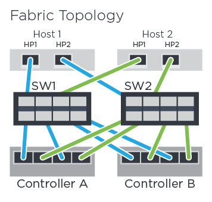

= Enregistrement de votre configuration NVMe over FC
:allow-uri-read: 
:icons: font
:imagesdir: ../media/

[role="lead"]
Vous pouvez générer et imprimer un PDF de cette page, puis utiliser la fiche technique suivante pour enregistrer des informations de configuration du stockage NVMe sur Fibre Channel. Vous avez besoin de ces informations pour effectuer les tâches de provisionnement.

== Topologie Direct Connect

Dans une topologie de connexion directe, un ou plusieurs hôtes sont directement connectés au contrôleur.

image::../media/nvme_fc_direct_topology.png[Exemple de topologie de connexion directe]

* Port 1 de l'adaptateur HBA hôte 1 et port 1 du contrôleur A
* Port 2 de l'adaptateur HBA hôte 1 et port 1 du contrôleur B
* Hôte 2, Port 1 de la carte HBA et contrôleur A, port hôte 2
* Port 2 de l'adaptateur HBA hôte 2 et port 2 du contrôleur B
* Hôte 3, port 1 de la carte HBA et contrôleur A, port hôte 3
* Hôte 3, port 2 de la carte HBA et port hôte du contrôleur B 3
* Hôte 4, port 1 de la carte HBA et contrôleur A, port hôte 4
* Hôte 4, port 2 de la carte HBA et port hôte du contrôleur B 4

== Topologie de connexion du commutateur

Dans une topologie en structure, un ou plusieurs commutateurs sont utilisés. Voir la https://mysupport.netapp.com/matrix["Matrice d'interopérabilité NetApp"^] pour obtenir la liste des commutateurs pris en charge.

== Identifiants d'hôte

Localisez et documentez le NQN initiateur à partir de chaque hôte.

|===
| Connexions des ports hôtes | NQN hôte 

 a| 
Hôte (initiateur) 1
 a| 

 a| 
Hôte (initiateur) 2
 a| 

|===

== NQN cible

Documentez le NQN cible de la matrice de stockage.

|===
| Nom de la matrice | NQN cible 

 a| 
Contrôleur de baie (cible)
 a| 

|===

== NQN cible

Documentez les NQN à utiliser par les ports de la matrice.

|===
| Connexions de port (cible) du contrôleur de matrice | NQN 

 a| 
Contrôleur A, port 1
 a| 

 a| 
Contrôleur B, port 1
 a| 

 a| 
Contrôleur A, port 2
 a| 

 a| 
Contrôleur B, port 2
 a| 

|===

== Nom d'hôte de mappage

NOTE: Le nom d'hôte de mappage est créé pendant le flux de travail.

|===

 a| 
Nom d'hôte de mappage
 a| 

 a| 
Type de système d'exploitation hôte
 a| 

|===