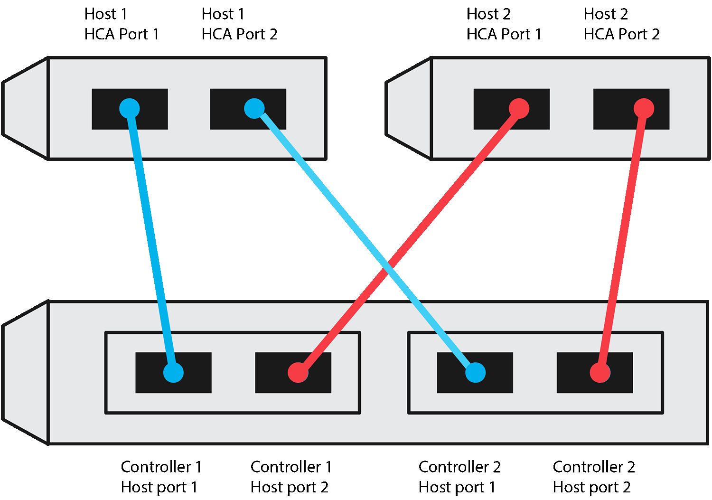

= Feuille de calcul de configuration NVMe sur TCP pour les hôtes Linux E-Series
:allow-uri-read: 
:icons: font
:imagesdir: ../media/

[role="lead"]
Vous pouvez générer et imprimer un PDF de cette page, puis utiliser la feuille de calcul suivante pour consigner les informations de configuration du stockage NVMe sur TCP. Vous avez besoin de ces informations pour effectuer les tâches de provisionnement.

[[direct-connect-topology]]
== Topologie Direct Connect

Dans une topologie à connexion directe, un ou plusieurs hôtes sont directement connectés au sous-système. Dans la version 11.50 du système d'exploitation SANtricity, nous prenons en charge une connexion unique de chaque hôte à un contrôleur de sous-système, comme illustré ci-dessous. Dans cette configuration, un port de la carte réseau (NIC) de chaque hôte doit être sur le même sous-réseau que le port du contrôleur E-Series auquel il est connecté, mais sur un sous-réseau différent de l'autre port NIC.

Un exemple de configuration qui satisfait aux exigences se compose de quatre sous-réseaux réseau comme suit :

* Sous-réseau 1 : port 1 de la carte réseau de l’hôte 1 et port 1 de l’interface d'hôte du contrôleur 1
* Sous-réseau 2 : port 2 de l’interface d'hôte de l’hôte 1 et port 1 de l’interface d'hôte du contrôleur 2
* Sous-réseau 3 : port 1 de l’interface d’hôte de l’hôte 2 et port 2 de l’interface d’hôte du contrôleur 1
* Sous-réseau 4 : port 2 de la carte réseau de l’hôte 2 et port 2 de l’interface d’hôte du contrôleur 2

[[switch-connect-topology]]
== Topologie de connexion du commutateur

Dans une topologie en structure, un ou plusieurs commutateurs sont utilisés. Reportez-vous à la section https://mysupport.netapp.com/matrix["Matrice d'interopérabilité NetApp"^] pour obtenir la liste des commutateurs pris en charge.

image::../media/nvmeof_switch_connect.gif[Exemple de connexion NVMe over TCP sur commutateur]

[[host-identifiers]]
== Identifiants d'hôte

Localisez et documentez le NQN initiateur à partir de chaque hôte.

|===
| Connexions des ports hôtes | Initiateur logiciel NQN 

 a| 
Hôte (initiateur) 1
 a| 
{nbsp}

 a| 
{nbsp}
 a| 
{nbsp}

 a| 
Hôte (initiateur) 2
 a| 
{nbsp}

 a| 
{nbsp}
 a| 
{nbsp}

 a| 
{nbsp}
 a| 
{nbsp}

|===

[[target-nqn]]
== NQN cible

Documentez le NQN cible de la matrice de stockage.

|===
| Nom de la matrice | NQN cible 

 a| 
Contrôleur de baie (cible)
 a| 

|===

[[target-nqns]]
== NQN cible

Documentez les NQN à utiliser par les ports de la matrice.

|===
| Connexions de port (cible) du contrôleur de matrice | NQN 

 a| 
Contrôleur A, port 1
 a| 

 a| 
Contrôleur B, port 1
 a| 

 a| 
Contrôleur A, port 2
 a| 

 a| 
Contrôleur B, port 2
 a| 

|===

[[mapping-host-name]]
== Nom d'hôte de mappage

NOTE: Le nom d'hôte de mappage est créé pendant le flux de travail.

|===

 a| 
Nom d'hôte de mappage
 a| 

 a| 
Type de système d'exploitation hôte
 a| 

|===