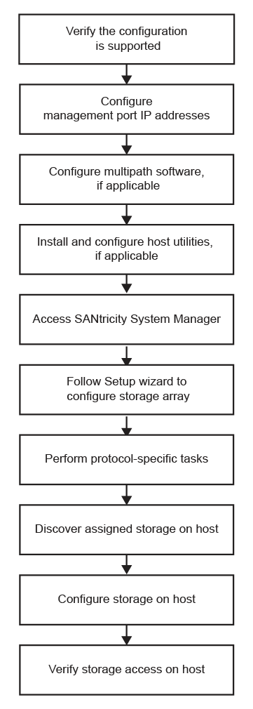

= Flux de travail de configuration express VMware pour le système de stockage E-Series
:allow-uri-read: 
:icons: font
:imagesdir: ../media/

[role="lead"]
Ce workflow vous guide dans la « méthode expresse » permettant de configurer votre baie de stockage et SANtricity System Manager pour mettre le stockage à la disposition d'un hôte VMware.

