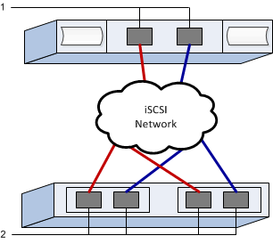

= Effectuez des tâches spécifiques à iSCSI dans E-Series - Windows
:allow-uri-read: 
:experimental: 
:icons: font
:imagesdir: ../media/

[role="lead"]
Pour le protocole iSCSI, vous devez configurer les commutateurs, configurer la mise en réseau côté baie et côté hôte, puis vérifier les connexions réseau IP.

== Étape 1 : configurer les commutateurs--iSCSI, Windows

La configuration des commutateurs est conforme aux recommandations du fournisseur en matière d'iSCSI. Ces recommandations peuvent inclure à la fois des directives de configuration et des mises à jour de code.

.Avant de commencer
Assurez-vous de disposer des éléments suivants :

* Deux réseaux distincts pour la haute disponibilité. Assurez-vous d'isoler votre trafic iSCSI pour séparer les segments du réseau à l'aide de VLAN ou de deux réseaux distincts.
* Activation du contrôle de flux matériel d'envoi et de réception *de bout en bout*.
* Contrôle de flux prioritaire désactivé.
* Le cas échéant, les trames jumbo activées.

NOTE: Les canaux de port/LACP n'est pas pris en charge sur les ports switchs du contrôleur. Le LACP côté hôte n'est pas recommandé. Le chemins d'accès multiples offre les mêmes avantages, voire meilleurs.

.Étapes
Consultez la documentation du fournisseur de votre commutateur.

== Étape 2 : configurer le réseau--iSCSI Windows

Vous pouvez configurer votre réseau iSCSI de différentes manières, selon vos besoins en termes de stockage des données. Consultez votre administrateur réseau pour obtenir des conseils sur le choix de la configuration la mieux adaptée à votre environnement.

Une stratégie efficace pour configurer le réseau iSCSI avec redondance de base consiste à connecter chaque port hôte et un port de chaque contrôleur pour séparer les commutateurs et partitionner chaque ensemble de ports hôte et contrôleur sur des segments réseau distincts à l'aide de VLAN.

.Avant de commencer
Assurez-vous de disposer des éléments suivants :

* Activation du contrôle de flux matériel d'envoi et de réception *de bout en bout*.
* Contrôle de flux prioritaire désactivé.
* Le cas échéant, les trames jumbo activées.
+
Si vous utilisez des trames jumbo au sein du SAN IP pour des raisons de performances, veillez à configurer la baie, les commutateurs et les hôtes pour utiliser des trames jumbo. Consultez la documentation de votre système d'exploitation et de vos commutateurs pour obtenir des informations sur l'activation des trames Jumbo sur les hôtes et sur les commutateurs. Pour activer les trames Jumbo sur la baie, suivez la procédure décrite à l'étape 3.

.Étapes
Consultez la documentation du fournisseur de votre commutateur.

NOTE: Pour la surcharge IP, de nombreux commutateurs réseau doivent être configurés au-dessus de 9,000 octets. Consultez la documentation de votre commutateur pour plus d'informations.

== Étape 3 : configurer les réseaux côté baie--iSCSI, Windows

Vous utilisez l'interface graphique de SANtricity System Manager pour configurer la mise en réseau iSCSI côté baie.

.Avant de commencer
* L'adresse IP ou le nom de domaine de l'un des contrôleurs de la matrice de stockage.
* Mot de passe de l'interface graphique System Manager, du contrôle d'accès basé sur des rôles (RBAC) ou du protocole LDAP, ainsi qu'un service d'annuaire configuré pour l'accès de sécurité approprié à la baie de stockage. Pour plus d'informations sur la gestion des accès, consultez l'aide en ligne de SANtricity System Manager.

.Description de la tâche
Cette tâche décrit comment accéder à la configuration du port iSCSI à partir de la page matériel. Vous pouvez également accéder à la configuration à partir du menu : système[Paramètres > configurer les ports iSCSI].

.Étapes
. Depuis votre navigateur, saisissez l'URL suivante : `+https://<DomainNameOrIPAddress>+`
+
`IPAddress` est l'adresse de l'un des contrôleurs de la baie de stockage.

+
Lors de la première ouverture du Gestionnaire système SANtricity sur une matrice qui n'a pas été configurée, l'invite définir le mot de passe administrateur s'affiche. La gestion de l'accès basée sur les rôles configure quatre rôles locaux : administrateur, support, sécurité et contrôle. Ces trois derniers rôles ont des mots de passe aléatoires qui ne peuvent être devinés. Après avoir défini un mot de passe pour le rôle admin, vous pouvez modifier tous les mots de passe à l'aide des informations d'identification admin. Consultez l'aide en ligne de SANtricity System Manager pour plus d'informations sur les quatre rôles d'utilisateur locaux.

. Entrez le mot de passe du Gestionnaire système pour le rôle admin dans les champs définir le mot de passe administrateur et confirmer le mot de passe, puis sélectionnez le bouton *définir le mot de passe*.
+
Lorsque vous ouvrez System Manager et qu'aucun pool, groupe de volumes, charges de travail ou notifications n'a été configuré, l'assistant d'installation démarre.

. Fermez l'assistant de configuration.
+
Vous utiliserez l'assistant ultérieurement pour effectuer d'autres tâches de configuration.

. Sélectionnez *matériel*.
. Si le graphique montre les lecteurs, cliquez sur *Afficher le verso du tiroir*.
+
Le graphique change pour afficher les contrôleurs au lieu des disques.

. Cliquez sur le contrôleur avec les ports iSCSI que vous souhaitez configurer.
+
Le menu contextuel du contrôleur s'affiche.

. Sélectionnez *configurer les ports iSCSI*.
+
La boîte de dialogue configurer les ports iSCSI s'ouvre.

. Dans la liste déroulante, sélectionnez le port à configurer, puis cliquez sur *Suivant*.
. Sélectionnez les paramètres du port de configuration, puis cliquez sur *Suivant*.
+
Pour afficher tous les paramètres de port, cliquez sur le lien *Afficher plus de paramètres de port* à droite de la boîte de dialogue.

+
|===
| Paramètre de port | Description 

 a| 
Vitesse du port ethernet configurée
 a| 
Sélectionnez la vitesse souhaitée. Les options qui s'affichent dans la liste déroulante dépendent de la vitesse maximale prise en charge par votre réseau (par exemple, 10 Gbit/s).

NOTE: Les cartes d'interface hôte iSCSI en option des contrôleurs E5700 et EF570 n'offrent pas de vitesse de négociation automatique. Vous devez régler la vitesse de chaque port sur 10 Go ou 25 Go. Tous les ports doivent être définis sur la même vitesse.

 a| 
Activez IPv4 / Activer IPv6
 a| 
Sélectionnez une ou les deux options pour activer la prise en charge des réseaux IPv4 et IPv6.

 a| 
Port d'écoute TCP (disponible en cliquant sur *Afficher plus de paramètres de port*.)
 a| 
Si nécessaire, entrez un nouveau numéro de port. Le port d'écoute est le numéro de port TCP utilisé par le contrôleur pour écouter les connexions iSCSI provenant d'initiateurs iSCSI hôtes. Le port d'écoute par défaut est 3260. Vous devez entrer 3260 ou une valeur comprise entre 49152 et 65535.

 a| 
Taille MTU (disponible en cliquant sur *Afficher plus de paramètres de port*).
 a| 
Si nécessaire, entrez une nouvelle taille en octets pour l'unité de transmission maximale (MTU). La taille par défaut de l'unité de transmission maximale (MTU) est de 1500 octets par trame. Vous devez entrer une valeur comprise entre 1500 et 9000.

 a| 
Activer les réponses PING ICMP
 a| 
Sélectionnez cette option pour activer le protocole ICMP (Internet Control message Protocol). Les systèmes d'exploitation des ordinateurs en réseau utilisent ce protocole pour envoyer des messages. Ces messages ICMP déterminent si un hôte est accessible et combien de temps il faut pour obtenir des paquets depuis et vers cet hôte.

|===
+
Si vous avez sélectionné *Activer IPv4*, une boîte de dialogue s'ouvre pour sélectionner les paramètres IPv4 après avoir cliqué sur *Suivant*. Si vous avez sélectionné *Activer IPv6*, une boîte de dialogue s'ouvre pour sélectionner les paramètres IPv6 après avoir cliqué sur *Suivant*. Si vous avez sélectionné les deux options, la boîte de dialogue des paramètres IPv4 s'ouvre en premier, puis après avoir cliqué sur *Suivant*, la boîte de dialogue des paramètres IPv6 s'ouvre.

. Configurez les paramètres IPv4 et/ou IPv6, automatiquement ou manuellement. Pour afficher tous les paramètres de port, cliquez sur le lien *Afficher plus de paramètres* à droite de la boîte de dialogue.
+
|===
| Paramètre de port | Description 

 a| 
Obtention automatique de la configuration
 a| 
Sélectionnez cette option pour obtenir la configuration automatiquement.

 a| 
Spécifiez manuellement la configuration statique
 a| 
Sélectionnez cette option, puis entrez une adresse statique dans les champs. Pour IPv4, incluez le masque de sous-réseau réseau et la passerelle. Pour IPv6, incluez l'adresse IP routable et l'adresse IP du routeur.

 a| 
Activez la prise en charge VLAN (disponible en cliquant sur *Afficher plus de paramètres*).
 a| 

NOTE: Cette option n'est disponible que dans un environnement iSCSI. Elle n'est pas disponible dans un environnement NVMe over RoCE.

Sélectionnez cette option pour activer un VLAN et entrer son ID. Un VLAN est un réseau logique qui se comporte comme il est physiquement séparé des autres réseaux locaux (LAN) physiques et virtuels pris en charge par les mêmes commutateurs, les mêmes routeurs, ou les deux.

 a| 
Activez la priorité ethernet (disponible en cliquant sur *Afficher plus de paramètres*).
 a| 

NOTE: Cette option n'est disponible que dans un environnement iSCSI. Elle n'est pas disponible dans un environnement NVMe over RoCE.

Sélectionnez cette option pour activer le paramètre qui détermine la priorité d'accès au réseau. Utilisez le curseur pour sélectionner une priorité entre 1 et 7. Dans un environnement de réseau local partagé (LAN), tel qu'Ethernet, de nombreuses stations peuvent se disputes l'accès au réseau. L'accès est le premier arrivé, premier servi. Deux stations peuvent essayer d'accéder au réseau en même temps, ce qui entraîne l'arrêt des deux stations et l'attente avant de réessayer. Ce processus est réduit pour l'Ethernet commuté, où une seule station est connectée à un port de commutateur.

|===
. Cliquez sur *Terminer*.
. Fermez System Manager.

== Étape 4 : configurer les réseaux côté hôte--iSCSI

Vous devez configurer la mise en réseau iSCSI côté hôte pour que l'initiateur iSCSI Microsoft puisse établir des sessions avec la baie.

.Avant de commencer
Assurez-vous de disposer des éléments suivants :

* Commutateurs entièrement configurés qui seront utilisés pour supporter le trafic de stockage iSCSI.
* Activation du contrôle de flux matériel d'envoi et de réception *de bout en bout*
* Contrôle de flux prioritaire désactivé.
* Configuration iSCSI côté baie terminée.
* L'adresse IP de chaque port du contrôleur.

.Description de la tâche
Ces instructions supposent que deux ports NIC seront utilisés pour le trafic iSCSI.

.Étapes
. Désactivez les protocoles de carte réseau inutilisés.
+
Ces protocoles incluent, sans s'y limiter, la qualité de service, le partage de fichiers et d'impressions et NetBIOS.

. L'exécution `> iscsicpl.exe` À partir d'une fenêtre de terminal sur l'hôte pour ouvrir la boîte de dialogue *iSCSI Initiator Properties*.
. Dans l'onglet **Discovery**, sélectionnez *Discover Portal*, puis entrez l'adresse IP de l'un des ports iSCSI cibles.
. Dans l'onglet **cibles**, sélectionnez le premier portail cible que vous avez découvert, puis sélectionnez *connexion*.
. Sélectionnez *Activer le multichemin*, sélectionnez *Ajouter cette connexion à la liste des cibles favorites*, puis sélectionnez **Avancé**.
. Pour *carte réseau locale*, sélectionnez *initiateur iSCSI Microsoft*.
. Pour *IP initiateur*, sélectionnez l'adresse IP d'un port sur le même sous-réseau ou VLAN que l'une des cibles iSCSI.
. Pour *IP cible*, sélectionnez l'adresse IP d'un port sur le même sous-réseau que l'adresse *IP initiateur* sélectionnée à l'étape ci-dessus.
. Conservez les valeurs par défaut des cases à cocher restantes, puis sélectionnez *OK*.
. Sélectionnez de nouveau *OK* pour revenir à la boîte de dialogue *connexion à la cible*.
. Répétez cette procédure pour chaque port d'initiateur et session (chemin logique) vers la matrice de stockage que vous souhaitez établir.

== Étape 5 : vérifiez les connexions réseau IP--iSCSI, Windows

Vous pouvez vérifier les connexions réseau IP à l'aide des tests ping afin de vous assurer que l'hôte et la matrice sont en mesure de communiquer.

. Sélectionnez menu:Démarrer[tous les programmes > Accessoires > invite de commande], puis utilisez l'interface de ligne de commande Windows pour exécuter l'une des commandes suivantes, selon que les trames jumbo sont activées :
+
** Si les trames Jumbo ne sont pas activées, exécutez la commande suivante :
+
[listing]
----
ping -S <hostIP\> <targetIP\>
----
** Si les trames Jumbo sont activées, exécutez la commande ping avec une taille de charge utile de 8,972 octets. Les en-têtes combinés IP et ICMP sont de 28 octets, qui, lorsqu'ils sont ajoutés à la charge utile, sont égaux à 9,000 octets. Le commutateur -f règle le `don’t fragment (DF)` bits. Le commutateur -l vous permet de définir la taille. Ces options permettent de transmettre avec succès des trames jumbo de 9,000 octets entre l'initiateur iSCSI et la cible.
+
[listing]
----
ping -l 8972 -f <iSCSI_target_IP_address\>
----
+
Dans cet exemple, l'adresse IP cible iSCSI est `192.0.2.8`.

+
[listing]
----
C:\>ping -l 8972 -f 192.0.2.8
Pinging 192.0.2.8 with 8972 bytes of data:
Reply from 192.0.2.8: bytes=8972 time=2ms TTL=64
Reply from 192.0.2.8: bytes=8972 time=2ms TTL=64
Reply from 192.0.2.8: bytes=8972 time=2ms TTL=64
Reply from 192.0.2.8: bytes=8972 time=2ms TTL=64
Ping statistics for 192.0.2.8:
  Packets: Sent = 4, Received = 4, Lost = 0 (0% loss),
Approximate round trip times in milli-seconds:
  Minimum = 2ms, Maximum = 2ms, Average = 2ms
----

. Problème a `ping` Commande à partir de l'adresse d'initiateur de chaque hôte (l'adresse IP du port Ethernet hôte utilisé pour iSCSI) vers chaque port iSCSI de contrôleur. Effectuez cette action à partir de chaque serveur hôte de la configuration, en modifiant les adresses IP si nécessaire.
+

NOTE: Si la commande échoue (par exemple, renvoie la commande `Packet needs to be fragmented but DF set`), vérifiez la taille MTU (prise en charge des trames Jumbo) pour les interfaces Ethernet sur le serveur hôte, le contrôleur de stockage et les ports de switch.

== Étape 6 : enregistrez votre configuration

Vous pouvez générer et imprimer un fichier PDF de cette page, puis utiliser la fiche technique suivante pour enregistrer les informations de configuration du stockage iSCSI. Vous avez besoin de ces informations pour effectuer les tâches de provisionnement.

=== Configuration recommandée

Les configurations recommandées se composent de deux ports d'initiateur et de quatre ports cibles avec un ou plusieurs VLAN.

=== IQN cible

|===
| N° de légende | Connexion du port cible | IQN 

 a| 
2
 a| 
Port cible
 a| 

|===

=== Nom d'hôte de mappage

|===
| N° de légende | Informations d'hôte | Nom et type 

 a| 
1
 a| 
Nom d'hôte de mappage
 a| 

 a| 
 a| 
Type de système d'exploitation hôte
 a| 

|===