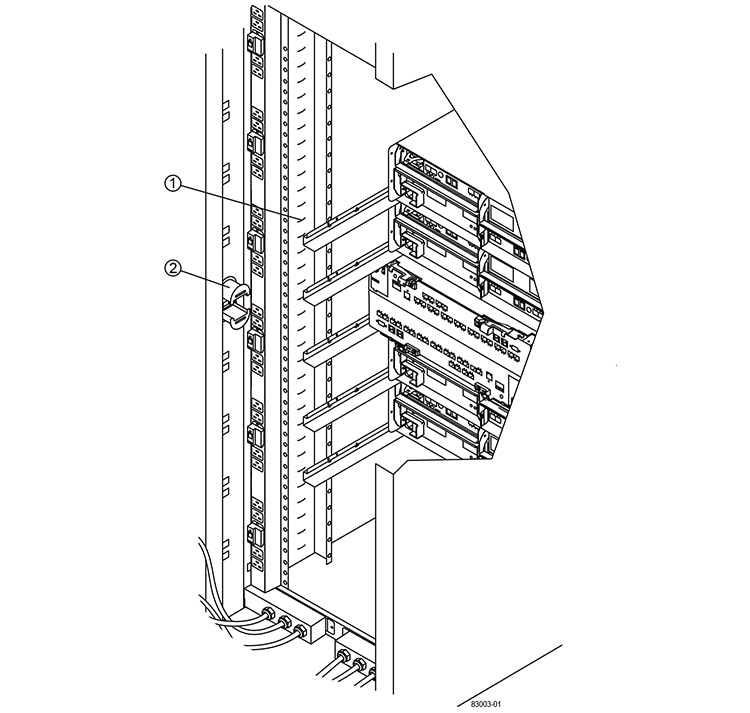
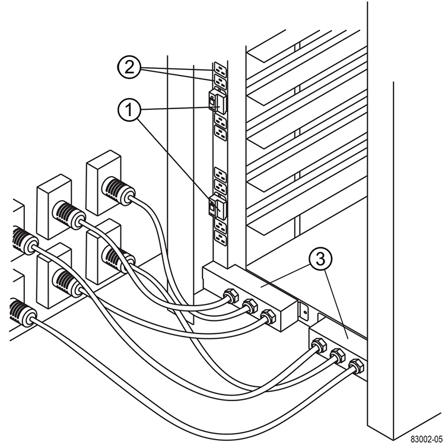

= Installation complète de l'armoire
:allow-uri-read: 
:icons: font
:imagesdir: ../media/

[role="lead"]
Après avoir déplacé l'armoire, abaissez les pieds de mise à niveau et le pied de stabilité, réinstallez les composants que vous avez retirés, installez les autres composants requis et connectez l'armoire à l'alimentation.

== Étape 1 : abaisser les pieds de mise à niveau et le pied de stabilité

Vous stabilisez l'armoire en réglant ses pieds. Les pieds de mise à niveau soutiennent l'armoire hors des roulettes. Le pied de stabilité empêche l'armoire de tomber une fois qu'elle est placée dans son emplacement permanent.

.Étapes
. Abaissez les pieds de mise à niveau pour soutenir l'armoire hors des roulettes.
+
Les pieds de mise à niveau sont situés près de chaque coin inférieur de l'armoire.

. Assurez-vous que l'armoire est aussi horizontale que possible.
+
La figure suivante offre une vue rapprochée du pied de stabilité et des pieds de mise à niveau.

+
image::../media/83000_08.gif[Pieds de mise à niveau et de stabilité]

+
|===

 a| 
1.
 a| 
Pieds de nivellement

 a| 
2.
 a| 
Pied de stabilité

|===

== Étape 2 : réinstallez les bacs

Après avoir déplacé l'armoire, vous pouvez réinstaller les bacs à leur emplacement d'origine.

CAUTION: _Ne pas_ installez les bacs suivants dans le haut de l'armoire au-dessus de votre tête. Lorsqu'ils sont entièrement remplis, chacun de ces plateaux pèse plus de 100 kg (220 lb). S'ils sont installés en haut de l'armoire, ces tiroirs créent une armoire haute capacité qui peut facilement être déséquilibrée : E2760, E2660, E5460, E5460, E5560, Et les tiroirs disques E5660, ainsi que le tiroir disque DE6600

.Étapes
. Réinstallez tous les bacs à leur emplacement d'origine dans l'armoire.
+

CAUTION: *Risque de blessure corporelle* -- un plateau vide pèse environ 56.7 kg (125 lb). Trois personnes sont nécessaires pour déplacer un bac vide en toute sécurité Si le bac est rempli de composants, un dispositif de levage mécanisé est nécessaire pour déplacer le bac en toute sécurité

. Réinstallez tous les composants à leur emplacement d'origine dans les bacs.
+
Pour éviter les conflits d'adresses et la perte de l'accès aux données, remplacez tous les composants du même bac et au même emplacement dans le bac

. Réinstallez tous les câbles à leur emplacement d'origine dans les bacs.
. Acheminez les câbles d'interface vers l'armoire.
. Acheminez les cordons d'alimentation principaux de l'armoire vers les deux sources d'alimentation externes. _Ne pas_ brancher les cordons d'alimentation pour le moment.

== Étape 3 : installer les bobines de câble et les attaches

Après avoir réinstallé les bacs, installez les bobines de câble et les attaches. Les bobines de câble et les attaches permettent de gérer l'excédent de longueur de câble et le routage des câbles pour les contrôleurs et les tiroirs.

.Étape
. Poser les bobines de câble et les attaches le long des deux côtés des sorties de distribution d'alimentation verticales.
+

+
|===

 a| 
1.
 a| 
Emplacement de l'attache-câble

 a| 
2.
 a| 
Bobine de câble

|===

== Étape 4 : installez des bacs supplémentaires

Si nécessaire, vous pouvez installer des bacs supplémentaires. Vous devez couvrir les positions inutilisées des plateaux pour assurer un débit d'air correct.

.Étapes
. Si vous avez des bacs supplémentaires qui doivent être installés, installez le matériel de montage pour ces bacs.
. Si l'avant de l'armoire n'est pas entièrement rempli de plateaux, utilisez des kits de panneau avant pour couvrir les espaces vides au-dessus ou en dessous des bacs installés.
+
Il est nécessaire de couvrir les espaces vides pour maintenir le débit d'air correct dans l'armoire.

. Mettez les bacs sous tension.

== Étape 5 : installer des rails de montage supplémentaires

Si vous installez des tiroirs de lecteurs de contrôleur ou des tiroirs de disques livrés séparément (non déjà installés dans l'armoire), vous devrez peut-être installer des rails de montage supplémentaires dans l'armoire.

.Étapes
. Déterminez l'emplacement des rails de montage.
+
** *Au-dessus d'un plateau existant* -- placez les rails de montage juste au-dessus du plateau supérieur dans l'armoire.
** *Sous un bac existant* -- placez les rails de montage suffisamment de dégagement pour maintenir le bac en place :
+
*** 8.9 cm (3.5 po) pour les tiroirs de disques de contrôleur 2U ou les tiroirs disques
*** 17.8 cm (7 po) pour les tiroirs de disques de contrôleur ou les tiroirs disques 4U

. Utilisez les marqueurs de mesure situés sur les supports verticaux avant droit et avant gauche pour fixer les rails de montage à la même position de chaque côté de l'armoire.
+
image::../media/92042_06.gif[Montage sur rail]

+
|===

 a| 
1.
 a| 
Rail réglable avant

 a| 
2.
 a| 
Rail arrière réglable

 a| 
3.
 a| 
Plaque de réglage et vis

 a| 
4.
 a| 
Vis M5×10 mm pour montage sur rail

 a| 
5.
 a| 
Ecrous d'attache

 a| 
6.
 a| 
Support de fixation arrière

 a| 
7.
 a| 
Support vertical

|===
+

NOTE: Les écrous à clip et le support de maintien arrière ne sont pas utilisés lorsque les rails sont installés dans une armoire 3040.

. Placer le rail réglable arrière sur le support vertical.
. Sur le rail réglable arrière, alignez les trous du rail réglable devant les trous du support vertical.
. Fixer deux vis M5×10 mm.
+
.. Fixez les vis à travers le rail de support vertical et le rail réglable arrière.
.. Serrez les vis.

. Placer le rail réglable avant sur le support vertical.
. Sur le rail réglable avant, alignez les trous du rail réglable devant les trous du support vertical.
. Fixer deux vis M5×10 mm.
+
.. Fixez une vis à travers le rail de support vertical et le trou inférieur du rail réglable avant.
.. Fixez une vis à travers le rail de support vertical et le milieu des trois trous supérieurs du rail réglable avant.
.. Serrez les vis.

+

NOTE: Les deux autres trous de vis sont utilisés pour monter le bac

. Répétez les étapes 3 à 8 pour fixer le second rail de l'autre côté de l'armoire.
. Installez chaque bac à l'aide des instructions d'installation appropriées.
. Choisissez l'une des options suivantes :
+
** Si toutes les positions des bacs sont pleines, mettez-les sous tension.
** Si toutes les positions des bacs ne sont pas pleines, utilisez des kits du panneau avant pour couvrir les espaces vides au-dessus ou en dessous des bacs installés.

== Étape 6 : branchez l'armoire sur l'alimentation

Pour terminer l'installation de l'armoire, mettez les composants de l'armoire sous tension.

.Description de la tâche
Pendant que les bacs exécutent la procédure de mise sous tension, les voyants situés à l'avant et à l'arrière des bacs clignotent. Selon votre configuration, la procédure de mise sous tension peut prendre plusieurs minutes.

.Étapes
. Coupez l'alimentation de tous les composants de l'armoire.
. Placer les 12 disjoncteurs en position arrêt (vers le bas).
. Branchez chacun des six connecteurs NEMA L6-30 (États-Unis et Canada) ou les six connecteurs CEI 60309 (partout dans le monde, sauf pour les États-Unis et le Canada) dans une prise électrique disponible.
+

NOTE: Vous devez connecter chaque PDU à une source d'alimentation indépendante à l'extérieur de l'armoire.

. Mettre les 12 disjoncteurs en position marche (vers le haut).
+

+
|===

 a| 
1.
 a| 
Disjoncteurs

 a| 
2.
 a| 
Prises électriques

 a| 
3.
 a| 
Boîtiers d'entrée électrique

|===
. Mettez tous les tiroirs disques de l'armoire sous tension.
+

NOTE: Patientez 60 secondes après la mise sous tension des tiroirs du disque avant de mettre les tiroirs du contrôleur sous tension.

. Patientez 60 secondes après la mise sous tension des tiroirs disques, puis remettez-le sous tension à tous les tiroirs disques du contrôleur de l'armoire.

.Résultat
L'installation de l'armoire est terminée. Vous pouvez reprendre les opérations normales.
