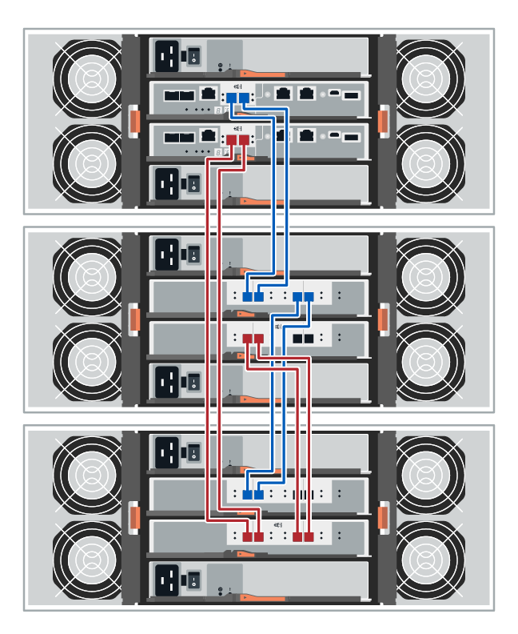

= Câblage du tiroir contrôleur au tiroir disque (E-Series)
:allow-uri-read: 
:icons: font
:imagesdir: ../media/

[role="lead"]
Vous devez connecter chaque contrôleur du tiroir contrôleur à un module d'E/S (IOM) d'un tiroir disque.

Cette procédure s'applique aux étagères de lecteurs IOM12, IOM12B et IOM12C.

NOTE: Les modules IOM12C sont uniquement pris en charge par SANtricity OS 11.70.2 et versions ultérieures. Assurez-vous que le micrologiciel de votre contrôleur a été mis à jour avant d'installer ou de mettre à niveau vers un IOM12C.

NOTE: Cette procédure concerne les remplacements ou les remplacements à chaud de module d'E/S de tiroir similaires. Cela signifie que vous ne pouvez remplacer qu'un module IOM12 par un autre module IOM12 ou remplacer un module IOM12C par un autre module IOM12C. (Votre tiroir peut être équipé de deux modules IOM12 ou de deux modules IOM12C.)

Si vous câbler un tiroir contrôleur plus ancien vers un DE212C, DE224C ou DE460, reportez-vous à la section https://mysupport.netapp.com/ecm/ecm_download_file/ECMLP2859057["Ajout de tiroirs disques IOM à un tiroir contrôleur E27XX, E56XX ou EF560 existant"^].

== Câblage des systèmes E2800 et E5700

Les informations suivantes s'appliquent au câblage des systèmes E2800, E2800B, EF280, E5700, EF5700B, Ou tiroir contrôleur EF570 vers un tiroir disque DE212C, DE224C ou DE460.

[role="tabbed-block"]
====
.tiroir de 12 ou 24 disques
--
Vous pouvez connecter le tiroir de votre contrôleur à un ou plusieurs tiroirs de 12 ou 24 disques.

L'image suivante montre une représentation du tiroir contrôleur et des tiroirs disques. Pour localiser les ports de votre modèle, reportez-vous à la section https://hwu.netapp.com/Controller/Index?platformTypeId=2357027["Hardware Universe"^].

image::../media/12_24_cabling.png[Un tiroir contrôleur et des tiroirs de 12 ou 24 disques]

--
.tiroir de 60 disques
--
Vous pouvez connecter le tiroir de votre contrôleur à un ou plusieurs tiroirs de 60 disques.

L'image suivante montre une représentation du tiroir contrôleur et des tiroirs disques. Pour localiser les ports de votre modèle, reportez-vous à la section https://hwu.netapp.com/Controller/Index?platformTypeId=2357027["Hardware Universe"^].

--
====

== Câblage EF300 et EF600

Les informations suivantes s'appliquent au câblage d'un tiroir contrôleur EF300, EF600, EF300C ou EF600C vers un tiroir disque DE212C, DE224C ou DE460.

.Avant de commencer
Avant de câbler une baie EF300 ou EF600, assurez-vous que la dernière version du firmware est mise à jour. Pour mettre à jour le micrologiciel, suivez les instructions de la section link:../upgrade-santricity/index.html["Mise à niveau de SANtricity OS"^].

[role="tabbed-block"]
====
.tiroir de 12 ou 24 disques
--
Vous pouvez connecter le tiroir de votre contrôleur à un ou plusieurs tiroirs de 12 ou 24 disques.

L'image suivante montre une représentation du tiroir contrôleur et des tiroirs disques. Pour localiser les ports de votre modèle, reportez-vous à la section https://hwu.netapp.com/Controller/Index?platformTypeId=2357027["Hardware Universe"^].

image::../media/ef_to_de224c_four_shelves.png[Un tiroir contrôleur et des tiroirs de 12 ou 24 disques]

--
.tiroir de 60 disques
--
Vous pouvez connecter le tiroir de votre contrôleur à un ou plusieurs tiroirs de 60 disques.

L'image suivante montre une représentation du tiroir contrôleur et des tiroirs disques. Pour localiser les ports de votre modèle, reportez-vous à la section https://hwu.netapp.com/Controller/Index?platformTypeId=2357027["Hardware Universe"^].

image::../media/ef_to_de460c.png[Un tiroir contrôleur et des tiroirs de 60 disques]

--
====

== Câblage E4000

Les informations suivantes s'appliquent au câblage d'un tiroir contrôleur E4000 à un tiroir disque DE212C, DE224C ou DE460.

[role="tabbed-block"]
====
.tiroir de 12 disques
--
Vous pouvez connecter le tiroir de votre contrôleur à un ou plusieurs tiroirs de 12 disques.

image::../media/e4012_cabling.png[Un tiroir contrôleur et un tiroir de 12 disques]

--
.tiroir de 60 disques
--
Vous pouvez connecter le tiroir de votre contrôleur à un ou plusieurs tiroirs de 60 disques.

image::../media/e4060_cabling.png[Un tiroir contrôleur et des tiroirs de 60 disques]

--
====