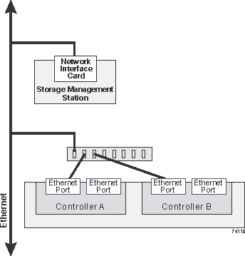

= Câblage Ethernet pour une station de gestion
:allow-uri-read: 
:icons: font
:imagesdir: ../media/

[role="lead"]
Vous pouvez connecter votre système de stockage à un réseau Ethernet pour la gestion hors bande des baies de stockage. Vous devez utiliser des câbles Ethernet pour toutes les connexions de gestion de la baie de stockage.

== Topologie directe

Une topologie directe connecte votre contrôleur directement à un réseau Ethernet.

Vous devez connecter le port de gestion 1 de chaque contrôleur pour la gestion hors bande et laisser le port 2 disponible pour accéder à la baie de stockage par le support technique.

.Connexions directes de la gestion du stockage
image::../media/74167.gif[74167]

== Topologie de la structure

Une topologie de structure utilise un commutateur pour connecter votre contrôleur à un réseau Ethernet.

Vous devez connecter le port de gestion 1 de chaque contrôleur pour la gestion hors bande et laisser le port 2 disponible pour accéder à la baie de stockage par le support technique.

.Les connexions de la gestion du stockage de la structure

