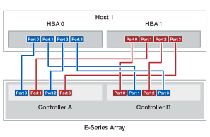

= Câblage pour connecter un hôte à des contrôleurs ou des commutateurs (E-Series)
:allow-uri-read: 
:icons: font
:imagesdir: ../media/

[role="lead"]
Vous pouvez connecter un hôte directement à un contrôleur (topologie à connexion directe) ou utiliser des commutateurs (topologie de commutateur) pour connecter un hôte à un contrôleur.

== Câblage pour topologie à connexion directe

Une topologie DAS connecte directement les adaptateurs hôtes aux contrôleurs de votre système de stockage.

Pour garantir des performances optimales, utilisez tous les ports d'adaptateur hôte disponibles.

.Un hôte avec deux HBA
La figure suivante montre un exemple d'un hôte avec deux HBA installés.

.Un hôte avec deux HBA (câblage alternatif)
La figure suivante montre un exemple d'un hôte avec deux HBA installés.

image::../media/1host_2hbas_alternate_wkflw_ieops-2147.svg[Un hôte/deux HBA et deux contrôleurs (câblage alternatif)]

.Deux hôtes avec deux HBA par hôte
La figure suivante montre un exemple de deux hôtes chacun avec deux HBA installés.

image::../media/2hosts_4hbas_ieops-2146.svg[Deux hôtes/quatre HBA et deux contrôleurs]

== Câblage pour une topologie de commutateur

Une topologie de commutateur utilise des commutateurs pour connecter les hôtes aux contrôleurs du système de stockage. Le commutateur doit prendre en charge le type de connexion utilisé entre l'hôte et le contrôleur.

La figure suivante montre un exemple de connexion. Pour les commutateurs offrant une fonctionnalité de provisionnement, il est conseillé d'isoler chaque paire cible et initiateur.

.Deux hôtes et deux commutateurs
image::../media/topology_host_fabric_generic_ieops-2152.svg[Câblage entre deux hôtes et deux switchs]

*(1)* _Connectez directement chaque carte hôte au commutateur._

*(2)* _Connectez directement chaque commutateur aux ports hôte des contrôleurs. Pour garantir des performances optimales, utilisez tous les ports d'adaptateur hôte disponibles._
