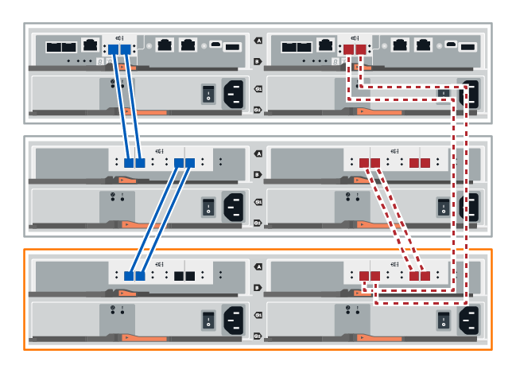

= Ajout à chaud d'un tiroir disque
:allow-uri-read: 
:icons: font
:imagesdir: ../media/

[role="lead"]
Vous pouvez ajouter un nouveau tiroir disque pendant que l'alimentation est toujours appliquée aux autres composants du système de stockage. Vous pouvez configurer, reconfigurer, ajouter ou transférer la capacité du système de stockage sans interrompre l'accès des utilisateurs aux données.

.Avant de commencer
En raison de la complexité de cette procédure, il est recommandé de procéder comme suit :

* Lire toutes les étapes avant de commencer la procédure.
* Assurez-vous que l'ajout à chaud d'un tiroir disque est la procédure adéquate.

.Description de la tâche
Cette procédure s'applique à l'ajout à chaud d'un tiroir disque DE212C, DE224C ou DE460C à un tiroir contrôleur E2800, E2800B, EF280, E5700, E5700B, EF570, EF300, EF600 ou E4000.

Cette procédure s'applique aux tiroirs disques IOM12 et IOM12B.

NOTE: Les modules IOM12B sont uniquement pris en charge par SANtricity OS 11.70.2 et versions ultérieures. Assurez-vous que le micrologiciel de votre contrôleur a été mis à jour avant d'installer ou de mettre à niveau vers un IOM12B.

NOTE: Cette procédure concerne les remplacements ou les remplacements à chaud de module d'E/S de tiroir similaires. Cela signifie que vous ne pouvez remplacer qu'un module IOM12 par un autre module IOM12 ou remplacer un module IOM12B par un autre module IOM12B. (Votre tiroir peut être équipé de deux modules IOM12 ou de deux modules IOM12B.)

Si vous câbler un tiroir contrôleur plus ancien vers un DE212C, DE224C ou DE460, reportez-vous à la section https://mysupport.netapp.com/ecm/ecm_download_file/ECMLP2859057["Ajout de tiroirs disques IOM à un tiroir contrôleur E27XX, E56XX ou EF560 existant"^].

NOTE: Pour préserver l'intégrité du système, vous devez suivre la procédure exactement dans l'ordre indiqué.

== Étape 1 : préparez-vous à ajouter le tiroir disque

Pour préparer l'ajout à chaud d'un tiroir disque, vérifiez la présence d'événements critiques et le statut des IOM.

.Avant de commencer
* La source d'alimentation de votre système de stockage doit être capable de répondre aux besoins en alimentation du nouveau tiroir disque. Pour connaître les spécifications d'alimentation de votre tiroir disque, reportez-vous au https://hwu.netapp.com/Controller/Index?platformTypeId=2357027["Hardware Universe"^].
* Le modèle de câblage du système de stockage existant doit correspondre à l'un des schémas applicables présentés dans cette procédure.

.Étapes
. Dans SANtricity System Manager, sélectionnez *support* > *support Center* > *Diagnostics*.
. Sélectionnez *collecter les données de support*.
+
La boîte de dialogue récupérer les données de support s'affiche.

. Cliquez sur *collect*.
+
Le fichier est enregistré dans le dossier Téléchargements de votre navigateur sous le nom support-data.7z. Les données ne sont pas automatiquement envoyées au support technique.

. Sélectionnez *support* > *Journal des événements*.
+
La page Journal des événements affiche les données d'événement.

. Sélectionnez l'en-tête de la colonne *priorité* pour trier les événements critiques en haut de la liste.
. Examinez les événements critiques du système pour les événements survenus au cours des deux à trois dernières semaines et vérifiez que tous les événements critiques récents ont été résolus ou résolus.
+

NOTE: Si des événements critiques non résolus se sont produits au cours des deux à trois semaines précédentes, arrêtez la procédure et contactez le support technique. Continuer la procédure uniquement lorsque le problème est résolu.

. Si des modules d'E/S sont connectés au matériel, procédez comme suit. Sinon, passez à l' <<step2_install_drive_shelf,Étape 2 : installez le tiroir disque et mettez-le sous tension.>>
+
.. Sélectionnez *matériel*.
.. Sélectionnez l'icône *modules d'E/S (IOM)*.
+
image::../media/sam1130_ss_hardware_iom_icon.gif[Icône IOM (ESMS)]

+
La boîte de dialogue Paramètres des composants de la tablette s'affiche avec l'onglet *IOM (ESM)* sélectionné.

.. Assurez-vous que l'état indiqué pour chaque IOM/ESM est _optimal_.
.. Cliquez sur *Afficher plus de paramètres*.
.. Vérifiez que les conditions suivantes sont réunies :
+
*** Le nombre de modules de gestion des E/S détectés correspond au nombre d'modules de gestion des E/S installés dans le système et à celui de chaque tiroir de disque.
*** Les deux EDM/modules d'E/S montrent que la communication est correcte.
*** Le débit de données est de 12 Gbit/s pour les tiroirs disques DE212C, DE224C et DE460C ou de 6 Gbit/s pour les autres tiroirs disques.

== Étape 2 : installer le tiroir disque et mettre sous tension

Vous installez un nouveau tiroir disque ou un tiroir disque installé précédemment, mettez sous tension et vérifiez si les LED nécessitent une intervention.

.Étapes
. Si vous installez un tiroir disque qui a déjà été installé dans un système de stockage, retirez les lecteurs. Les lecteurs doivent être installés un par un plus tard dans cette procédure.
+
Si l'historique d'installation du tiroir disque que vous installez est inconnu, vous devez supposer qu'il a été précédemment installé dans un système de stockage.

. Installez le tiroir disque dans le rack qui contient les composants du système de stockage.
+

NOTE: Consultez les instructions d'installation de votre modèle pour connaître la procédure complète d'installation physique et de câblage d'alimentation. Les instructions d'installation de votre modèle incluent des notes et des avertissements que vous devez prendre en compte pour installer en toute sécurité une étagère de disques.

. Mettez le nouveau tiroir disque sous tension et vérifiez qu'aucun voyant d'avertissement orange n'est allumé sur le tiroir disque. Si possible, résolvez toute anomalie avant de poursuivre cette procédure.

== Étape 3 : branchez le système sur le câble

Si vous câbler un tiroir contrôleur plus ancien vers un DE212C, DE224C ou DE460, reportez-vous à la section https://mysupport.netapp.com/ecm/ecm_download_file/ECMLP2859057["Ajout de tiroirs disques IOM à un tiroir contrôleur E27XX, E56XX ou EF560 existant"^].

[role="tabbed-block"]
====
.Connectez le tiroir disque pour les systèmes E2800 ou E5700
--
Vous connectez le tiroir disque au contrôleur A, confirmez l'état du module d'E/S et connectez le tiroir disque au contrôleur B.

.Étapes
. Connectez le tiroir disque au contrôleur A.
+
La figure suivante montre un exemple de connexion entre un tiroir disque supplémentaire et le contrôleur A. Pour localiser les ports de votre modèle, reportez-vous à la section https://hwu.netapp.com/Controller/Index?platformTypeId=2357027["Hardware Universe"^].

+
image::../media/hot_e5700_0.png[Connectez le tiroir disque au contrôleur]

+
image::../media/hot_e5700_1.png[Connectez le tiroir disque au contrôleur]

. Dans le Gestionnaire système SANtricity, cliquez sur *matériel*.
+

NOTE: À ce stade de la procédure, un seul chemin d'accès actif vers le tiroir contrôleur n'est disponible.

. Faites défiler vers le bas si nécessaire pour voir tous les tiroirs disques du nouveau système de stockage. Si le nouveau tiroir disque n'est pas affiché, résolvez le problème de connexion.
. Sélectionnez l'icône *ESMS/IOMS* pour la nouvelle étagère de disques.
+
image::../media/sam1130_ss_hardware_iom_icon.gif[Icône ESMS/IOM]

+
La boîte de dialogue *Paramètres de composant de tiroir* s'affiche.

. Sélectionnez l'onglet *ESMS/IOMS* dans la boîte de dialogue *Paramètres de composant de tiroir*.
. Sélectionnez *Afficher plus d'options* et vérifiez les éléments suivants :
+
** IOM/ESM A figure dans la liste.
** Le débit de données actuel est de 12 Gbit/s pour un tiroir disque SAS-3.
** Les communications de la carte sont correctes.

. Débrancher tous les câbles d'extension du contrôleur B.
. Connectez le tiroir disque au contrôleur B.
+
La figure suivante montre un exemple de connexion entre un tiroir disque supplémentaire et le contrôleur B. Pour localiser les ports de votre modèle, reportez-vous à la section https://hwu.netapp.com/Controller/Index?platformTypeId=2357027["Hardware Universe"^].

+

. Si ce n'est pas déjà fait, sélectionnez l'onglet *ESMS/IOMS* dans la boîte de dialogue *Paramètres de composant de tiroir*, puis sélectionnez *Afficher plus d'options*. Vérifiez que les communications de la carte sont *OUI*.
+

NOTE: L'état optimal indique que la perte d'erreur de redondance associée au nouveau tiroir disque a été résolue et que le système de stockage est stabilisé.

--
.Connectez le tiroir disque pour EF300 ou EF600
--
Vous connectez le tiroir disque au contrôleur A, confirmez l'état du module d'E/S et connectez le tiroir disque au contrôleur B.

.Avant de commencer
* Vous avez mis à jour votre micrologiciel à la dernière version. Pour mettre à jour votre micrologiciel, suivez les instructions de la section link:../upgrade-santricity/index.html["Mise à niveau de SANtricity OS"].

.Étapes
. Déconnectez les deux câbles du contrôleur côté A des ports IOM12 un et deux du dernier tiroir précédent de la pile, puis connectez-les aux nouveaux ports IOM12 du tiroir un et deux.
+
image::../media/de224c_sides.png[Déconnectez les câbles du contrôleur A et connectez-les au nouveau tiroir]

. Connectez les câbles aux ports IOM12 latéraux A trois et quatre du nouveau tiroir aux ports 1 et 2 du dernier tiroir IOM12 précédent.
+
La figure suivante montre un exemple de connexion côté entre un tiroir disque supplémentaire et le dernier tiroir précédent. Pour localiser les ports de votre modèle, reportez-vous à la section https://hwu.netapp.com/Controller/Index?platformTypeId=2357027["Hardware Universe"^].

+
image::../media/hot_ef_0.png[Exemple de câblage de tiroir disque]

+
image::../media/hot_ef_1.png[Exemple de câblage de tiroir disque]

. Dans le Gestionnaire système SANtricity, cliquez sur *matériel*.
+

NOTE: À ce stade de la procédure, un seul chemin d'accès actif vers le tiroir contrôleur n'est disponible.

. Faites défiler vers le bas si nécessaire pour voir tous les tiroirs disques du nouveau système de stockage. Si le nouveau tiroir disque n'est pas affiché, résolvez le problème de connexion.
. Sélectionnez l'icône *ESMS/IOMS* pour la nouvelle étagère de disques.
+
image::../media/sam1130_ss_hardware_iom_icon.gif[Icône ESMS/IOM]

+
La boîte de dialogue *Paramètres de composant de tiroir* s'affiche.

. Sélectionnez l'onglet *ESMS/IOMS* dans la boîte de dialogue *Paramètres de composant de tiroir*.
. Sélectionnez *Afficher plus d'options* et vérifiez les éléments suivants :
+
** IOM/ESM A figure dans la liste.
** Le débit de données actuel est de 12 Gbit/s pour un tiroir disque SAS-3.
** Les communications de la carte sont correctes.

. Déconnectez les deux câbles du contrôleur côté B des ports IOM12 un et deux du dernier tiroir précédent de la pile, puis connectez-les aux nouveaux ports IOM12 du tiroir un et deux.
. Connectez les câbles aux ports IOM12 du côté B trois et quatre du nouveau shelf aux ports IOM12 du dernier tiroir précédent un et deux.
+
La figure suivante montre un exemple de connexion côté B entre un tiroir disque supplémentaire et le dernier tiroir précédent. Pour localiser les ports de votre modèle, reportez-vous à la section https://hwu.netapp.com/Controller/Index?platformTypeId=2357027["Hardware Universe"^].

+
image::../media/hot_ef_2.png[Exemple de câblage de tiroir disque]

. Si ce n'est pas déjà fait, sélectionnez l'onglet *ESMS/IOMS* dans la boîte de dialogue *Paramètres de composant de tiroir*, puis sélectionnez *Afficher plus d'options*. Vérifiez que les communications de la carte sont *OUI*.
+

NOTE: L'état optimal indique que la perte d'erreur de redondance associée au nouveau tiroir disque a été résolue et que le système de stockage est stabilisé.

--
.Connectez le tiroir disque pour E4000
--
Vous connectez le tiroir disque au contrôleur A, confirmez l'état du module d'E/S et connectez le tiroir disque au contrôleur B.

.Étapes
. Connectez le tiroir disque au contrôleur A.
+
image::../media/hot_e4000_cabling_1.png[Câblage du tiroir disque]

. Dans le Gestionnaire système SANtricity, cliquez sur *matériel*.
+

NOTE: À ce stade de la procédure, un seul chemin d'accès actif vers le tiroir contrôleur n'est disponible.

. Faites défiler vers le bas si nécessaire pour voir tous les tiroirs disques du nouveau système de stockage. Si le nouveau tiroir disque n'est pas affiché, résolvez le problème de connexion.
. Sélectionnez l'icône *ESMS/IOMS* pour la nouvelle étagère de disques.
+
image::../media/sam1130_ss_hardware_iom_icon.gif[Icône matériel de module d'E/S.]

+
La boîte de dialogue *Paramètres de composant de tiroir* s'affiche.

. Sélectionnez l'onglet *ESMS/IOMS* dans la boîte de dialogue *Paramètres de composant de tiroir*.
. Sélectionnez *Afficher plus d'options* et vérifiez les éléments suivants :
+
** IOM/ESM A figure dans la liste.
** Le débit de données actuel est de 12 Gbit/s pour un tiroir disque SAS-3.
** Les communications de la carte sont correctes.

. Débrancher tous les câbles d'extension du contrôleur B.
. Connectez le tiroir disque au contrôleur B.
+
image::../media/hot_e4000_cabling_2.png[Câblage du tiroir disque]

. Si ce n'est pas déjà fait, sélectionnez l'onglet *ESMS/IOMS* dans la boîte de dialogue *Paramètres de composant de tiroir*, puis sélectionnez *Afficher plus d'options*. Vérifiez que les communications de la carte sont *OUI*.
+

NOTE: L'état optimal indique que la perte d'erreur de redondance associée au nouveau tiroir disque a été résolue et que le système de stockage est stabilisé.

--
====

== Étape 4 : ajout à chaud complet

Pour terminer l'ajout à chaud, vérifiez s'il n'y a pas d'erreur et vérifiez que le tiroir disque ajouté utilise le dernier firmware.

.Étapes
. Dans le Gestionnaire système SANtricity, cliquez sur *Accueil*.
. Si le lien intitulé *Recover from problemes* apparaît au centre de la page, cliquez sur le lien et résolvez les problèmes indiqués dans le Recovery Guru.
. Dans le Gestionnaire système SANtricity, cliquez sur *matériel*, puis faites défiler la liste vers le bas si nécessaire pour afficher le nouveau tiroir disque ajouté.
. Pour les disques qui ont été installés dans un autre système de stockage, ajoutez un disque à la fois au tiroir qui vient d'être installé. Attendez que chaque lecteur soit reconnu avant d'insérer le disque suivant.
+
Lorsqu'un lecteur est reconnu par le système de stockage, la représentation de l'emplacement du lecteur dans la page *Hardware* s'affiche sous la forme d'un rectangle bleu.

. Sélectionnez l'onglet *support* > *support Center* > *support Resources*.
. Cliquez sur le lien *Software and Firmware Inventory*, puis vérifiez quelles versions du firmware IOM/ESM et du firmware du lecteur sont installées sur le nouveau tiroir.
+

NOTE: Vous devrez peut-être faire défiler la page pour accéder à ce lien.

. Si nécessaire, mettez à niveau le micrologiciel du lecteur.
+
Le firmware IOM/ESM est automatiquement mis à niveau vers la dernière version, sauf si vous avez désactivé la fonctionnalité de mise à niveau.

La procédure d'ajout à chaud est terminée. Vous pouvez reprendre les opérations normales.
