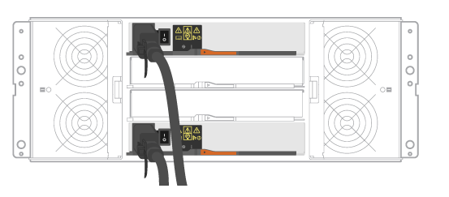

= Branchez les câbles des tiroirs
:allow-uri-read: 
:icons: font
:imagesdir: ../media/

[role="lead"]
Découvrez comment connecter les câbles d'alimentation et mettre les tiroirs disques sous tension.

.Avant de commencer
* Installez votre matériel.
* Prenez les précautions anti-statiques.

Cette procédure s'applique aux tiroirs disques IOM12 et IOM12B.

NOTE: Les modules IOM12B sont uniquement pris en charge par SANtricity OS 11.07.2 et versions ultérieures. Assurez-vous que le micrologiciel de votre contrôleur a été mis à jour avant d'installer ou de mettre à niveau vers un IOM12B.

NOTE: Cette procédure concerne les remplacements ou les remplacements à chaud de module d'E/S de tiroir similaires. Cela signifie que vous ne pouvez remplacer qu'un module IOM12 par un autre module IOM12 ou remplacer un module IOM12B par un autre module IOM12B. (Votre tiroir peut être équipé de deux modules IOM12 ou de deux modules IOM12B.)

.Étapes
. Branchez les câbles des tiroirs.
+
Branchez les câbles du système en fonction de votre configuration. Si vous avez besoin de plus d'options de câblage que les exemples présentés dans cette section, reportez-vous à la section link:../install-hw-cabling/index.html["Câblage"].

+
Pour les exemples présentés dans cette section, vous avez besoin des câbles suivants :

+
|===

 a| 
image:../media/sas_cable.png[""]
 a| 
*Câbles SAS*

|===
+
.Exemple A : un tiroir contrôleur E2860 avec deux tiroirs disques DE460C dans une configuration SAS standard.

+
.. Reliez le contrôleur A au module d'E/S A du premier tiroir de disque.
.. Reliez le module d'E/S A du premier tiroir de disque au module d'E/S A du second tiroir de disque.
.. Sur les câbles du premier tiroir de disque, le module d'E/S B du second tiroir.
.. Reliez le contrôleur B au module d'E/S B du second tiroir de disque.

+
.Exemple B : un tiroir contrôleur E2860 avec un tiroir disque DE460C dans une configuration SAS standard.
image:../media/example_b_2860.png[""]

+
.. Reliez le contrôleur A au module A.
.. Le câble du contrôleur B vers l'IOM B.

. Met les tiroirs disques sous tension.
+
Vous avez besoin des câbles suivants :

+
|===

 a| 
image:../media/power_cable_inst-hw-e2800-e5700.png[""]
 a| 
* Câbles d'alimentation*

|===
+

CAUTION: Vérifiez que les boutons d'alimentation des tiroirs disques sont éteints.

+
.. Connectez les deux câbles d'alimentation de chaque shelf à différentes unités de distribution de l'alimentation dans l'armoire ou le rack.
.. Si vous avez des tiroirs disques, mettez d'abord les deux commutateurs de mise sous tension. Attendre 2 minutes avant d'appliquer la mise sous tension du tiroir contrôleur.
.. Allumer les deux boutons marche/arrêt sur le tiroir contrôleur.
.. Vérifier les LED et l'affichage à sept segments sur chaque contrôleur.
+
Au cours de l'amorçage, l'écran à sept segments affiche la séquence répétée de OS, SD, vierge pour indiquer que le contrôleur exécute le traitement au début de la journée. Une fois le contrôleur démarré, l'ID de tiroir s'affiche.

+
|===

 a| 
*Exemple : les connexions d'alimentation se trouvent à l'arrière de l'étagère.*

|===

