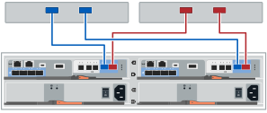

= Configuration complète du système de stockage (E4012)
:allow-uri-read: 
:icons: font
:imagesdir: ../media/

[role="lead"]
Découvrez comment câbler les contrôleurs à votre réseau et configurer un système de stockage.

== Étape 1 : câblage des hôtes de données

Branchez les câbles du système en fonction de la topologie de votre réseau.

[role="tabbed-block"]
====
.Option 1 : topologie à connexion directe
--
L'exemple suivant montre le câblage aux hôtes de données via une topologie de connexion directe.

. Si aucun tiroir d'extension n'est installé, connectez directement chaque adaptateur hôte aux ports hôtes e0a et e0b des contrôleurs.

--
.Option 2 : topologie de la structure
--
L'exemple suivant montre le câblage vers les hôtes de données via une topologie de structure.

image:../media/drw_e4012_fabric_topology_ieops-2046.svg["Topologie de structure E4012, largeur=1000 px"]

. Connectez chaque adaptateur hôte directement au commutateur.
. Connectez chaque commutateur directement aux ports hôtes e0a et e0b des contrôleurs.

--
====

== Étape 2 : connexion et configuration de la connexion de gestion

Vous pouvez configurer les ports de gestion du contrôleur à l'aide d'un serveur DHCP ou d'une adresse IP statique.

[role="tabbed-block"]
====
.Option 1 : serveur DHCP
--
Découvrez comment configurer les ports de gestion avec un serveur DHCP.

.Avant de commencer
* Configurez votre serveur DHCP pour associer une adresse IP, un masque de sous-réseau et une adresse de passerelle en tant que bail permanent pour chaque contrôleur.
* Obtenez les adresses IP attribuées pour vous connecter au système de stockage à partir de votre administrateur réseau.

.Étapes
. Connectez un câble Ethernet au port de gestion de chaque contrôleur et connectez l'autre extrémité à votre réseau.
+
Les figures suivantes présentent des exemples d'emplacement du port de gestion du contrôleur :

+
image:../media/e4000_management_port.png["Port de gestion du contrôleur E4000"]

. Ouvrez un navigateur et connectez-vous au système de stockage en utilisant l'une des adresses IP de contrôleur que vous avez fournies votre administrateur réseau.

--
.Option 2 : adresse IP statique
--
Découvrez comment configurer manuellement les ports de gestion en entrant l'adresse IP et le masque de sous-réseau.

.Avant de commencer
* Obtenez l'adresse IP des contrôleurs, le masque de sous-réseau, l'adresse de passerelle et les informations des serveurs DNS et NTP auprès de votre administrateur réseau.
* Assurez-vous que l'ordinateur portable que vous utilisez ne reçoit pas la configuration réseau d'un serveur DHCP.

.Étapes
. À l'aide d'un câble Ethernet, connectez le port de gestion du contrôleur A au port Ethernet d'un ordinateur portable.
+
Les figures suivantes présentent des exemples d'emplacement du port de gestion du contrôleur :

+
image:../media/e4000_management_port.png["Port de gestion du contrôleur E4000"]

. Ouvrez un navigateur et utilisez l'adresse IP par défaut (169.254.128.101) pour établir une connexion au contrôleur. Le contrôleur renvoie un certificat auto-signé. Le navigateur vous informe que la connexion n'est pas sécurisée.
. Suivez les instructions du navigateur pour continuer et lancer SANtricity System Manager. Si vous ne parvenez pas à établir de connexion, vérifiez que vous ne recevez pas la configuration réseau d'un serveur DHCP.
. Définissez le mot de passe du système de stockage pour vous connecter.
. Utilisez les paramètres réseau fournis par votre administrateur réseau dans l'assistant *configurer les paramètres réseau* pour configurer les paramètres réseau du contrôleur A, puis sélectionnez *Terminer*.
+

NOTE: Étant donné que vous réinitialisez l'adresse IP, System Manager perd la connexion au contrôleur.

. Déconnectez le câble ethernet du système de stockage et connectez le port de gestion du contrôleur A à votre réseau.
. Ouvrez un navigateur sur un ordinateur connecté à votre réseau et entrez l'adresse IP du contrôleur A nouvellement configurée.
+

NOTE: Si vous perdez la connexion au contrôleur A, vous pouvez connecter un câble ethernet au contrôleur B pour rétablir la connexion au contrôleur A via le contrôleur B (169.254.128.102).

. Connectez-vous à l'aide du mot de passe que vous avez défini précédemment. L'assistant configurer les paramètres réseau s'affiche.
. Utilisez les paramètres réseau fournis par votre administrateur réseau dans l'assistant *configurer les paramètres réseau* pour configurer les paramètres réseau du contrôleur B, puis sélectionnez *Terminer*.
. Connectez le contrôleur B à votre réseau.
. Validez les paramètres réseau du contrôleur B en entrant l'adresse IP récemment configurée du contrôleur B dans un navigateur.
+

NOTE: Si vous perdez la connexion au contrôleur B, vous pouvez utiliser votre connexion validée précédemment au contrôleur A pour rétablir la connexion au contrôleur B via le contrôleur A.

--
====

== Étape 3 : configurer et gérer votre système de stockage

Une fois votre matériel installé, utilisez le logiciel SANtricity pour configurer et gérer votre système de stockage.

.Avant de commencer
* Configurez vos ports de gestion.
* Vérifiez et enregistrez votre mot de passe et vos adresses IP.

.Étapes
. Utilisez le logiciel SANtricity pour configurer et gérer vos baies de stockage.
. Dans la configuration réseau la plus simple, connectez votre contrôleur à un navigateur Web et utilisez SANtricity System Manager pour gérer une seule baie de stockage de la gamme E4000. Pour accéder à System Manager, utilisez les mêmes adresses IP que celles que vous avez utilisées pour configurer vos ports de gestion.

