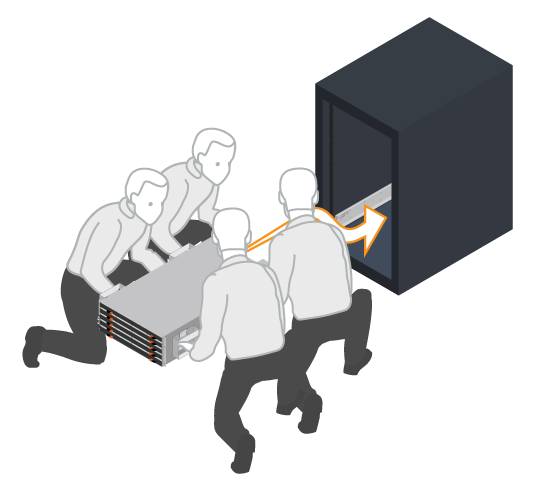

= Installer le matériel - E4012
:allow-uri-read: 
:icons: font
:imagesdir: ../media/

[role="lead"]
Découvrez comment installer un système de stockage E4012 ou DE212C dans un rack à deux montants ou une armoire système NetApp.

.Avant de commencer
Assurez-vous de faire ce qui suit :

* Enregistrez votre matériel sur http://mysupport.netapp.com/["Support NetApp"^].
* Préparez une zone de travail plate et sans électricité statique.
* Procurez-vous un bracelet antistatique et prenez les précautions anti-statiques.

.Étapes
. Déballez le contenu du matériel, puis inventoriez le matériel de fixation contre le bordereau d'emballage.
. Installer les rails.
+
Si des instructions ont été fournies avec le matériel de montage en rack, reportez-vous à ces instructions pour obtenir des informations détaillées sur l'installation des rails. Pour des instructions supplémentaires de montage en rack, reportez-vous à la section link:../rackmount-hardware.html["Matériel de montage en rack"].

+

NOTE: Installez le matériel en partant du bas du rack ou de l'armoire jusqu'en haut pour éviter que l'équipement ne se renverse.

+
image:../media/install_rails_inst-hw-e2800-e5700.png["Poser les rails"]

. Installer le shelf.
+

CAUTION: Lorsque chaque tiroir est entièrement chargé avec des disques, il pèse 29.6 kg (65.25 lb). Deux personnes ou un ascenseur mécanique sont nécessaires pour déplacer la tablette en toute sécurité.

+
.. En commençant avec le shelf que vous souhaitez au bas de l'armoire, placez l'arrière du shelf (extrémité avec les connecteurs) sur les rails.
.. En soutenant l'étagère par le bas, faites-la glisser dans l'armoire. 

. Fixer le shelf.
+
Fixez le shelf sur le rack comme indiqué dans link:../rackmount-hardware.html["Matériel de montage en rack"].

+
.. Insérez des vis dans les premier et troisième trous du haut du shelf des deux côtés pour le fixer à l'avant de l'armoire.
.. Placez deux supports arrière de chaque côté de la section supérieure arrière de la tablette. Insérez les vis dans le premier et le troisième trous de chaque support pour fixer l'arrière de l'armoire.
+
image:../media/trafford_secure.png["Fixez le tiroir au rack"]

. Installez le cadre ou les embouts.
+
.. Positionnez le panneau avant en face du shelf contrôleur de manière à ce que les trous de chaque extrémité soient alignés sur les fixations du shelf contrôleur.
.. Enclenchez le panneau.
.. Si vous disposez d'étagères de disques en option, placez le capuchon d'extrémité gauche devant la tablette de disques de manière à ce que les trous du bouchon d'extrémité soient alignés avec les fixations sur le côté gauche de la tablette.
.. Enclenchez le bouchon d'extrémité.
.. Répéter les étapes ci-dessus pour le chapeau d'extrémité droit.

image:../media/install_faceplate_2_0_inst-hw-e2800-e5700.png["Installez le cache"]
