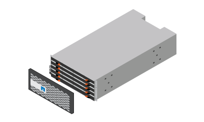

= Avant l'installation
:allow-uri-read: 
:icons: font
:imagesdir: ../media/

[role="lead"]
Vous devez préparer votre site pour répondre aux spécifications de votre système de stockage de la série E4000.

.Étapes
. Créez un compte et enregistrez votre matériel sur http://mysupport.netapp.com/["Support NetApp"^].
. Assurez-vous que les éléments suivants se trouvent dans la boîte que vous avez reçue :
+
[role="tabbed-block"]
====
.E4012
--
Tiroir avec disques installés (panneau vendu séparément)::
+
--

--
Matériel de montage en rack::
+
--
image:../media/superrails_inst-hw-e2800-e5700.png["Matériel de montage en rack"]

--
Câbles Ethernet pour la connexion de gestion (si commandés)::
+
--
image:../media/cable_ethernet_inst-hw-e2800-e5700.png["Câbles Ethernet pour la connexion de gestion"]

--
Câbles d'E/S pour le câblage des hôtes de données::
+
--
image:../media/cable_io_inst-hw-e2800-e5700.png["Câbles d'E/S pour le câblage des hôtes de données"]

--
Câbles d'alimentation::
+
--
image:../media/cable_power_inst-hw-e2800-e5700.png["Câbles d'alimentation"]

--
Câbles SAS::
+
--
image:../media/sas_cable.png["Câbles SAS"]

--

--
.E4060
--
Matériel de montage en rack, de panneau et de tiroir::
+
--

--
Quatre poignées de tiroir x4:: image:../media/handles_counted.png["Quatre poignées de tablette"]
Câbles Ethernet pour la connexion de gestion (si commandés)::
+
--
image:../media/cable_ethernet_inst-hw-e2800-e5700.png["Câbles Ethernet pour la connexion de gestion"]

--
Câbles d'E/S pour le câblage des hôtes de données::
+
--
image:../media/cable_io_inst-hw-e2800-e5700.png["Câbles d'E/S pour le câblage des hôtes de données"]

--
Câbles d'alimentation::
+
--
image:../media/cable_power_inst-hw-e2800-e5700.png["Câbles d'alimentation"]

--
Câbles SAS::
+
--
image:../media/sas_cable.png["Câbles SAS"]

--

--
====
. Obtenir les éléments supplémentaires nécessaires à l'installation :
+
** Un tournevis philips n° 2
** Une lampe de poche
** Une sangle ESD
** Une armoire ou un rack peut contenir des étagères des tailles suivantes :
+
[role="tabbed-block"]
====
.E4012
--
*Profondeur*: 21.1. Po (53.59 cm)

*Largeur*: 17.64 po (44.8)

*Hauteur*: 3.4 po (8.64 cm)

*Poids max*: 65.25 lb (29.6 kg)

--
.E4060
--
*Profondeur*: 36.3 po (92.2 cm)

*Largeur*: 17.64 po (44.8 cm)

*Hauteur*: 7.0 po (17.78 cm)

*Poids max*: 253.33 lb (114.91 kg)

--
====
** Un emplacement fournissant la tension correcte de l'alimentation CA :
+
*** E4012 : 120 à 240 volts c.a.
*** E4060 : 240 V c.a.

** Navigateur pris en charge pour le logiciel de gestion :
+
*** Google Chrome (version 89 et ultérieure)
*** Microsoft Edge (version 90 et ultérieure)
*** Mozilla Firefox (version 80 et ultérieure)
*** Safari (version 14 et ultérieure)

