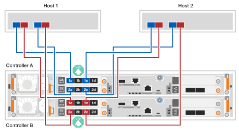

= Câbler le matériel - EF50 et EF80
:allow-uri-read: 
:icons: font
:imagesdir: ../media/

[role="lead"]
Après avoir installé le matériel de votre système de stockage EF50 ou EF80, câblez les connexions de mise en miroir entre contrôleurs et les connexions réseau d'interface d'hôte. (Vous câblerez les ports de gestion ultérieurement, dans la section Configuration complète du système de stockage.)

.Description de la tâche
* Le terme _module d'E/S_ est utilisé pour désigner les cartes d'interface d'hôte (HIC) dans cette procédure.
* Les schémas de câblage comportent des icônes fléchées indiquant l'orientation correcte (vers le haut ou vers le bas) de la languette du connecteur de câble lors de l'insertion d'un connecteur dans un port.
+
Lorsque vous insérez le connecteur, vous devriez sentir qu'il s'enclenche ; si vous ne le sentez pas s'enclencher, retirez-le, retournez-le et réessayez.

+
image:../media/drw_cable_pull_tab_direction_ieops-1699.svg["Direction de la languette de traction du câble"]

[[step-1-cable-the-inter-controller-mirroring-connections]]
== Étape 1 : Câbler les connexions de duplication entre contrôleurs

Reliez les contrôleurs entre eux pour activer la mise en miroir inter-contrôleurs. Les connexions de mise en miroir inter-contrôleurs garantissent une redondance complète du système et sont utilisées pour la mise en miroir du cache et l'expédition des E/S. Le câblage est identique pour les systèmes de stockage EF50 et EF80.

NOTE: Quelle que soit la vitesse des modules d'E/S de duplication inter-contrôleurs installés dans votre système de stockage (100 GbE ou 200 GbE, comme pris en charge par votre système de stockage), vous utilisez les câbles 200 GbE inclus. Si la vitesse des modules d'E/S de duplication inter-contrôleurs est de 100 GbE, la connexion fonctionne à la vitesse inférieure (100 GbE).

.Étapes
. Connectez les contrôleurs entre eux :
+
.. Câble le port e4a du contrôleur A au port e4a du contrôleur B.
.. Câble du port e4b du contrôleur A au port e4b du contrôleur B.
+
*Câbles Ethernet 200 GbE*

+
image::../media/oie_cable100_gbe_qsfp28.png[Câble Ethernet 100 GbE utilisé pour les connexions de mirroring]

+
image:../media/drw_ef50-ef80_mirroring_2p_100gbe_ieops-2659.svg["Câblage de connexion de mise en miroir entre contrôleurs ef50 et ef80"]

[[step-2-cable-the-host-connections]]
== Étape 2 : Câbler les connexions d'hôte

Câblez les connexions d'hôte de votre système de stockage en fonction de la topologie de votre réseau : connexion directe ou connexion via une structure.

.Description de la tâche
* Selon le modèle de votre système de stockage, le type de modules d'E/S d'hôte installés dans le système de stockage peut être Ethernet ou Fibre Channel (FC). Les exemples de câblage dans cette procédure montrent les deux types de modules d'E/S d'hôte pris en charge par les modèles de systèmes de stockage.
* Les exemples de câblage ne montrent pas les cartes HBA FC 64Gb à 4 ports dans l'hôte 1 et l'hôte 2 ; cependant, si vous les avez installées, vous câblez chaque autre port de la même manière que celle indiquée pour les cartes HBA à 2 ports.

[role="tabbed-block"]
====
.Topologie à connexion directe
--
Les exemples suivants montrent le câblage d'un système de stockage aux hôtes à l'aide d'une topologie à connexion directe.

.EF50 avec deux modules d'E/S FC 64Gb à 4 ports
[%collapsible]
=====
.Description de la tâche
* L'exemple de câblage montre les modules d'E/S hôte dans les emplacements 1 et 2. Il s'agit du nombre maximal de modules d'E/S hôte pris en charge pour le système de stockage EF50. Cependant, seul le module d'E/S hôte dans l'emplacement 1 est requis ; le module d'E/S hôte dans l'emplacement 2 est optionnel.
+
Si votre système de stockage possède un seul module d'E/S hôte installé, vous pouvez ignorer le câblage vers le module d'E/S hôte supplémentaire et ne câbler que le module d'E/S hôte installé.

* Un système de stockage à connexion directe possède deux chemins distincts pour la redondance : chemin A et chemin B.
+
** La connectivité du chemin A est représentée par un câblage bleu et des ports bleus sur les hôtes et les contrôleurs. Elle relie les ports HBA de chaque hôte aux ports a et c du contrôleur A.
** La connectivité du chemin B est représentée par un câblage rouge et des ports rouges sur les hôtes et les contrôleurs. Elle relie les ports HBA de chaque hôte aux ports a et c du contrôleur B.

* Bien que l'exemple de câblage montre les ports a et c du module d'E/S connectés aux hôtes, vous pouvez utiliser les ports a et b ou les ports c et d.

.Étapes
. Câblez les hôtes aux contrôleurs :
+
.. Câble interface d'hôte 1 chemin A (bleu) ports HBA vers les ports a du contrôleur A (1a et 2a).
.. Câble interface d'hôte 1 chemin B (rouge) ports HBA vers les ports a du contrôleur B (1a et 2a).
.. Câble interface d'hôte 2 chemin A (bleu) ports HBA vers les ports c du contrôleur A (1c et 2c).
.. Câblez les ports HBA du chemin hôte 2 (rouge) à les ports c du contrôleur B (1c et 2c).
+
*Câbles FC 64 Gb/s*

+
image:../media/oie_cable_sfp_gbe_copper.png["Câble FC 64 Gb"]

+

=====
.EF80 avec trois modules d'E/S 2 ports 200 GbE
[%collapsible]
=====
.Description de la tâche
* L'exemple de câblage montre les modules d'E/S hôte dans les emplacements 1, 2 et 3. Il s'agit du nombre maximal de modules d'E/S hôte pris en charge pour le système de stockage EF80. Cependant, seul le module d'E/S hôte dans l'emplacement 1 est requis ; les modules d'E/S hôte dans l'emplacement 2 et l'emplacement 3 sont tous deux optionnels.
+
Si votre système de stockage comporte moins de modules d'E/S d'hôte installés, vous pouvez ignorer le câblage vers les modules d'E/S d'hôte supplémentaires et ne câbler que les modules d'E/S d'hôte installés.

* Un système de stockage à connexion directe possède deux chemins distincts pour la redondance : chemin A et chemin B.
+
** La connectivité du chemin A est représentée par un câblage bleu et des ports bleus sur les hôtes et les contrôleurs. Elle relie les ports HBA de chaque hôte aux ports a et b du contrôleur A.
** La connectivité du chemin B est représentée par un câblage rouge et des ports rouges sur les hôtes et les contrôleurs. Elle relie les ports HBA de chaque hôte aux ports a et b du contrôleur B.

.Étapes
. Câblez les hôtes aux contrôleurs :
+
.. Câble interface d'hôte 1 chemin A (bleu) ports HBA vers les ports a du contrôleur A (e1a, e2a et e3a).
.. Câblez les ports HBA du chemin hôte 1 B (rouge) vers les ports a du contrôleur B (e1a, e2a et e3a).
.. Câblez les ports HBA du chemin hôte 2 (A, bleu) vers les ports b du contrôleur A (e1b, e2b et e3b).
.. Câble interface d'hôte 2 chemin B (rouge) ports HBA vers les ports b du contrôleur B (e1b, e2b et e3b).
+
*Câbles 200 GbE*

+
image::../media/oie_cable_sfp_gbe_copper.png[Câble 200 GbE]

+
image:../media/drw_ef80_2p_200gbe_ib_3hic_direct_ieops-2680.svg["Topologie EF80 à connexion directe aux hôtes utilisant trois modules d'E/S IB 2 ports 200gbe"]

=====
.EF80 avec trois modules d'E/S FC 64Gb à 4 ports
[%collapsible]
=====
.Description de la tâche
* L'exemple de câblage montre les modules d'E/S hôte dans les emplacements 1, 2 et 3. Il s'agit du nombre maximal de modules d'E/S hôte pris en charge pour le système de stockage EF80. Cependant, seul le module d'E/S hôte dans l'emplacement 1 est requis ; les modules d'E/S hôte dans l'emplacement 2 et l'emplacement 3 sont tous deux optionnels.
+
Si votre système de stockage comporte moins de modules d'E/S d'hôte installés, vous pouvez ignorer le câblage vers les modules d'E/S d'hôte supplémentaires et ne câbler que les modules d'E/S d'hôte installés.

* Un système de stockage à connexion directe possède deux chemins distincts pour la redondance : chemin A et chemin B.
+
** La connectivité du chemin A est représentée par un câblage bleu et des ports bleus sur les hôtes et les contrôleurs. Elle relie les ports HBA de chaque hôte aux ports a et c du contrôleur A.
** La connectivité du chemin B est représentée par un câblage rouge et des ports rouges sur les hôtes et les contrôleurs. Elle relie les ports HBA de chaque hôte aux ports a et c du contrôleur B.

* Bien que l'exemple de câblage montre les ports a et c du module d'E/S connectés aux hôtes, vous pouvez utiliser les ports a et b ou les ports c et d.

.Étapes
. Câblez les hôtes aux contrôleurs :
+
.. Câble interface d'hôte 1 chemin A (bleu) ports HBA vers les ports a du contrôleur A (1a, 2a et 3a).
.. Câble host 1 chemin B (rouge) ports HBA vers les ports a du contrôleur B (1a, 2a et 3a).
.. Câble host 2 chemin A (bleu) ports HBA vers les ports c du contrôleur A (1c, 2c et 3c).
.. Câble interface d'hôte 2 chemin B (rouge) ports HBA vers les ports c du contrôleur B (1c, 2c et 3c).
+
*Câbles FC 64 Gb/s*

+
image:../media/oie_cable_sfp_gbe_copper.png["Câble FC 64 Gb"]

+
image:../media/drw_ef80_4p_64gb_fc_3hic_direct_ieops-2674.svg["Topologie EF80 à connexion directe aux hôtes utilisant trois modules d'E/S FC 64gb à 4 ports"]

=====
--
.Topologie attachée au fabric
--
Les exemples suivants illustrent le câblage d'un système de stockage aux hôtes à l'aide d'une topologie connectée à un fabric.

.EF50 avec deux modules d'E/S FC 64Gb à 4 ports
[%collapsible]
=====
.Description de la tâche
* L'exemple de câblage montre les modules d'E/S hôte dans les emplacements 1 et 2. Il s'agit du nombre maximal de modules d'E/S hôte pris en charge pour le système de stockage EF50. Cependant, seul le module d'E/S hôte dans l'emplacement 1 est requis ; le module d'E/S hôte dans l'emplacement 2 est optionnel.
+
Si votre système de stockage possède un seul module d'E/S hôte installé, vous pouvez ignorer le câblage vers le module d'E/S hôte supplémentaire et ne câbler que le module d'E/S hôte installé.

* Un système de stockage fixé au fabric possède deux chemins de commutateur distincts pour la redondance : chemin du commutateur 1 et chemin du commutateur 2.
+
** La connectivité du chemin du commutateur 1 est représentée par un câblage bleu et des ports bleus sur les hôtes et les contrôleurs. Elle connecte les ports HBA de chaque hôte via le commutateur 1 aux ports a et c du contrôleur A et du contrôleur B.
** La connectivité du chemin du commutateur 2 est représentée par un câblage rouge et des ports rouges sur les hôtes et les contrôleurs. Elle connecte les ports HBA de chaque hôte via le commutateur 2 aux ports b et d des contrôleurs A et B.

.Étapes
. Connectez les hôtes aux commutateurs.
+
Vous pouvez utiliser n'importe quel port des commutateurs.

+
.. Câblez les ports HBA du chemin (bleu) du commutateur 1 de l'hôte 1 et de l'hôte 2 vers le commutateur 1.
.. Câblez l'interface d'hôte 1 et l'interface d'hôte 2 du chemin 2 du commutateur (rouge) des ports HBA vers le commutateur 2.

. Connectez les commutateurs aux contrôleurs :
+
.. Commutateur de câble 1 (bleu) vers les ports a et c du contrôleur A (1a, 2a, 1c et 2c).
.. Commuter le câble 1 (bleu) vers les ports a et c du contrôleur B (1a, 2a, 1c et 2c).
.. Commuter le câble 2 (rouge) vers les ports b et d du contrôleur A (1b, 2b, 1d et 2d).
.. Basculez le câble 2 (rouge) vers les ports b et d du contrôleur B (1b, 2b, 1d et 2d).
+
*Câbles FC 64 Gb/s*

+
image:../media/oie_cable_sfp_gbe_copper.png["Câble FC 64 Gb"]

+
image:../media/drw_ef50_4p_64gb_fc_2hic_fabric_ieops-2673.svg["Topologie EF50 connectée au réseau à l'aide de deux modules d'E/S FC 64 Gb à 4 ports"]

=====
.EF80 avec trois modules d'E/S 2 ports 200 GbE
[%collapsible]
=====
.Description de la tâche
* L'exemple de câblage montre les modules d'E/S hôte dans les emplacements 1, 2 et 3. Il s'agit du nombre maximal de modules d'E/S hôte pris en charge pour le système de stockage EF80. Cependant, seul le module d'E/S hôte dans l'emplacement 1 est requis ; les modules d'E/S hôte dans l'emplacement 2 et l'emplacement 3 sont tous deux optionnels.
+
Si votre système de stockage comporte moins de modules d'E/S d'hôte installés, vous pouvez ignorer le câblage vers les modules d'E/S d'hôte supplémentaires et ne câbler que les modules d'E/S d'hôte installés.

* L'exemple de câblage montre trois HBA sur chaque hôte. Si vos hôtes possèdent moins de trois HBA, vous pouvez ignorer le câblage vers les HBA supplémentaires et ne câbler qu'aux HBA installés.
* Un système de stockage fixé au fabric possède deux chemins de commutateur distincts pour la redondance : chemin du commutateur 1 et chemin du commutateur 2.
+
** La connectivité du chemin du commutateur 1 est représentée par un câblage bleu et des ports bleus sur les hôtes et les contrôleurs. Elle connecte les ports HBA de chaque hôte via le commutateur 1 aux ports a des contrôleurs A et B.
** La connectivité du chemin du commutateur 2 est représentée par un câblage rouge et des ports rouges sur les hôtes et les contrôleurs. Elle connecte les ports HBA de chaque hôte via le commutateur 2 aux ports b du contrôleur A et du contrôleur B.

.Étapes
. Connectez les hôtes aux commutateurs :
+
Vous pouvez utiliser n'importe quel port des commutateurs.

+
.. Câblez les ports HBA du chemin (bleu) du commutateur 1 de l'hôte 1 et de l'hôte 2 vers le commutateur 1.
.. Câblez l'interface d'hôte 1 et l'interface d'hôte 2 du chemin 2 du commutateur (rouge) des ports HBA vers le commutateur 2.

. Connectez les commutateurs aux contrôleurs :
+
.. Commuter le câble 1 (bleu) vers les ports a du contrôleur A (e1a, e2a et e3a).
.. Commuter le câble 1 (bleu) vers les ports a du contrôleur B (e1a, e2a et e3a).
.. Basculez le câble 2 (rouge) vers les ports b du contrôleur A (e1b, e2b et e3b).
.. Commuter le câble 2 (rouge) vers les ports b du contrôleur B (e1b, e2b et e3b).
+
*Câbles 200 GbE*

+
image::../media/oie_cable_sfp_gbe_copper.png[Câble 200 GbE]

+
image:../media/drw_ef80_2p_200gbe_ib_3hic_fabric_ieops-2679.svg["Topologie EF80 connectée au réseau utilisant trois modules IO 2 ports 200gbe"]

=====
.EF80 avec trois modules d'E/S FC 64Gb à 4 ports
[%collapsible]
=====
.Description de la tâche
* L'exemple de câblage montre les modules d'E/S hôte dans les emplacements 1, 2 et 3. Il s'agit du nombre maximal de modules d'E/S hôte pris en charge pour le système de stockage EF80. Cependant, seul le module d'E/S hôte dans l'emplacement 1 est requis ; les modules d'E/S hôte dans l'emplacement 2 et l'emplacement 3 sont tous deux optionnels.
+
Si votre système de stockage comporte moins de modules d'E/S d'hôte installés, vous pouvez ignorer le câblage vers les modules d'E/S d'hôte supplémentaires et ne câbler que les modules d'E/S d'hôte installés.

* L'exemple de câblage montre trois HBA sur chaque hôte. Si vos hôtes possèdent moins de trois HBA, vous pouvez ignorer le câblage vers les HBA supplémentaires et ne câbler qu'aux HBA installés.
* Un système de stockage fixé au fabric possède deux chemins de commutateur distincts pour la redondance : chemin du commutateur 1 et chemin du commutateur 2.
+
** La connectivité du chemin du commutateur 1 est représentée par un câblage bleu et des ports bleus sur les hôtes et les contrôleurs. Elle connecte les ports HBA de chaque hôte via le commutateur 1 aux ports a et c du contrôleur A et du contrôleur B.
** La connectivité du chemin du commutateur 2 est représentée par un câblage rouge et des ports rouges sur les hôtes et les contrôleurs. Elle connecte les ports HBA de chaque hôte via le commutateur 2 aux ports b et d des contrôleurs A et B.

.Étapes
. Connectez les hôtes aux commutateurs :
+
Vous pouvez utiliser n'importe quel port des commutateurs.

+
.. Câblez les ports HBA du chemin (bleu) du commutateur 1 de l'hôte 1 et de l'hôte 2 vers le commutateur 1.
.. Câblez l'interface d'hôte 1 et l'interface d'hôte 2 du chemin 2 du commutateur (rouge) des ports HBA vers le commutateur 2.

. Connectez les commutateurs aux contrôleurs :
+
.. Câblez le commutateur 1 (bleu) aux ports a et c du contrôleur A (1a, 2a, 3a, 1c, 2c et 3c).
.. Commutateur de câble 1 (bleu) vers les ports a et c du contrôleur B (1a, 2a, 3a, 1c, 2c et 3c).
.. Commuter le câble 2 (rouge) vers les ports b et d du contrôleur A (1b, 2b, 3b, 1d, 2d et 3d).
.. Commuter le câble 2 (rouge) vers les ports b et d du contrôleur B (1b, 2b, 3b, 1d, 2d et 3d).
+
*Câbles FC 64 Gb/s*

+
image:../media/oie_cable_sfp_gbe_copper.png["Câble FC 64 Gb"]

+
image:../media/drw_ef80_4p_64gb_fc_3hic_fabric_ieops-2675.svg["Topologie EF80 connectée au réseau utilisant trois modules FC IO à 4 ports 64 Gb"]

=====
--
====
.Et la suite ?
Après avoir câblé les connexions de mise en miroir inter-contrôleurs et hôtes pour votre système de stockage, link:install-power-hardware.html["Mettez votre système de stockage sous tension"].
