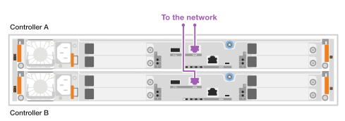

= Configuration complète du système de stockage - EF50 et EF80
:allow-uri-read: 
:icons: font
:imagesdir: ../media/

[role="lead"]
Après avoir mis sous tension votre système de stockage EF50 ou EF80, vous terminez la configuration du système en câblant et en configurant le port de gestion sur chaque contrôleur pour la gestion hors bande du système de stockage, en configurant votre système de stockage, puis en vérifiant que le protocole du module I/O hôte est correct.

[[step-1-cable-and-configure-the-management-ports]]
== Étape 1: Câbler et configurer les ports de gestion

Câblez le port de gestion de chaque contrôleur, puis configurez les ports à l'aide d'un serveur DHCP ou d'une adresse IP statique.

[role="tabbed-block"]
====
.Option 1 : serveur DHCP
--
Câblez puis configurez les ports de gestion à l'aide d'un serveur DHCP.

.Avant de commencer
* Obtenez les adresses IP attribuées pour vous connecter au système de stockage à partir de votre administrateur réseau.
* Notez l'adresse MAC inscrite sur le côté de chaque contrôleur. Vous utilisez l'adresse MAC pour identifier quelle adresse IP est attribuée à chaque contrôleur.
* Configurez votre serveur DHCP pour associer une adresse IP, un masque de sous-réseau et une adresse de passerelle en tant que bail permanent pour chaque contrôleur.

.Étapes
. À l'aide de câbles Ethernet, connectez le port de gestion de chaque contrôleur à votre réseau.
+
*Câbles RJ-45 1000BASE-T*

+
image::../media/oie_cable_rj45.png[Câbles RJ-45]

+

. Ouvrez un navigateur et connectez-vous au système de stockage en utilisant l'une des adresses IP de contrôleur que vous avez fournies votre administrateur réseau.

--
.Option 2 : adresse IP statique
--
Câblez puis configurez manuellement les ports de gestion en saisissant l'adresse IP et le masque de sous-réseau.

.Avant de commencer
* Obtenez l'adresse IP des contrôleurs, le masque de sous-réseau, l'adresse de passerelle et les informations des serveurs DNS et NTP auprès de votre administrateur réseau.
* Assurez-vous que l'ordinateur portable que vous utilisez ne reçoit pas la configuration réseau d'un serveur DHCP.

.Étapes
. À l'aide d'un câble Ethernet, connectez le port de gestion du contrôleur A au port Ethernet d'un ordinateur portable.
+
*Câbles RJ-45 1000BASE-T*

+
image::../media/oie_cable_rj45.png[Câbles RJ-45]

+
image:../media/drw_ef50-ef80_wrench_to_laptop_ieops-2663.svg["Câblage du port de gestion des contrôleurs ef50 et ef80"]

. Ouvrez un navigateur et utilisez l'adresse IP par défaut (169.254.128.101) pour établir une connexion au contrôleur.
+
Le contrôleur renvoie un certificat auto-signé. Le navigateur vous informe que la connexion n'est pas sécurisée.

. Suivez les instructions du navigateur pour continuer et lancer SANtricity System Manager.
+
Si vous ne parvenez pas à établir de connexion, vérifiez que vous ne recevez pas la configuration réseau d'un serveur DHCP.

. Définissez le mot de passe du système de stockage pour vous connecter.
. Utilisez les paramètres réseau fournis par votre administrateur réseau dans l'assistant *configurer les paramètres réseau* pour configurer les paramètres réseau du contrôleur A, puis sélectionnez *Terminer*.
+

NOTE: Étant donné que vous réinitialisez l'adresse IP, System Manager perd la connexion au contrôleur.

. Débranchez le câble Ethernet de votre ordinateur portable (en le laissant connecté au contrôleur A), puis connectez-le à votre réseau.
. Ouvrez un navigateur sur un ordinateur connecté à votre réseau et entrez l'adresse IP du contrôleur A nouvellement configurée.
+

NOTE: Si vous perdez la connexion au contrôleur A, vous pouvez connecter un câble Ethernet au contrôleur B pour rétablir la connexion au contrôleur A via le contrôleur B (169.254.128.102).

. Connectez-vous à l'aide du mot de passe que vous avez défini précédemment. L'assistant *Configurer les paramètres réseau* s'affiche.
. Utilisez les paramètres réseau fournis par votre administrateur réseau dans l'assistant *configurer les paramètres réseau* pour configurer les paramètres réseau du contrôleur B, puis sélectionnez *Terminer*.
. Connectez le contrôleur B à votre réseau.
+
Les deux ports de gestion du contrôleur sont désormais connectés au réseau :

+

. Validez les paramètres réseau du contrôleur B en entrant l'adresse IP récemment configurée du contrôleur B dans un navigateur.
+

NOTE: Si vous perdez la connexion au contrôleur B, vous pouvez utiliser votre connexion validée précédemment au contrôleur A pour rétablir la connexion au contrôleur B via le contrôleur A.

--
====

[[step-2-configure-your-storage-system]]
== Étape 2 : Configurez votre système de stockage

Utilisez SANtricity System Manager pour configurer et gérer votre système de stockage.

.Avant de commencer
* Vous devez avoir câblé et configuré vos ports de gestion sur le réseau.
* Vérifiez et enregistrez votre mot de passe et les adresses IP configurées.

.Étapes
. Accédez à SANtricity System Manager en utilisant les adresses IP configurées.
. Utilisez SANtricity System Manager pour gérer votre système de stockage.
+
Vous pouvez consulter l'aide en ligne incluse avec SANtricity System Manager.

[[step-3-verify-the-host-io-module-protocol-is-correct]]
== Étape 3 : Vérifiez que le protocole du module d’E/S hôte est correct

Votre système de stockage est livré avec un protocole par défaut sur les modules d'E/S hôtes. Si le protocole par défaut n'est pas celui que vous souhaitez, vous pouvez le changer.

.Étapes
. Vérifiez le protocole par défaut utilisé sur les modules d'E/S hôtes de votre système de stockage, en utilisant SANtricity System Manager.
+
.. Sélectionnez *Settings* > *System*.
.. Dans la section *Paramètres supplémentaires*, cliquez sur *Modifier le protocole d'E/S hôte* pour ouvrir cette page.
.. Voir le protocole d'E/S hôte par défaut utilisé sur les modules d'E/S hôte de votre système de stockage, affiché dans le champ *Protocole d'E/S hôte*.

. L'étape suivante dépend du fait que le protocole par défaut soit celui que vous souhaitez ou non :
+
[cols="1,2"]
|===
| Si... | Ensuite... 

 a| 
Le protocole par défaut est le protocole que vous souhaitez
 a| 
Aucune action n'est requise.

 a| 
Le protocole par défaut n'est pas le protocole que vous souhaitez
 a| 
Vous devez le modifier en utilisant la link:../maintenance-ef50-ef80/io-module-change-protocol.html["Modifier le protocole hôte"^] procédure.

NOTE: Modifier le protocole du port hôte implique de préparer le changement de protocole, d'arrêter les opérations d'E/S de l'hôte, de modifier le protocole, puis de configurer l'hôte pour utiliser le nouveau protocole.

|===

