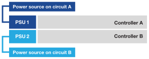

= Mettez sous tension le matériel - EF50 et EF80
:allow-uri-read: 
:icons: font
:imagesdir: ../media/

[role="lead"]
Après avoir câblé les connexions de mise en miroir inter-contrôleurs et hôtes pour votre système de stockage EF50 ou EF80, vous mettez les contrôleurs sous tension.

.Avant de commencer
Prenez les précautions anti-statiques.

.Étapes
. Branchez un câble d'alimentation à chaque bloc d'alimentation du contrôleur, puis connectez-les à des sources d'alimentation sur des circuits différents.
+

NOTE: Si vous utilisez des unités de distribution d'énergie (PDUs) tierces, n'utilisez pas de prises de courant directement derrière les contrôleurs, car vous pourriez bloquer l'accès aux contrôleurs.

+
* Câbles d'alimentation*

+
image:../media/power_cable_inst-hw-ef600.png["Câbles d'alimentation"]

+

+
** Le système commence à démarrer. Le démarrage initial peut prendre jusqu'à huit minutes.
** Les LED du châssis du système clignotent et les ventilateurs se mettent en marche, ce qui indique que les contrôleurs sont en cours de mise sous tension.
+
Au démarrage, il est normal que les ventilateurs soient très bruyants.

** L'écran numérique situé à l'avant du châssis (derrière le panneau) ne s'allume pas.

. Fixez les cordons d'alimentation à l'aide du dispositif de fixation présent sur chaque alimentation.

.Et la suite ?
Après avoir mis votre système de stockage sous tension, link:install-complete-setup.html["configuration complète du système de stockage"].
