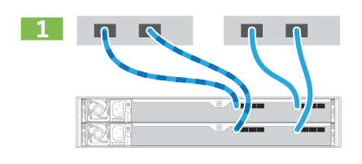
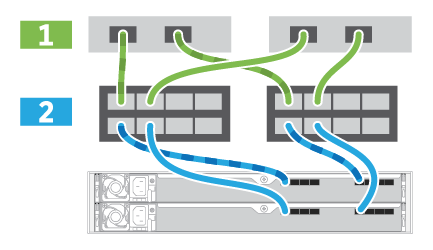

= Configuration et installation complètes du système de stockage
:allow-uri-read: 
:icons: font
:imagesdir: ../media/

[role="lead"]
Découvrez comment connecter les câbles du contrôleur à votre réseau, puis terminez l'installation et la configuration.

== Étape 1 : câblage des hôtes de données

Branchez les câbles du système de stockage en fonction de la topologie de votre réseau.

=== Option 1 : topologie à connexion directe

L'exemple suivant montre le câblage aux hôtes de données via une topologie de connexion directe.

|===

 a| 

 a| 
. Connectez chaque adaptateur hôte directement sur les ports hôte des contrôleurs.

|===

=== Option 2 : topologie de la structure

L'exemple suivant montre le câblage vers les hôtes de données via une topologie de structure.

|===

 a| 

 a| 
. Connectez chaque adaptateur hôte directement au commutateur.
. Connectez chaque commutateur directement aux ports hôte sur les contrôleurs.

|===

== Étape 2 : connexion et configuration de la connexion de gestion

Vous pouvez configurer les ports de gestion du contrôleur à l'aide d'un serveur DHCP ou d'une adresse IP statique.

=== Option 1 : serveur DHCP

Découvrez comment configurer les ports de gestion avec un serveur DHCP.

.Avant de commencer
* Configurez votre serveur DHCP pour associer une adresse IP, un masque de sous-réseau et une adresse de passerelle en tant que bail permanent pour chaque contrôleur.
* Obtenez les adresses IP attribuées que vous utiliserez pour vous connecter au système de stockage auprès de votre administrateur réseau.

.Étapes
. Connectez un câble Ethernet au port de gestion de chaque contrôleur et connectez l'autre extrémité à votre réseau.
+
|===

 a| 
image:../media/cable_ethernet_inst-hw-ef600.png[""]
 a| 
Câbles Ethernet RJ-45 (si commandés)

|===
+
|===

 a| 
La figure suivante montre un exemple d'emplacement du port de gestion du contrôleur (EF600 illustré) :

 a| 
image:../media/ethernet_callout.png[""]

|===
. Ouvrez un navigateur et connectez-vous au système de stockage en utilisant l'une des adresses IP de contrôleur que vous avez fournies votre administrateur réseau.

=== Option 2 : adresse IP statique

Découvrez comment configurer manuellement les ports de gestion en entrant l'adresse IP et le masque de sous-réseau.

.Avant de commencer
* Obtenez l'adresse IP des contrôleurs, le masque de sous-réseau, l'adresse de passerelle et les informations de serveur DNS et NTP auprès de votre administrateur réseau.
* Assurez-vous que l'ordinateur portable que vous utilisez ne reçoit pas la configuration réseau d'un serveur DHCP.

.Étapes
. À l'aide d'un câble Ethernet, connectez le port de gestion du contrôleur A au port Ethernet d'un ordinateur portable.
+

NOTE: Le contrôleur A est le boîtier supérieur du contrôleur et le contrôleur B le boîtier inférieur du contrôleur.

+
|===

 a| 
image:../media/cable_ethernet_inst-hw-ef600.png[""]
 a| 
Câbles Ethernet RJ-45 (si commandés)

|===
+
|===

 a| 
La figure suivante montre un exemple d'emplacement du port de gestion du contrôleur (EF600 illustré) :

 a| 
image:../media/ethernet_callout.png[""]

|===
. Ouvrez un navigateur et utilisez l'adresse IP par défaut (169.254.128.101) pour établir une connexion au contrôleur. Le contrôleur renvoie un certificat auto-signé. Le navigateur vous informe que la connexion n'est pas sécurisée.
+

NOTE: Pour les plates-formes exécutant SANtricity 11.60 et versions supérieures, le masque de sous-réseau par défaut est 255.255.0.0.

. Suivez les instructions du navigateur pour continuer et lancer SANtricity System Manager.
+

NOTE: Si vous ne parvenez pas à établir de connexion, vérifiez que vous ne recevez pas la configuration réseau d'un serveur DHCP.

. Définissez le mot de passe du système de stockage pour vous connecter.
. Utilisez les paramètres réseau fournis par votre administrateur réseau dans l'assistant *configurer les paramètres réseau* pour configurer les paramètres réseau du contrôleur A, puis sélectionnez *Terminer*.
+

NOTE: Étant donné que vous réinitialisez l'adresse IP, System Manager perd la connexion au contrôleur.

. Déconnectez votre ordinateur portable du système de stockage et connectez le port de gestion du contrôleur A à votre réseau.
. Ouvrez un navigateur sur un ordinateur connecté à votre réseau et entrez l'adresse IP du contrôleur A nouvellement configurée.
+

NOTE: Si vous perdez la connexion au contrôleur A, vous pouvez connecter un câble ethernet au contrôleur B pour rétablir la connexion au contrôleur A via le contrôleur B (169.254.128.102).

. Connectez-vous à l'aide du mot de passe que vous avez défini précédemment.
+
L'assistant configurer les paramètres réseau s'affiche.

. Utilisez les paramètres réseau fournis par votre administrateur réseau dans l'assistant *configurer les paramètres réseau* pour configurer les paramètres réseau du contrôleur B, puis sélectionnez *Terminer*.
. Connectez le contrôleur B à votre réseau.
. Valider les paramètres réseau du contrôleur B en entrant l'adresse IP configurée du contrôleur B dans un navigateur.
+

NOTE: Si vous perdez la connexion au contrôleur B, vous pouvez utiliser votre connexion validée précédemment au contrôleur A pour rétablir la connexion au contrôleur B via le contrôleur A.

== Étape 3 : configurer le système de stockage

Une fois le matériel EF300 ou EF600 installé, utilisez le logiciel SANtricity pour configurer et gérer votre système de stockage.

.Avant de commencer
* Configurez vos ports de gestion.
* Vérifiez et enregistrez votre mot de passe et vos adresses IP.

.Étapes
. Connectez votre contrôleur à un navigateur Web.
. Gérez votre système de stockage EF300 ou EF600 à l'aide de SANtricity System Manager. Consultez l'aide en ligne incluse avec System Manager.
+
|===

 a| 
image:../media/management_station_inst-hw-ef600_g2285.png[""]
 a| 
Pour accéder à System Manager, utilisez les mêmes adresses IP que celles que vous avez utilisées pour configurer vos ports de gestion.

|===

Si vous effectuez le câblage de votre EF300 pour l'extension SAS, reportez-vous à la section link:../maintenance-ef600/index.html["Tout en maintenant le matériel EF600"] Pour l'installation de la carte d'extension SAS et du link:../install-hw-cabling/index.html["Câblage du matériel E-Series"] Pour le câblage d'extension SAS.
