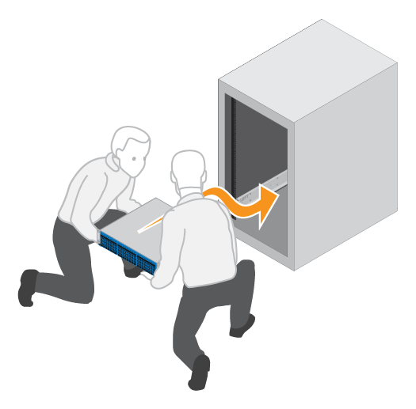

= Installez le matériel - EF300, EF600, EF300C et EF600C
:allow-uri-read: 
:icons: font
:imagesdir: ../media/

[role="lead"]
Vous pouvez installer un système de stockage EF300, EF600, EF300C ou EF600C dans un rack à deux montants ou une armoire système NetApp.

.Avant de commencer
Assurez-vous de faire ce qui suit :

* Enregistrez votre matériel sur http://mysupport.netapp.com/["Support NetApp"^].
* Préparez une zone de travail plate et sans électricité statique.
* Prenez les précautions anti-statiques.

.Étapes
. Déballez le matériel.
+
.. Déballez le contenu et procédez à l'inventaire du matériel de fixation contre le bordereau d'expédition.
.. Avant de continuer, lisez toutes les instructions.

. Installer les rails.
+

NOTE: Pour éviter que l'équipement ne se renverse, installez le matériel en partant du bas du rack ou de l'armoire jusqu'en haut.

+
|===

 a| 
Si des instructions sont fournies avec le matériel de fixation en rack, reportez-vous à ces instructions pour savoir comment installer les rails. Pour des instructions supplémentaires de montage en rack, reportez-vous à la section link:../rackmount-hardware.html["Matériel de montage en rack"].

 a| 
image:../media/install_rails_inst-hw-ef600.png["Poser les rails"]

|===
. Installer le shelf.
+
|===

 a| 
.. Si vous installez plusieurs tiroirs, commencez l'installation en partant du bas, en haut de l'armoire. Positionner l'arrière de la tablette sur les rails.
+

CAUTION: Lors de l'installation de la tablette, utiliser un pont en équipe avec deux personnes.

.. En soutenant le shelf par le bas, faites-le glisser dans l'armoire.

 a| 

|===
. Fixer le shelf.
+
|===

 a| 
Pour plus d'informations, voir link:../rackmount-hardware.html["Matériel de montage en rack"].

 a| 
image:../media/secure_shelf_inst-hw-ef600.png["Fixer le shelf"]

|===
. Installez la plaque avant.
+
|===

 a| 
.. Alignez la façade avec la tablette et enclenchez-la.

 a| 
image:../media/install_faceplate_2_0_inst-hw-ef600.png["Installez le cache"]

|===

