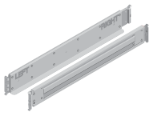

= Préparez l'installation : EF300, EF600, EF300C et EF600C
:allow-uri-read: 
:icons: font
:imagesdir: ../media/

[role="lead"]
Découvrez comment préparer l'installation de votre système de stockage séries EF300, EF600, EF300C ou EF600C.

.Avant de commencer
Si vous procédez au câblage de votre EF300 pour l'extension SAS, consultez les informations suivantes :

* link:../maintenance-ef600/sas-add-supertask-task.html["Ajoutez des cartes d'extension SAS"^] Pour l'installation de la carte d'extension SAS.
* link:../install-hw-cabling/index.html["Présentation du câblage"] Pour le câblage d'extension SAS.

.Étapes
. Créez un compte et enregistrez votre matériel sur http://mysupport.netapp.com/["Support NetApp"^].
. Assurez-vous que les éléments suivants se trouvent dans la boîte que vous avez reçue.
+
|===

 a| 
image:../media/ef600_w_faceplate.png["Tiroir avec disques et panneau installés"]
 a| 
Tiroir avec disques installés (caches cadres et embouts fournis séparément)

 a| 

 a| 
Matériel de montage en rack

|===
+
Le tableau suivant identifie les types de câbles que vous pouvez recevoir. Si vous recevez un câble non répertorié dans le tableau, reportez-vous à la section https://hwu.netapp.com/["Hardware Universe"] pour localiser le câble et identifier son utilisation.

+
|===
| Type de connecteur | Type de câble | Utiliser 

 a| 
image:../media/cable_ethernet_inst-hw-ef600.png["Câble ethernet RJ-45"]
 a| 
Câbles Ethernet RJ-45 (si commandés)
 a| 
Connexion de gestion

 a| 
image:../media/cable_io_inst-hw-ef600.png["Câble d'E/S."]
 a| 
Câbles d'E/S (si commandés)
 a| 
Câblage des hôtes de données

 a| 
image:../media/cable_power_inst-hw-ef600.png["Câbles d'alimentation"]
 a| 
Câbles d'alimentation (si commandés)
 a| 
Mise sous tension du système de stockage

|===
. Assurez-vous de fournir les éléments suivants.
+
|===

 a| 
image:../media/screwdriver_inst-hw-ef600.png["Tournevis Phillips n°2"]
 a| 
Tournevis Phillips n°2

 a| 
image:../media/flashlight_inst-hw-ef600.png["Lampe de poche"]
 a| 
Lampe de poche

 a| 
image:../media/wrist_strap_inst-hw-ef600.png["Bracelet ESD"]
 a| 
Bracelet ESD

 a| 
image:../media/2u_rackspace_inst-hw-ef600.png["Rack 2U"]
 a| 
Espace rack 2U : configuration standard de 19 pouces (48.30 cm) rack permettant d'installer les étagères 2U des dimensions suivantes.

*Profondeur*: 19.0 po. (48.3 cm)

*Largeur*: 17.6 po. (44.7 cm)

*Hauteur*: 3.34 po. (8.48 cm)

*Tiroir* : 24 disques

*Poids max*: 60.5 lb (27.4 kg)

NOTE: Si vous utilisez des armoires tierces, les câbles d'alimentation risquent de limiter l'accès au contrôleur.

 a| 
image:../media/management_station_inst-hw-ef600_g60b3.png["Station de gestion avec navigateur pris en charge pour le logiciel de gestion"]
 a| 
Navigateur pris en charge pour le logiciel de gestion :

** Google Chrome (version 89 et ultérieure)
** Microsoft Edge (90 et versions ultérieures)
** Mozilla Firefox (version 80 et ultérieure)
** Safari (version 14 et ultérieure)

|===

