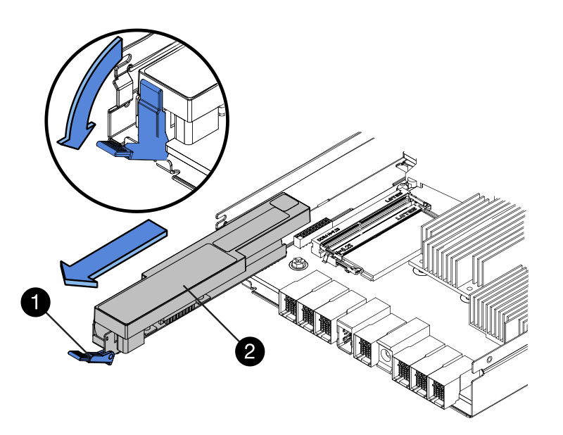

= Retirez la batterie défectueuse - E2800
:allow-uri-read: 
:icons: font
:imagesdir: ../media/

[role="lead"]
Après avoir retiré le boîtier du contrôleur du shelf, vous pouvez retirer la batterie.

.Étapes
. Retirez le couvercle du boîtier du contrôleur en appuyant sur le bouton et en faisant glisser le couvercle hors de celui-ci.
. Vérifiez que le voyant vert à l'intérieur du contrôleur (entre la batterie et les modules DIMM) est éteint.
+
Si ce voyant vert est allumé, le contrôleur utilise toujours l'alimentation de la batterie. Vous devez attendre que ce voyant s'éteigne avant de retirer des composants.

+
image::../media/28_dwg_e2800_internal_cache_active_led_maint-e2800.gif[Voyant de cache interne actif]

+
*(1)* _cache interne actif_

+
*(2)* _batterie_

. Repérez le loquet de dégagement bleu de la batterie.
. Déverrouillez la batterie en appuyant sur le loquet de déverrouillage vers le bas et en l'éloignant du boîtier du contrôleur.
+

+
*(1)* _loquet de dégagement de la batterie_

+
*(2)* _batterie_

. Soulevez la batterie et faites-la glisser hors du boîtier du contrôleur.
. Suivez les procédures appropriées pour votre emplacement afin de recycler ou de mettre au rebut la batterie défectueuse.
+

CAUTION: Pour se conformer aux réglementations IATA, n'expédiez jamais une batterie au lithium par avion à moins qu'elle ne soit installée sur le shelf contrôleur.

. Accédez à link:batteries-install-new-task.html["Installez la batterie neuve"].

