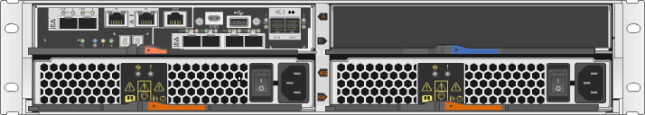

= Conditions requises pour remplacer un contrôleur - E2800
:allow-uri-read: 
:icons: font
:imagesdir: ../media/

[role="lead"]
Avant de remplacer ou d'ajouter un contrôleur E2800, vérifiez les exigences et les considérations.

Chaque boîtier de contrôleur contient une carte contrôleur, une batterie et une carte d'interface hôte (HIC) en option. Vous pouvez ajouter un second contrôleur à une configuration simplex ou remplacer un contrôleur défectueux.

Ces procédures s'appliquent aux tiroirs disques IOM12 et IOM12B.

NOTE: Les modules IOM12B sont uniquement pris en charge par SANtricity OS 11.70.2 et versions ultérieures. Assurez-vous que le micrologiciel de votre contrôleur a été mis à jour avant d'installer ou de mettre à niveau vers un IOM12B.

NOTE: Ces procédures sont pour les remplacements ou les remplacements à chaud des modules d'E/S de tiroir similaires. Cela signifie que vous ne pouvez remplacer qu'un module IOM12 par un autre module IOM12 ou remplacer un module IOM12B par un autre module IOM12B. (Votre tiroir peut être équipé de deux modules IOM12 ou de deux modules IOM12B.)

== Conditions requises pour l'ajout du second contrôleur

Vous pouvez ajouter un second boîtier de contrôleur à la version simplex des tiroirs contrôleurs suivants :

* Tiroir contrôleur E2812
* Tiroir contrôleur E2824
* Baie Flash EF280

Les figures montrent un exemple de tiroir de contrôleur avant d'ajouter un second contrôleur (une cartouche de contrôleur et un cache de contrôleur) et après l'ajout d'un second contrôleur (deux boîtiers de contrôleur).

image::../media/28_dwg_2800_controller_duplex.gif[Configuration E2800 duplex]

NOTE: Les figures montrent des exemples de boîtiers de contrôleur. Les ports hôte de vos boîtiers de contrôleur peuvent être différents.

Avant d'ajouter un second contrôleur, vous devez disposer :

* Un nouveau boîtier de contrôleur portant le même numéro de pièce que le boîtier de contrôleur actuellement installé.
* Nouvelle HIC identique à celle de la HIC dans le boîtier de contrôleur actuellement installé (uniquement nécessaire si le boîtier de contrôleur actuellement installé comporte une carte d'interface hôte).
* Tous les câbles, émetteurs-récepteurs, commutateurs et adaptateurs de bus hôte (HBA) nécessaires pour connecter les nouveaux ports de contrôleur.
+
Pour plus d'informations sur le matériel compatible, reportez-vous au https://mysupport.netapp.com/NOW/products/interoperability["Matrice d'interopérabilité NetApp"^] ou le http://hwu.netapp.com/home.aspx["NetApp Hardware Universe"^].

* Pilote multivoie installé sur l'hôte pour que vous puissiez utiliser les deux contrôleurs. Reportez-vous à la link:../config-linux/index.html["Configuration Linux Express"], link:../config-windows/index.html["Configuration Windows Express"], ou link:../config-vmware/index.html["Configuration VMware Express"] pour obtenir des instructions.
* Un bracelet antistatique ou d'autres précautions antistatiques.
* Un tournevis cruciforme n° 1.
* Étiquettes permettant d'identifier les nouveaux câbles.
* Station de gestion avec un navigateur qui peut accéder au Gestionnaire système SANtricity du contrôleur. (Pour ouvrir l'interface System Manager, pointez le navigateur vers le nom de domaine ou l'adresse IP du contrôleur.)
+
Vous pouvez également effectuer certaines opérations à l'aide de l'interface de ligne de commandes. Si vous ne disposez pas d'un accès à l'interface de ligne de commandes, vous pouvez effectuer l'une des opérations suivantes :

+
** *Pour SANtricity System Manager (version 11.60 et supérieure)* -- Télécharger le paquet CLI (fichier zip) depuis System Manager. Accédez au menu:Paramètres[système > modules complémentaires > interface de ligne de commande]. Vous pouvez ensuite lancer des commandes CLI à partir d'une invite du système d'exploitation, telle que l'invite DOS C:.
** *Pour SANtricity Storage Manager/Enterprise Management Window (EMW)* -- Suivez les instructions du guide express pour télécharger et installer le logiciel. Vous pouvez exécuter des commandes CLI à partir de l'EMW en sélectionnant menu:Outils[Exécuter script].

== Conditions requises pour remplacer le contrôleur

Lors du remplacement d'un boîtier de contrôleur défectueux, retirer la batterie et la HIC, s'ils sont installés, du boîtier de contrôleur d'origine et les installer dans le boîtier de contrôleur de remplacement.

Vous pouvez déterminer si le boîtier de contrôleur est défectueux de deux façons :

* Le gourou de la restauration de SANtricity System Manager vous indique de remplacer le boîtier du contrôleur.
* La LED d'avertissement orange sur le boîtier du contrôleur est allumée, ce qui indique que le contrôleur est défectueux.
+
[]
====

NOTE: Le voyant d'avertissement orange du contrôleur s'éteint dès que les conditions de remplacement suivantes sont réunies :

** Echec du chemin du lecteur Alt
** Tiroir ouvert/manquant
** Le ventilateur est défectueux/manquant
** Alimentation manquante

====

image::../media/28_dwg_2800_controller_attn_led_maint-e2800.gif[LED d'avertissement E2800]

*(1)* _LED attention_

NOTE: La figure montre un exemple de cartouche de contrôleur ; les ports hôtes du boîtier de contrôleur peuvent être différents.

Avant de remplacer un contrôleur, vous devez disposer des éléments suivants :

* Un boîtier de contrôleur de remplacement portant le même numéro de pièce que le boîtier de contrôleur que vous remplacez.
* Un bracelet antistatique ou d'autres précautions antistatiques.
* Étiquettes permettant d'identifier chaque câble connecté au boîtier du contrôleur.
* Tournevis cruciforme n° 1.
* Station de gestion avec un navigateur qui peut accéder au Gestionnaire système SANtricity du contrôleur. (Pour ouvrir l'interface System Manager, pointez le navigateur vers le nom de domaine ou l'adresse IP du contrôleur.)
+
Vous pouvez également effectuer certaines opérations à l'aide de l'interface de ligne de commandes. Si vous ne disposez pas d'un accès à l'interface de ligne de commandes, vous pouvez effectuer l'une des opérations suivantes :

+
** *Pour SANtricity System Manager (version 11.60 et supérieure)* -- Télécharger le paquet CLI (fichier zip) depuis System Manager. Accédez au menu:Paramètres[système > modules complémentaires > interface de ligne de commande]. Vous pouvez ensuite lancer des commandes CLI à partir d'une invite du système d'exploitation, telle que l'invite DOS C:.
** *Pour SANtricity Storage Manager/Enterprise Management Window (EMW)* -- Suivez les instructions du guide express pour télécharger et installer le logiciel. Vous pouvez exécuter des commandes CLI à partir de l'EMW en sélectionnant menu:Outils[Exécuter script].

=== Configuration du mode recto verso requise

Si le tiroir contrôleur est doté de deux contrôleurs (configuration duplex), vous pouvez remplacer un absorbeur de contrôleurs alors que votre baie de stockage est sous tension et effectuer des opérations d'E/S sur l'hôte, tant que les conditions suivantes sont vraies :

* Le second boîtier du contrôleur situé sur le shelf présente un état optimal.
* Le champ *OK à supprimer* de la zone Détails du gourou de la restauration dans le Gestionnaire de système SANtricity affiche *Oui*, indiquant qu'il est sûr de supprimer ce composant.

=== Configuration requise pour la configuration recto

Si vous ne disposez que d'un seul boîtier de contrôleur (configuration simplex), les données de la matrice de stockage ne seront pas accessibles tant que vous n'aurez pas remplacé le boîtier de contrôleur. Vous devez arrêter les opérations d'E/S de l'hôte et mettre la baie de stockage hors tension.
