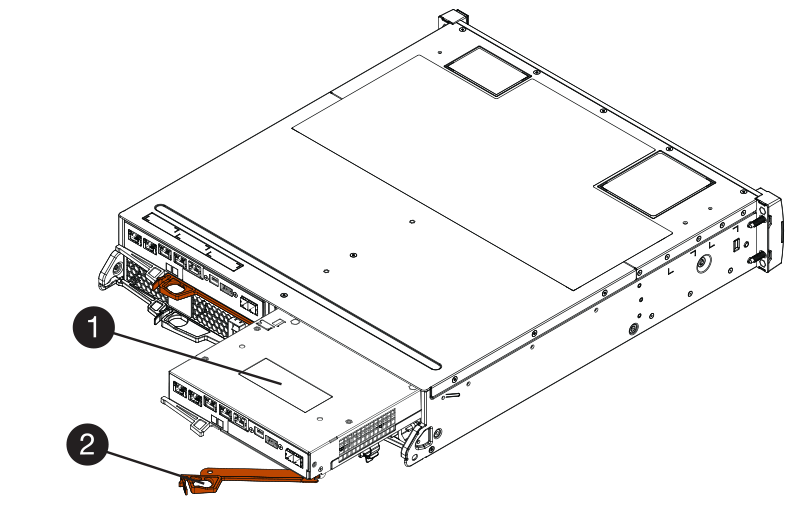

= Ajoutez le second boîtier du contrôleur - E2800
:allow-uri-read: 
:experimental: 
:icons: font
:imagesdir: ../media/

[role="lead"]
Vous pouvez ajouter un second canister dans la baie E2800.

.Description de la tâche
Cette tâche décrit comment ajouter un second bidon de contrôleur à la version simplex d'un tiroir contrôleur E2812, un tiroir contrôleur E2824 ou une baie Flash EF280. Cette procédure est également appelée conversion recto-verso, une procédure en ligne. Vous pouvez accéder aux données de la matrice de stockage pendant cette procédure.

.Avant de commencer
Assurez-vous de disposer des éléments suivants :

* Un nouveau boîtier de contrôleur portant le même numéro de pièce que le boîtier de contrôleur actuellement installé. (Voir l'étape 1 pour vérifier le numéro de pièce.)
* Nouvelle HIC identique à celle de la HIC dans le boîtier de contrôleur actuellement installé (uniquement nécessaire si le boîtier de contrôleur actuellement installé comporte une carte d'interface hôte).
* Un bracelet antistatique ou prendre d'autres précautions antistatiques.
* Un tournevis cruciforme n° 1.
* Étiquettes permettant d'identifier les nouveaux câbles. Pour plus d'informations sur le matériel compatible, reportez-vous au https://mysupport.netapp.com/NOW/products/interoperability["Matrice d'interopérabilité NetApp"^] ou le http://hwu.netapp.com/home.aspx["NetApp Hardware Universe"^].
* Tous les câbles, émetteurs-récepteurs, commutateurs et adaptateurs de bus hôte (HBA) nécessaires pour connecter les nouveaux ports de contrôleur.
* Station de gestion avec un navigateur qui peut accéder au Gestionnaire système SANtricity du contrôleur. (Pour ouvrir l'interface System Manager, pointez le navigateur vers le nom de domaine ou l'adresse IP du contrôleur.)

== Étape 1 : vérifier la référence du nouveau contrôleur

Vérifier que le nouveau contrôleur possède la même référence que le contrôleur actuellement installé.

.Étapes
. Déballez le nouveau boîtier du contrôleur et placez-le sur une surface plane et sans électricité statique.
. Repérez les étiquettes d'adresse MAC et de référence des FRU à l'arrière du boîtier du contrôleur.
+
image::../media/28_dwg_e2800_labels_maint-e2800.gif[Adresse MAC et numéro de référence des FRU sur le contrôleur E2800]

+
*(1)* _adresse MAC:_ l'adresse MAC du port de gestion 1 (« P1 »). Si vous avez utilisé DHCP pour obtenir l'adresse IP du contrôleur d'origine, vous devez disposer de cette adresse pour vous connecter au nouveau contrôleur.

+
*(2)* _FRU référence:_ ce numéro doit correspondre au numéro de référence de remplacement du contrôleur actuellement installé.

. Dans le Gestionnaire système SANtricity, localisez la référence de remplacement du boîtier du contrôleur installé.
+
.. Sélectionnez *matériel*.
.. Localisez le tiroir contrôleur, marqué par l'icône du contrôleur image:../media/sam1130_ss_hardware_controller_icon_maint-e2800.gif["Icône du contrôleur"].
.. Cliquez sur l'icône du contrôleur.
.. Sélectionnez le contrôleur et cliquez sur *Suivant*.
.. Dans l'onglet *base*, notez le *Numéro de pièce de remplacement* pour le contrôleur.

. Vérifier que la référence de pièce de rechange pour le contrôleur installé est identique à celle de la référence FRU pour le nouveau contrôleur.
+

CAUTION: *Perte possible d'accès aux données* -- si les deux numéros de pièce ne sont pas les mêmes, n'essayez pas cette procédure. En outre, si le boîtier de contrôleur d'origine est équipé d'une carte d'interface hôte (HIC), vous devez installer une HIC identique dans le nouveau boîtier de contrôleur. En présence de contrôleurs non concordants ou de contrôleurs hors ligne, le nouveau contrôleur se verrouillera après la mise en ligne.

== Étape 2 : installez la carte d'interface hôte

Si le contrôleur actuellement installé inclut une HIC, vous devez installer le même modèle de carte d'interface hôte (HIC) dans le second boîtier de contrôleur.

.Étapes
. Déballez la nouvelle HIC et confirmez qu'elle est identique à la HIC existante.
+

CAUTION: *Perte possible d'accès aux données* -- les circuits intégrés installés dans les deux boîtiers de contrôleur doivent être identiques. Si la HIC de remplacement n'est pas identique à la HIC que vous remplacez, ne pas effectuer cette procédure. La présence de circuits intégrés non concordants provoque le blocage du nouveau contrôleur lorsqu'il est connecté.

. Retournez le nouveau boîtier du contrôleur afin que le couvercle soit orienté vers le haut.
. Appuyez sur le bouton du capot et faites glisser le capot pour le retirer.
. À l'aide d'un tournevis cruciforme n° 1, retirez les quatre vis qui fixent le cache blanc au boîtier du contrôleur, puis retirez le cache.
. Alignez les trois vis moletées de la HIC avec les trous correspondants du contrôleur, puis alignez le connecteur situé au bas de la HIC avec le connecteur d'interface HIC de la carte contrôleur.
+
Veillez à ne pas rayer ou heurter les composants au bas de la HIC ou au-dessus de la carte contrôleur.

. Abaisser avec précaution la HIC et mettre le connecteur HIC en place en appuyant doucement sur la HIC.
+

CAUTION: *Dommages possibles à l'équipement* -- faites très attention de ne pas pincer le connecteur ruban doré pour les voyants du contrôleur entre la HIC et les vis à molette.

+
image::../media/28_dwg_e2800_hic_thumbscrews_maint-e2800.gif[Installer HIC sur le contrôleur]

+
*(1)* _carte d'interface hôte_

+
*(2)* _vis_

. Serrez les vis à molette HIC à la main.
+
N'utilisez pas de tournevis, sinon vous risquez de trop serrer les vis.

. À l'aide d'un tournevis cruciforme n° 1, fixez la nouvelle carte HIC sur le boîtier du contrôleur à l'aide des quatre vis que vous avez retirées précédemment.
+
image::../media/28_dwg_e2800_hic_faceplace_screws_maint-e2800.gif[Installez le cache]

. Réinstallez le couvercle sur le boîtier du contrôleur en faisant glisser le couvercle de l'arrière vers l'avant jusqu'à ce que le bouton s'enclenche.
. Mettez le boîtier du contrôleur de côté jusqu'à ce que vous soyez prêt à l'installer.

== Étape 3 : collecte des données de support

Collectez les données de support avant et après le remplacement d'un composant pour vous assurer que vous pouvez envoyer un ensemble complet de journaux au support technique si le remplacement ne résout pas le problème.

.Étapes
. Dans la page d'accueil de SANtricity System Manager, assurez-vous que la baie de stockage affiche un état optimal.
+
Si le statut n'est pas optimal, utilisez le gourou de la restauration ou contactez le support technique pour résoudre le problème. Ne pas poursuivre cette procédure.

. Collecte des données de support de votre baie de stockage à l'aide de SANtricity System Manager
+
.. Sélectionnez menu :support[Centre de support > Diagnostics].
.. Sélectionnez *collecter les données de support*.
.. Cliquez sur *collect*.
+
Le fichier est enregistré dans le dossier Téléchargements de votre navigateur portant le nom *support-data.7z*.

. Assurez-vous qu'aucune opération d'E/S n'est en cours entre la matrice de stockage et tous les hôtes connectés. Par exemple, vous pouvez effectuer les opérations suivantes :
+
** Arrêtez tous les processus qui impliquent les LUN mappées du stockage vers les hôtes.
** Assurez-vous qu'aucune application n'écrit de données sur les LUN mappées du stockage aux hôtes.
** Démontez tous les systèmes de fichiers associés aux volumes de la baie.
+

NOTE: Les étapes exactes permettant d'arrêter les opérations d'E/S de l'hôte dépendent du système d'exploitation hôte et de la configuration, qui dépassent le cadre de ces instructions. Si vous ne savez pas comment arrêter les opérations d'E/S des hôtes dans votre environnement, essayez d'arrêter l'hôte.

+

CAUTION: *Perte de données possible* -- si vous continuez cette procédure pendant les opérations d'E/S, vous risquez de perdre des données.

== Étape 4 : changez la configuration en mode recto verso

Avant d'ajouter un second contrôleur au tiroir du contrôleur, vous devez modifier la configuration en mode duplex en installant un nouveau fichier NVSRAM et en utilisant l'interface de ligne de commande pour définir la matrice de stockage en mode duplex. La version duplex du fichier NVSRAM est incluse dans le fichier de téléchargement du logiciel SANtricity OS (micrologiciel du contrôleur).

.Étapes
. Téléchargez le dernier fichier NVSRAM du site de support NetApp pour votre client de gestion.
+
.. Dans SANtricity System Manager, sélectionnez menu :support [Upgrade Center]. Dans la zone intitulée « mise à niveau du logiciel SANtricity OS », cliquez sur *téléchargements de NetApp SANtricity OS*.
.. Sur le site de support NetApp, sélectionnez *logiciel de contrôleur de système d'exploitation SANtricity E-Series*.
.. Suivez les instructions en ligne pour sélectionner la version de NVSRAM que vous souhaitez installer, puis terminez le téléchargement du fichier. Assurez-vous de sélectionner la version duplex de la NVSRAM (le fichier a "d" près de la fin de son nom).
+
Le nom de fichier sera similaire à : *N290X-830834-D01.dlp*

. Mettez à niveau les fichiers à l'aide de SANtricity System Manager.
+

CAUTION: *Risque de perte de données ou de détérioration de la baie de stockage* -- ne modifiez pas la matrice de stockage pendant la mise à niveau. Maintenez l'alimentation de la baie de stockage.

+
Vous pouvez annuler l'opération pendant le contrôle d'intégrité de pré-mise à niveau, mais pas pendant le transfert ou l'activation.

+
** Depuis SANtricity System Manager :
+
... Sous *mise à niveau du logiciel SANtricity OS*, cliquez sur *commencer la mise à niveau*.
... En regard de *Select Controller NVSRAM file*, cliquez sur *Browse*, puis sélectionnez le fichier NVSRAM que vous avez téléchargé.
... Cliquez sur *Démarrer*, puis confirmez que vous souhaitez effectuer l'opération.
+
La mise à niveau commence et les événements suivants se produisent :

+
**** La vérification préalable à la mise à niveau commence. Si la vérification préalable à la mise à niveau de l'état du système échoue, utilisez le gourou de la restauration ou contactez le support technique afin de résoudre le problème.
**** Les fichiers du contrôleur sont transférés et activés. Le temps nécessaire dépend de la configuration de votre matrice de stockage.
**** Le contrôleur redémarre automatiquement pour appliquer les nouveaux paramètres.

** Vous pouvez également utiliser la commande suivante de l'interface de ligne de commande pour effectuer la mise à niveau :
+
[listing]
----
download storageArray NVSRAM file="filename" healthCheckMelOverride=FALSE;
----
+
Dans cette commande, `filename` Est le chemin du fichier et le nom du fichier pour la version duplex du fichier NVSRAM du contrôleur (le fichier avec "`d`" dans son nom). Placez le chemin du fichier et le nom du fichier entre guillemets (" "). Par exemple :

+
[listing]
----
file="C:\downloads\N290X-830834-D01.dlp"
----

. (Facultatif) pour afficher la liste des mises à niveau, cliquez sur *Enregistrer le journal*.
+
Le fichier est enregistré dans le dossier Téléchargements de votre navigateur portant le nom *latest-upgrade-log-TIMESTAMP.txt*.

+
** Après la mise à niveau de la NVSRAM du contrôleur, vérifiez ce qui suit dans le Gestionnaire système SANtricity :
+
*** Accédez à la page matériel et vérifiez que tous les composants s'affichent.
*** Accédez à la boîte de dialogue Inventaire des logiciels et micrologiciels (accédez au menu:support[Upgrade Center], puis cliquez sur le lien *Software and Firmware Inventory*). Vérifiez les nouvelles versions du logiciel et du micrologiciel.

** Lorsque vous mettez à niveau la NVSRAM du contrôleur, tous les paramètres personnalisés que vous avez appliqués à la NVSRAM existante sont perdus pendant le processus d'activation. Vous devez à nouveau appliquer les paramètres personnalisés à la NVSRAM une fois le processus d'activation terminé.

. Définissez le paramètre de la matrice de stockage sur duplex à l'aide des commandes CLI. Pour utiliser l'interface CLI, ouvrez une invite de commande si vous avez téléchargé le package CLI ou vous pouvez ouvrir la fenêtre de gestion d'entreprise (EMW) si Storage Manager est installé.
+
** À partir d'une invite de commande :
+
... Utilisez la commande suivante pour passer de la baie de disques simplex à duplex :
+
[listing]
----
set storageArray redundancyMode=duplex;
----
... Utiliser la commande suivante pour réinitialiser le contrôleur.
+
[listing]
----
reset controller [a];
----

** À partir de l'interface EMW :
+
... Sélectionnez la matrice de stockage.
... Sélectionnez menu:Outils[Exécuter script].
... Tapez la commande suivante dans la zone de texte.
+
[listing]
----
set storageArray redundancyMode=duplex;
----
... Sélectionner menu:Outils[vérifier et exécuter].
... Tapez la commande suivante dans la zone de texte.
+
[listing]
----
reset controller [a];
----
... Sélectionner menu:Outils[vérifier et exécuter].

Après le redémarrage du contrôleur, un message d'erreur « contrôleur de remplacement manquant » s'affiche. Ce message indique que le contrôleur A a a été correctement converti en mode duplex. Ce message persiste jusqu'à ce que vous installiez le second contrôleur et connectiviez les câbles hôtes.

== Étape 5 : retirez le cache du contrôleur

Retirez le cache du contrôleur avant d'installer le second contrôleur. Un espace vide contrôleur est installé dans les tiroirs contrôleurs qui ne disposent que d'un seul contrôleur.

.Étapes
. Appuyez sur le loquet de la poignée de came du cache du contrôleur jusqu'à ce qu'il se relâche, puis ouvrez la poignée de came vers la droite.
. Faites glisser le boîtier du contrôleur vide hors de l'étagère et mettez-le de côté.
+
Lorsque vous retirez le cache du contrôleur, un rabat se met en place pour bloquer la baie vide.

== Étape 6 : installer le second boîtier du contrôleur

Installez un second boîtier de contrôleur pour modifier une configuration recto-verso.

.Étapes
. Retournez le boîtier du contrôleur, de sorte que le capot amovible soit orienté vers le bas.
. Avec la poignée de came en position ouverte, faites glisser le boîtier du contrôleur complètement dans la tablette du contrôleur.
+

+
*(1)* _canister_

+
*(2)* _poignée de came_

. Déplacez la poignée de came vers la gauche pour verrouiller le boîtier du contrôleur en place.
. Insérez les émetteurs-récepteurs SFP+ et connectez les câbles au nouveau contrôleur.

== Étape 7 : Ajout d'un second contrôleur complet

Terminez le processus d'ajout d'un second contrôleur en vérifiant qu'il fonctionne correctement, réinstallez le fichier NVSRAM duplex, distribuez les volumes entre les contrôleurs et collectez les données de support.

.Étapes
. Au démarrage du contrôleur, vérifier les LED du contrôleur et l'écran à sept segments.
+
Lorsque la communication avec l'autre contrôleur est rétablie :

+
** L'affichage à sept segments montre la séquence répétée *OS*, *OL*, *_blank_* pour indiquer que le contrôleur est hors ligne.
** Le voyant d'avertissement orange reste allumé.
** Les voyants Host Link peuvent être allumés, clignotants ou éteints, selon l'interface hôte. image:../media/28_dwg_attn_led_7s_display_maint-e2800.gif["LED du contrôleur E2800"]
+
*(1)* _voyant attention (ambre)_

+
*(2)* _affichage à sept segments_

+
*(3)* _LED Host Link_

. Vérifier les codes sur l'affichage à sept segments du contrôleur lorsqu'il est connecté. Si l'écran affiche l'une des séquences répétées suivantes, retirez immédiatement le contrôleur.
+
** *OE*, *L0*, *_blank_* (contrôleurs non concordants)
** *OE*, *L6*, *_blank_* (HIC non pris en charge)
+

CAUTION: *Perte possible d'accès aux données* -- si le contrôleur que vous venez d'installer affiche un de ces codes, et que l'autre contrôleur est réinitialisé pour une raison quelconque, le second contrôleur peut également se verrouiller.

. Mettez à jour les paramètres de la baie de manière recto vers recto-verso à l'aide de la commande CLI suivante :
+
`set storageArray redundancyMode=duplex;`

. Dans SANtricity System Manager, vérifier que l'état du contrôleur est optimal
+
Si l'état n'est pas optimal ou si l'un des voyants d'avertissement est allumé, vérifiez que tous les câbles sont correctement installés et que le boîtier du contrôleur est correctement installé. Au besoin, déposer et réinstaller le boîtier du contrôleur.

+

NOTE: Si vous ne pouvez pas résoudre le problème, contactez le support technique.

. Réinstallez la version duplex du fichier NVSRAM à l'aide du Gestionnaire système SANtricity.
+
Cette étape garantit que les deux contrôleurs ont une version identique de ce fichier.

+

CAUTION: *Risque de perte de données ou de détérioration de la baie de stockage* -- ne modifiez pas la matrice de stockage pendant la mise à niveau. Maintenez l'alimentation de la baie de stockage.

+

NOTE: Vous devez installer le logiciel SANtricity OS lorsque vous installez un nouveau fichier NVSRAM à l'aide du Gestionnaire système SANtricity. Si vous disposez déjà de la dernière version du logiciel SANtricity OS, vous devez réinstaller cette version.

+
.. Si nécessaire, téléchargez la dernière version du logiciel de système d'exploitation SANtricity depuis le site de support NetApp.
.. Dans System Manager, accédez au Centre de mise à niveau.
.. Sous *mise à niveau du logiciel SANtricity OS*, cliquez sur *commencer la mise à niveau*.
.. Cliquez sur *Parcourir* et sélectionnez le fichier logiciel SANtricity OS.
.. Cliquez sur *Parcourir* et sélectionnez le fichier NVSRAM du contrôleur.
.. Cliquez sur *Démarrer* et confirmez que vous souhaitez effectuer l'opération.
+
Le transfert du contrôle commence.

. Après le redémarrage des contrôleurs, distribuer en option les volumes entre le contrôleur A et le nouveau contrôleur B.
+
.. Sélectionnez menu:Storage[volumes].
.. Dans l'onglet tous les volumes, sélectionnez menu:plus[changer la propriété].
.. Tapez la commande suivante dans la zone de texte : `change ownership`
+
Le bouton Modifier la propriété est activé.

.. Pour chaque volume que vous souhaitez redistribuer, sélectionnez *contrôleur B* dans la liste *propriétaire préféré*.
+
image::../media/sam1130_ss_change_volume_ownership.gif[Écran Gestionnaire système pour modifier la propriété du volume]

.. Cliquez sur *changer la propriété*.
+
Lorsque le processus est terminé, la boîte de dialogue Modifier la propriété du volume affiche les nouvelles valeurs pour *propriétaire préféré* et *propriétaire actuel*.

. Collecte des données de support de votre baie de stockage à l'aide de SANtricity System Manager
+
.. Sélectionnez menu :support[Centre de support > Diagnostics].
.. Cliquez sur *collect*.
+
Le fichier est enregistré dans le dossier Téléchargements de votre navigateur portant le nom *support-data.7z*.

.Et la suite ?
Le processus d'ajout d'un second contrôleur est terminé. Vous pouvez reprendre les opérations normales.
