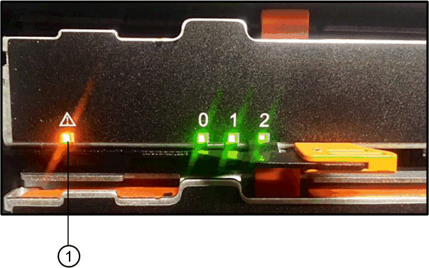

= Remplacement du disque dans le système E2800 (tiroir de 60 disques)
:allow-uri-read: 
:icons: font
:imagesdir: ../media/

[role="lead"]
Vous pouvez remplacer un disque du système E2800 par un tiroir de 60 disques.

La fonctionnalité Recovery Guru de SANtricity System Manager surveille les disques de la baie de stockage et peut vous informer d'une panne disque imminente ou d'une panne disque réelle. Lorsqu'un disque est en panne, le voyant d'avertissement orange s'allume. Vous pouvez remplacer à chaud un disque défectueux alors que la matrice de stockage reçoit des opérations d'E/S.

Cette procédure s'applique aux tiroirs disques DCM et DCM2.

.Avant de commencer
* Passez en revue les exigences de gestion des disques du link:drives-overview-supertask-concept.html["Conditions requises pour le remplacement des disques E2800"].

.Ce dont vous avez besoin, 8217;ll
* Disque de remplacement pris en charge par NetApp pour le tiroir contrôleur ou le tiroir disque.
* Un bracelet antistatique ou d'autres précautions antistatiques.
* Station de gestion avec un navigateur qui peut accéder au Gestionnaire système SANtricity du contrôleur. (Pour ouvrir l'interface System Manager, pointez le navigateur vers le nom de domaine ou l'adresse IP du contrôleur.)

== Étape 1 : préparer le remplacement de l'entraînement

Préparation au remplacement d'un disque en vérifiant la fonctionnalité Recovery Guru dans SANtricity System Manager et en effectuant les étapes préalables requises. Vous pouvez ensuite localiser le composant défectueux.

.Étapes
. Si le gourou de la restauration de SANtricity System Manager vous a averti d'une _panne de disque imminente_, mais que le disque n'est pas encore défaillant, suivez les instructions de la fonctionnalité Recovery Guru qui indique la panne du disque.
. Si nécessaire, utilisez SANtricity System Manager pour confirmer que vous disposez d'un disque de remplacement approprié.
+
.. Sélectionnez *matériel*.
.. Sélectionnez le disque défectueux sur le graphique du tiroir.
.. Cliquez sur le lecteur pour afficher son menu contextuel, puis sélectionnez *Paramètres d'affichage*.
.. Vérifiez que la capacité du disque de remplacement est égale ou supérieure à celle du disque que vous remplacez et qu'il possède les fonctionnalités attendues.
+
Par exemple, n'essayez pas de remplacer un disque dur par un disque SSD. De même, si vous remplacez un lecteur compatible avec la sécurité, assurez-vous que le lecteur de remplacement est également compatible avec la sécurité.

. Si nécessaire, utilisez SANtricity System Manager pour localiser le disque dans la baie de stockage.
+
.. Si le tiroir dispose d'un panneau, retirez-le pour voir les LED.
.. Dans le menu contextuel du lecteur, sélectionnez *Activer le voyant de localisation*.
+
Le voyant d'avertissement du tiroir disque (orange) clignote pour vous permettre d'ouvrir le tiroir de disque approprié afin d'identifier le lecteur à remplacer.

+

+
*(1)* _LED attention_

.. Déverrouillez le tiroir d'entraînement en tirant sur les deux leviers.
.. A l'aide des leviers étendus, tirez doucement le tiroir d'entraînement vers l'extérieur jusqu'à ce qu'il s'arrête.
.. Observez la partie supérieure du tiroir disque pour trouver le voyant d'avertissement devant chaque lecteur.
+
image::../media/2860_dwg_amber_on_drive_maint-e2800.gif[2860 dwg de couleur ambre sur le service d'entraînement e2800]

*(1)* _voyant attention allumé pour le lecteur en haut à droite_

Les LED d'avertissement du tiroir disque se trouvent sur le côté gauche de chaque disque, devant une icône d'avertissement située sur la poignée du disque, juste derrière le voyant.

image::../media/28_dwg_e2860_de460c_attention_led_drive_maint-e2800.gif[28 dwg e2860 de460c conduit attention maint e2800]

*(1)* _icône attention_

*(2)* _LED attention_

== Étape 2 : retrait du disque défectueux

Retirez un disque défectueux pour le remplacer par un nouveau disque.

.Étapes
. Déballez le lecteur de remplacement et placez-le sur une surface plane et sans électricité statique près de l'étagère.
+
Conservez tous les matériaux d'emballage pour la prochaine fois que vous devez renvoyer un lecteur.

. Dégagez les leviers du tiroir d'entraînement du centre du tiroir d'entraînement approprié en tirant les deux côtés du tiroir.
. Tirez avec précaution sur les leviers du tiroir d'entraînement étendu pour extraire le tiroir d'entraînement jusqu'à son extension complète sans le retirer du boîtier.
. Tirez doucement le loquet de dégagement orange situé devant le lecteur que vous souhaitez retirer.
+
La poignée de came des ressorts d'entraînement s'ouvre partiellement et l'entraînement est libéré du tiroir.

+
image::../media/trafford_drive_rel_button_maint-e2800.gif[touche de conduite de trafford maint. e2800]

+
*(1)* _loquet de déblocage Orange_

. Ouvrez la poignée de came et soulevez légèrement l'entraînement.
. Attendre 30 secondes.
. Utilisez la poignée de came pour soulever l'entraînement de l'étagère.
+
image::../media/92_dwg_de6600_install_or_remove_drive_maint-e2800.gif[92 dwg de6600 installez ou retirez le maint d'entraînement e2800]

. Placez le lecteur sur une surface antistatique avec amorti, à l'écart des champs magnétiques.
. Attendez 30 secondes que le logiciel reconnaisse que le lecteur a été retiré.
+

NOTE: Si vous retirez accidentellement un lecteur actif, attendez au moins 30 secondes, puis réinstallez-le. Pour la procédure de restauration, reportez-vous au logiciel de gestion du stockage.

== Étape 3 : installer un nouveau lecteur

Installez un nouveau lecteur pour remplacer le lecteur défectueux.

CAUTION: Installez le disque de remplacement dès que possible après avoir retiré le disque défectueux. Dans le cas contraire, il existe un risque de surchauffe de l'équipement.

CAUTION: *Perte possible d'accès aux données* -- lorsque vous repoussez le tiroir d'entraînement dans le boîtier, ne le fermez jamais. Poussez lentement le tiroir pour éviter de le secouant et d'endommager le module de stockage.

.Étapes
. Relever la poignée de came du nouvel entraînement à la verticale.
. Alignez les deux boutons relevés de chaque côté du support d'entraînement avec l'espace correspondant dans le canal d'entraînement du tiroir d'entraînement.
+
image::../media/28_dwg_e2860_de460c_drive_cru_maint-e2800.gif[28 dwg e2860 de460c drive cru maint e2800]

+
*(1)* _bouton relevé sur le côté droit du support d'entraînement_

. Abaissez le lecteur tout droit, puis faites tourner la poignée de came vers le bas jusqu'à ce que le lecteur s'enclenche sous le loquet de dégagement orange.
. Replacez avec précaution le tiroir du lecteur dans le boîtier. Poussez lentement le tiroir pour éviter de le secouant et d'endommager le module de stockage.
. Fermez le tiroir d'entraînement en poussant les deux leviers vers le centre.
+
Le voyant d'activité vert du disque remplacé à l'avant du tiroir s'allume lorsque le disque est correctement inséré.

+
Selon votre configuration, le contrôleur peut reconstruire automatiquement les données sur le nouveau disque. Si le tiroir utilise des disques de rechange à chaud, le contrôleur peut avoir à effectuer une reconstruction complète sur le disque de rechange à chaud avant de pouvoir copier les données sur le disque remplacé. Ce processus de reconstruction augmente le temps requis pour mener à bien cette procédure.

== Étape 4 : remplacement complet du disque

Vérifiez que le nouveau lecteur fonctionne correctement.

.Étapes
. Vérifiez le voyant d'alimentation et la LED d'avertissement du disque que vous avez remplacé. (Lorsque vous insérez un disque pour la première fois, sa LED d'avertissement peut s'allume. Toutefois, le voyant devrait s'éteindre en moins d'une minute.)
+
** La LED d'alimentation est allumée ou clignote et la LED d'avertissement est éteinte : indique que le nouveau disque fonctionne correctement.
** Le voyant d'alimentation est éteint : indique que le lecteur n'est peut-être pas installé correctement. Retirez le lecteur, attendez 30 secondes, puis réinstallez-le.
** La LED d'avertissement est allumée : indique que le nouveau disque est susceptible d'être défectueux. Remplacez-le par un autre lecteur neuf.

. Si le gourou de la restauration de SANtricity System Manager affiche toujours un problème, sélectionnez *revérifier* pour vous assurer que le problème a été résolu.
. Si le gourou de la restauration indique que la reconstruction du disque n'a pas démarré automatiquement, lancer la reconstruction manuellement, comme suit :
+

NOTE: Effectuez cette opération uniquement lorsque vous y êtes invité par le support technique ou le gourou de la restauration

+
.. Sélectionnez *matériel*.
.. Cliquez sur le lecteur que vous avez remplacé.
.. Dans le menu contextuel du lecteur, sélectionnez *reconstruire*.
.. Confirmez que vous souhaitez effectuer cette opération.
+
Une fois la reconstruction du disque terminée, le groupe de volumes est à l'état optimal.

. Si nécessaire, réinstallez le cadre.
. Retournez la pièce défectueuse à NetApp, tel que décrit dans les instructions RMA (retour de matériel) fournies avec le kit.

Le remplacement de votre disque est terminé. Vous pouvez reprendre les opérations normales.
