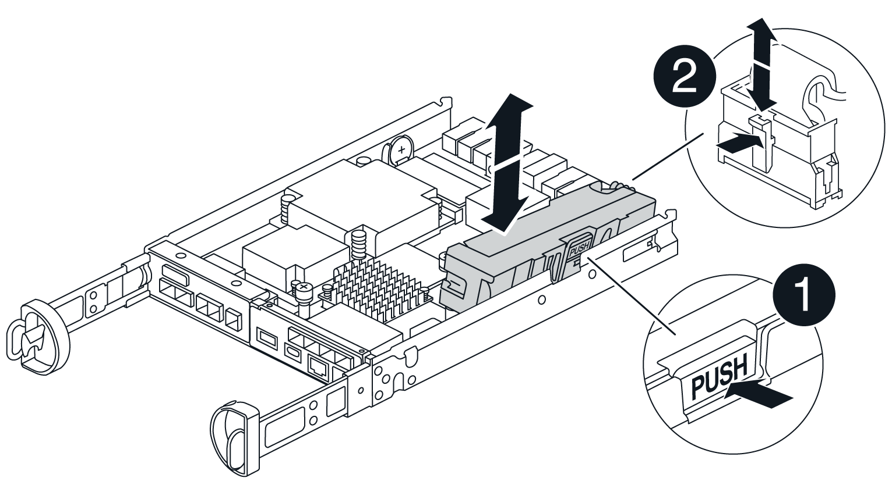

= Remplacez la batterie dans E4000
:allow-uri-read: 
:icons: font
:imagesdir: ../media/

[role="lead"]
Vous devez remplacer la batterie concernée dans votre appareil E4000 si le gourou de la récupération dans le Gestionnaire système SANtricity indique un état « batterie en panne » ou « Remplacement de la batterie requis ». Pour protéger vos données, la batterie doit être remplacée dès que possible.

Dans SANtricity System Manager, vérifiez les détails dans la fonctionnalité Recovery Guru qui confirme la présence d'un problème au niveau de la batterie et pour garantir qu'aucun autre élément ne doit être résolu en premier.

.Avant de commencer
Si vous envisagez de remplacer une batterie défectueuse, vous devez disposer des éléments suivants :

* Une batterie de rechange.
* Un bracelet antistatique ou d'autres précautions antistatiques.
* Étiquettes permettant d'identifier chaque câble connecté au boîtier du contrôleur.
* Station de gestion avec un navigateur qui peut accéder au Gestionnaire système SANtricity du contrôleur. (Pour ouvrir l'interface System Manager, pointez le navigateur vers le nom de domaine ou l'adresse IP du contrôleur.)
* Vérifiez qu'aucun volume n'est en cours d'utilisation ou que vous avez installé un pilote multivoie sur tous les hôtes qui utilisent ces volumes.

== Étape 1 : préparez-vous à remplacer la batterie

Les étapes à suivre pour préparer le remplacement de la batterie dépendent de la configuration recto-verso (deux contrôleurs) ou recto (un contrôleur).

Si vous disposez d'une configuration recto verso, vous devez mettre le contrôleur affecté hors ligne pour pouvoir retirer en toute sécurité la batterie défectueuse. Le contrôleur que vous ne mettez pas hors ligne doit être en ligne (dans l'état optimal).

Si vous disposez d'une configuration simplex, mettez le tiroir contrôleur hors tension, afin que vous puissiez retirer la batterie défectueuse en toute sécurité.

[role="tabbed-block"]
====
.Mettez le tiroir contrôleur hors tension (simplex)
--
.Étapes
. Sauvegardez la base de données de configuration de la baie de stockage à l'aide de SANtricity System Manager.
+
Si un problème survient lorsque vous supprimez un contrôleur, vous pouvez utiliser le fichier enregistré pour restaurer votre configuration. Le système enregistre l'état actuel de la base de données de configuration RAID, qui inclut toutes les données des groupes de volumes et des pools de disques sur le contrôleur.

+
** Depuis System Manager :
+
... Sélectionnez *support › Centre de support › Diagnostics*.
... Sélectionnez *collecter les données de configuration*.
... Cliquez sur *collect*.
+
Le fichier est enregistré dans le dossier Téléchargements de votre navigateur sous le nom *configurationData-<arrayName>-<DateTime>.7z*.

** Vous pouvez également sauvegarder la base de données de configuration à l'aide de la commande CLI suivante :
+
`save storageArray dbmDatabase sourceLocation=onboard contentType=all file="filename";`

. Collecte des données de support de votre baie de stockage à l'aide de SANtricity System Manager
+
En cas de problème lors de la suppression d'un contrôleur, vous pouvez utiliser le fichier enregistré pour résoudre le problème. Le système enregistre les données d'inventaire, d'état et de performances de votre matrice de stockage dans un seul fichier.

+
.. Sélectionnez *support › Centre de support › Diagnostics*.
.. Sélectionnez *collecter les données de support*.
.. Cliquez sur *collect*.
+
Le fichier est enregistré dans le dossier Téléchargements de votre navigateur portant le nom *support-data.7z*.

. Assurez-vous qu'aucune opération d'E/S n'est en cours entre la matrice de stockage et tous les hôtes connectés. Par exemple, vous pouvez effectuer les opérations suivantes :
+
.. Arrêtez tous les processus qui impliquent les LUN mappées du stockage vers les hôtes.
.. Assurez-vous qu'aucune application n'écrit de données sur les LUN mappées du stockage aux hôtes.
.. Démontez tous les systèmes de fichiers associés aux volumes de la baie.
+

NOTE: Les étapes exactes permettant d'arrêter les opérations d'E/S de l'hôte dépendent du système d'exploitation hôte et de la configuration, qui dépassent le cadre de ces instructions. Si vous ne savez pas comment arrêter les opérations d'E/S des hôtes dans votre environnement, essayez d'arrêter l'hôte.

+

CAUTION: *Perte possible de données*--si vous continuez cette procédure pendant que des opérations d'E/S se produisent, vous risquez de perdre des données.

. Attendez que les données de la mémoire cache soient écrites sur les disques.
+
La LED verte cache actif située à l'arrière du contrôleur est allumée lorsqu'il est nécessaire d'écrire les données en cache sur les disques. Vous devez attendre que ce voyant s'éteigne.

. Dans la page d'accueil de SANtricity System Manager, sélectionnez *Afficher les opérations en cours*.
. Vérifiez que toutes les opérations ont été effectuées avant de passer à l'étape suivante.
. Eteindre les deux interrupteurs de l'alimentation en panne du tiroir contrôleur.
. Attendre que toutes les LED du tiroir contrôleur s'éteignent.

--
.Mettez le contrôleur hors ligne (duplex)
--
.Étapes
. Dans SANtricity System Manager, vérifiez les détails dans la fonctionnalité Recovery Guru qui confirme la présence d'un problème au niveau de la batterie et pour garantir qu'aucun autre élément ne doit être résolu en premier.
. Dans la zone Details du Recovery Guru, déterminez la batterie à remplacer.
. Sauvegardez la base de données de configuration de la baie de stockage à l'aide de SANtricity System Manager.
+
Si un problème survient lorsque vous supprimez un contrôleur, vous pouvez utiliser le fichier enregistré pour restaurer votre configuration. Le système enregistre l'état actuel de la base de données de configuration RAID, qui inclut toutes les données des groupes de volumes et des pools de disques sur le contrôleur.

+
** Depuis System Manager :
+
... Sélectionnez *support › Centre de support › Diagnostics*.
... Sélectionnez *collecter les données de configuration*.
... Cliquez sur *collect*.
+
Le fichier est enregistré dans le dossier Téléchargements de votre navigateur sous le nom *configurationData-<arrayName>-<DateTime>.7z*.

** Vous pouvez également sauvegarder la base de données de configuration à l'aide de la commande CLI suivante :
+
`save storageArray dbmDatabase sourceLocation=onboard contentType=all file="filename";`

. Collecte des données de support de votre baie de stockage à l'aide de SANtricity System Manager
. En cas de problème lors de la suppression d'un contrôleur, vous pouvez utiliser le fichier enregistré pour résoudre le problème. Le système enregistre les données d'inventaire, d'état et de performances de votre matrice de stockage dans un seul fichier.
+
.. Sélectionnez *support › Centre de support › Diagnostics*.
.. Sélectionnez *collecter les données de support*.
.. Cliquez sur *collect*.
+
Le fichier est enregistré dans le dossier Téléchargements de votre navigateur sous le nom support-data.7z.

. Si le contrôleur n'est pas encore hors ligne, mettez-le hors ligne maintenant en utilisant SANtricity System Manager.
+
** Depuis SANtricity System Manager :
+
... Sélectionnez *matériel*.
... Si le graphique montre les lecteurs, sélectionnez *contrôleur & composants* pour afficher les contrôleurs.
... Sélectionnez le contrôleur que vous souhaitez placer hors ligne.
... Dans le menu contextuel, sélectionnez *placer hors ligne* et confirmez que vous souhaitez effectuer l'opération.
+

NOTE: Si vous accédez à SANtricity System Manager à l'aide du contrôleur que vous tentez de mettre hors ligne, un message SANtricity System Manager indisponible s'affiche. Sélectionnez *connexion à une autre connexion réseau* pour accéder automatiquement au Gestionnaire système SANtricity à l'aide de l'autre contrôleur.

** Vous pouvez également mettre les contrôleurs hors ligne en utilisant les commandes de l'interface de ligne de commandes suivantes :
+
*Pour le contrôleur A* : `set controller [a] availability=offline`

+
*Pour le contrôleur B* : `set controller [b] availability=offline`

. Attendez que SANtricity System Manager mette à jour l'état du contrôleur en mode hors ligne.
. Sélectionnez *revérifier* dans Recovery Guru et confirmez que le champ *OK à supprimer* de la zone *Détails* affiche *Oui*. Cela indique qu'il est possible de retirer le boîtier du contrôleur en toute sécurité.

--
====

== Étape 2 : retirez le boîtier du contrôleur E4000

Vous devez retirer le boîtier du contrôleur du shelf contrôleur afin que vous puissiez retirer la batterie.

.Avant de commencer
Assurez-vous de disposer des éléments suivants :

* Un bracelet antistatique ou d'autres précautions antistatiques.
* Étiquettes permettant d'identifier chaque câble connecté au boîtier du contrôleur.

.Étapes
. Débrancher tous les câbles du boîtier du contrôleur.
+

CAUTION: Pour éviter de dégrader les performances, ne pas tordre, plier, pincer ou marcher sur les câbles.

. Si les ports hôtes du boîtier du contrôleur utilisent des émetteurs-récepteurs SFP+, laissez-les installés.
. Vérifiez que les voyants cache Active à l'arrière du contrôleur et la façade du contrôleur sont éteints.
+
Si l'un des voyants est allumé, le contrôleur utilise toujours l'alimentation par batterie. Tous les voyants doivent être éteints avant de poursuivre cette procédure.

. Appuyez sur le loquet de la poignée de la came jusqu'à ce qu'elle se libère, ouvrez complètement la poignée de la came pour libérer le boîtier du contrôleur du fond de panier central, puis, de deux mains, retirez le boîtier du contrôleur à mi-chemin du châssis.

== Étape 3 : installez la nouvelle batterie

Vous devez retirer la batterie défectueuse et la remplacer.

.Étapes
. Déballez la nouvelle batterie et placez-la sur une surface plane et antistatique.
+

NOTE: Conformément aux réglementations de sécurité IATA, les batteries de rechange sont livrées avec un état de charge (SoC) de 30 % ou moins. Lorsque vous réappliquez l'alimentation, n'oubliez pas que la mise en cache des écritures ne reprend pas tant que la batterie de remplacement n'est pas entièrement chargée et qu'elle a terminé son cycle d'apprentissage initial.

. Si vous n'êtes pas déjà mis à la terre, mettez-vous à la terre correctement.
. Retirez le boîtier du contrôleur du châssis.
. Retournez le boîtier du contrôleur et placez-le sur une surface plane et stable.
. Ouvrez le capot en appuyant sur les boutons bleus situés sur les côtés du boîtier du contrôleur pour libérer le capot, puis faites pivoter le capot vers le haut et hors du boîtier du contrôleur.
+
image::../media/drw_E4000_open_controller_module_cover_IEOPS-870.png[Ouvrir le couvercle du module de contrôleur.]

. Localiser la batterie dans le boîtier du contrôleur.
. Retirez la batterie défectueuse du boîtier du contrôleur :
+
.. Appuyez sur la languette de dégagement de la batterie située sur le côté du boîtier du contrôleur.
.. Faites glisser la batterie vers le haut jusqu'à ce qu'elle se dégage des supports de fixation, puis retirez la batterie du boîtier du contrôleur.
.. Débrancher la batterie du boîtier du contrôleur.
+

+
|===

 a| 
image::../media/legend_icon_01.png[Une icône]
| Languette de déverrouillage de la batterie 

 a| 
image::../media/legend_icon_02.png[Deux icônes]
| Connecteur d'alimentation de la batterie 
|===

. Retirez la batterie de rechange de son emballage. Installez la batterie de rechange :
+
.. Rebranchez le connecteur de la batterie dans la prise située sur le boîtier du contrôleur.
+
Assurez-vous que le connecteur se verrouille dans le support de batterie de la carte mère.

.. Alignez la batterie avec les supports de fixation de la paroi latérale en tôle.
.. Faites glisser la languette de dégagement de la batterie vers le bas jusqu'à ce que le loquet de la batterie s'enclenche et s'enclenche dans l'ouverture de la paroi latérale.

. Réinstallez le couvercle du boîtier du contrôleur et verrouillez-le en place.

== Étape 4 : réinstallez le boîtier du contrôleur

Après avoir remplacé les composants du boîtier du contrôleur, réinstallez-le dans le châssis.

.Étapes
. Si vous n'êtes pas déjà mis à la terre, mettez-vous à la terre correctement.
. Si ce n'est pas déjà fait, remettre en place le couvercle sur le boîtier du contrôleur.
. Retournez le boîtier du contrôleur et alignez l'extrémité sur l'ouverture du châssis.
. Alignez l'extrémité du boîtier du contrôleur avec l'ouverture du châssis, puis poussez doucement le boîtier du contrôleur à mi-chemin dans le système.
+

NOTE: N'insérez pas complètement le boîtier du contrôleur dans le châssis avant d'y être invité.

. Recâblage du système, selon les besoins.
. Si vous avez retiré les convertisseurs de support (QSFP ou SFP), n'oubliez pas de les réinstaller si vous utilisez des câbles à fibre optique.
. Terminer la réinstallation du boîtier du contrôleur :
+
.. Avec la poignée de la came en position ouverte, poussez fermement le boîtier du contrôleur jusqu'à ce qu'il rencontre le fond de panier central et qu'il soit bien en place, puis fermez la poignée de la came en position verrouillée.
+

NOTE: N'appliquez pas de force excessive lorsque vous faites glisser le boîtier du contrôleur dans le châssis pour éviter d'endommager les connecteurs.

+
Le contrôleur commence à démarrer dès qu'il est assis dans le châssis.

.. Si ce n'est déjà fait, réinstallez le périphérique de gestion des câbles.
.. Fixez les câbles au dispositif de gestion des câbles à l'aide du crochet et de la sangle de boucle.

== Étape 5 : remplacement complet de la batterie

Les étapes de remplacement de la batterie dépendent de la configuration recto verso (deux contrôleurs) ou recto (un contrôleur).

[role="tabbed-block"]
====
.Mise sous tension du contrôleur (simplex)
--
.Étapes
. Allumer les deux boutons d'alimentation à l'arrière du tiroir contrôleur.
+
** N'éteignez pas les interrupteurs d'alimentation pendant le processus de mise sous tension, qui dure généralement 90 secondes ou moins.
** Les ventilateurs de chaque shelf sont très bruyants lors du premier démarrage. Le bruit est normal au démarrage.

. Une fois le contrôleur remis en ligne, vérifiez les LED d'avertissement du tiroir contrôleur.
+
Si l'état n'est pas optimal ou si l'un des voyants d'avertissement est allumé, vérifiez que tous les câbles sont correctement installés et vérifiez que la batterie et le boîtier du contrôleur sont correctement installés. Si nécessaire, retirez et réinstallez le boîtier du contrôleur et la batterie.

+

NOTE: Si vous ne pouvez pas résoudre le problème, contactez le support technique. Si nécessaire, collectez les données d'assistance de votre baie de stockage à l'aide de SANtricity System Manager.

. Collecte des données de support de votre baie de stockage à l'aide de SANtricity System Manager
+
.. Sélectionnez *support › Centre de support › Diagnostics*.
.. Sélectionnez collecter les données de support.
.. Cliquez sur collecter.
+
Le fichier est enregistré dans le dossier Téléchargements de votre navigateur portant le nom *support-data.7z*.

--
.Mise en ligne du contrôleur (duplex)
--
.Étapes
. Mettre le contrôleur en ligne à l'aide de SANtricity System Manager.
+
** Depuis SANtricity System Manager :
+
... Sélectionnez *matériel*.
... Si le graphique montre les lecteurs, sélectionnez *contrôleur et composants*.
... Sélectionnez le contrôleur que vous souhaitez placer en ligne.
... Sélectionnez *placer en ligne* dans le menu contextuel et confirmez que vous souhaitez effectuer l'opération.
+
Le système met le contrôleur en ligne.

** Vous pouvez également remettre le contrôleur en ligne à l'aide des commandes CLI suivantes :
+
*Pour le contrôleur A* : `set controller [a] availability=online`;

+
*Pour le contrôleur B* : `set controller [b] availability=online`;

. Une fois le contrôleur remis en ligne, vérifiez les LED d'avertissement du tiroir contrôleur.
+
Si l'état n'est pas optimal ou si l'un des voyants d'avertissement est allumé, vérifiez que tous les câbles sont correctement installés et vérifiez que la batterie et le boîtier du contrôleur sont correctement installés. Si nécessaire, retirez et réinstallez le boîtier du contrôleur et la batterie.

+

NOTE: Si vous ne pouvez pas résoudre le problème, contactez le support technique. Si nécessaire, collectez les données d'assistance de votre baie de stockage à l'aide de SANtricity System Manager.

. Vérifiez que tous les volumes ont été renvoyés au propriétaire préféré.
+
.. Sélectionnez *stockage › volumes*. Dans la page *tous les volumes*, vérifiez que les volumes sont distribués à leurs propriétaires préférés. Sélectionnez *plus › Modifier la propriété* pour afficher les propriétaires de volumes.
.. Si les volumes appartiennent tous au propriétaire privilégié, passez à l'étape 5.
.. Si aucun volume n'est renvoyé, vous devez le renvoyer manuellement. Aller à *plus › redistribuer les volumes*.
.. Si seuls certains des volumes sont renvoyés à leur propriétaire préféré après la distribution automatique ou manuelle, vous devez vérifier la fonctionnalité Recovery Guru pour détecter les problèmes de connectivité hôte.
.. Si aucun Recovery Guru n'est présent ou si, après avoir suivi les étapes de Recovery Guru, les volumes ne sont toujours pas renvoyés à leurs propriétaires préférés, contactez le support technique.

. Collecte des données de support de votre baie de stockage à l'aide de SANtricity System Manager
+
.. Sélectionnez *support › Centre de support › Diagnostics*.
.. Sélectionnez *collecter les données de support*.
.. Cliquez sur *collect*.
+
Le fichier est enregistré dans le dossier Téléchargements de votre navigateur portant le nom *support-data.7z*.

--
====
.Et la suite ?
Le remplacement de la batterie est terminé. Vous pouvez reprendre les opérations normales.
