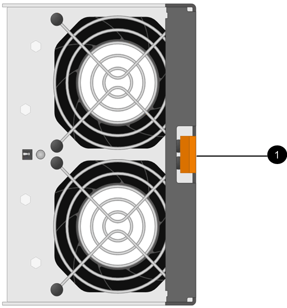

= Remplacez le boîtier du ventilateur E5700 (60 disques)
:allow-uri-read: 
:experimental: 
:icons: font
:imagesdir: ../media/

[role="lead"]
Vous pouvez remplacer une cartouche de ventilateur dans une baie E5700 par une étagère de 60 disques, qui comprend les types d'étagères suivants :

* Tiroir contrôleur E5760
* Tiroir disque DE460C

.Description de la tâche
Chaque tiroir de contrôleur ou tiroir de 60 disques comprend deux boîtiers de ventilateur. En cas de défaillance de la cartouche du ventilateur, vous devez la remplacer dès que possible pour vous assurer que la tablette dispose d'un refroidissement adéquat.

CAUTION: *Dommages possibles à l'équipement* -- si vous effectuez cette procédure sous tension, vous devez la terminer dans les 30 minutes afin d'éviter la possibilité de surchauffe de l'équipement.

.Avant de commencer
* Révision link:canisters-overview-supertask-concept.html["Conditions requises pour le remplacement de l'absorbeur E5700"].
* Passez en revue les détails du gourou de la restauration pour confirmer qu'il y a un problème avec une batterie et pour vous assurer qu'aucun autre élément ne doit être résolu en premier.
* Vérifier que le voyant d'avertissement orange sur le boîtier du ventilateur est allumé, ce qui indique que le ventilateur est défectueux. Contactez le support technique pour obtenir de l'aide si les voyants d'avertissement orange des deux ventilateurs du tiroir sont allumés.
* Assurez-vous de disposer des éléments suivants :
+
** Une cartouche de ventilateur de remplacement prise en charge pour votre modèle de tiroir contrôleur ou de tiroir disque.
** Un bracelet antistatique ou d'autres précautions antistatiques.
** Station de gestion avec un navigateur qui peut accéder au Gestionnaire système SANtricity du contrôleur. (Pour ouvrir l'interface System Manager, pointez le navigateur vers le nom de domaine ou l'adresse IP du contrôleur.)

== Étape 1 : préparer le remplacement du boîtier du ventilateur

Préparez-vous à remplacer un boîtier de ventilateur dans un tiroir de contrôleur de 60 disques ou un tiroir disque.

.Étapes
. Collecte des données de support de votre baie de stockage à l'aide de SANtricity System Manager
+
Si un problème survient au cours de cette procédure, vous pouvez utiliser le fichier enregistré pour résoudre le problème. Le système enregistre les données d'inventaire, d'état et de performances de votre matrice de stockage dans un seul fichier.

+
.. Sélectionnez menu :support[Centre de support > Diagnostics].
.. Sélectionnez *collecter les données de support*.
.. Cliquez sur *collect*.
+
Le fichier est enregistré dans le dossier Téléchargements de votre navigateur portant le nom *support-data.7z*.

. Dans le Gestionnaire système SANtricity, déterminez quelle cartouche de ventilateur est défectueuse.
+
.. Sélectionnez *matériel*.
.. Regarder le ventilateur image:../media/sam1130_ss_hardware_fan_icon_maint-e5700.gif[""] Icône à droite des listes déroulantes *Shelf* pour déterminer quelle étagère est dotée de la cartouche défectueuse du ventilateur.
+
Si un composant est défectueux, cette icône est rouge.

.. Lorsque vous trouvez la tablette avec une icône rouge, sélectionnez *Afficher le verso de la tablette*.
.. Sélectionnez le boîtier du ventilateur ou l'icône rouge du ventilateur.
.. Dans l'onglet *fans*, observez les États des boîtiers de ventilateur pour déterminer quel absorbeur de ventilateur doit être remplacé.
+
Un composant ayant l'état *FAILED* doit être remplacé.

+

CAUTION: Si le second boîtier de ventilateur de l'étagère n'a pas l'état *optimal*, ne tentez pas de remplacer à chaud le boîtier de ventilateur défectueux. Cependant, contactez le support technique pour obtenir de l'aide.

+
Vous pouvez également trouver des informations sur le canister de ventilateur défectueux dans la zone Détails du gourou de la récupération, ou vous pouvez consulter le journal des événements sous support et filtrer par type de composant.

. À l'arrière de la matrice de stockage, observez les voyants d'avertissement pour localiser le boîtier du ventilateur que vous devez retirer.
+
Vous devez remplacer le boîtier du ventilateur dont le voyant d'avertissement est allumé.

+
image::../media/28_dwg_e2860_de460c_single_fan_canister_with_led_callout_maint-e5700.gif[28 dwg e2860 de460c canister à ventilateur unique avec led légende maint e5700]

+
*(1)* _LED attention_. Si ce voyant s'affiche en orange fixe, cela signifie que le ventilateur est défectueux.

== Étape 2 : retirer le boîtier de ventilateur défectueux et en installer un nouveau

Retirez un boîtier de ventilateur défectueux pour le remplacer par un neuf.

CAUTION: Si vous ne coupez pas l'alimentation de votre matrice de stockage, assurez-vous de retirer et de remplacer le boîtier du ventilateur dans les 30 minutes afin d'éviter toute surchauffe du système.

.Étapes
. Déballez le nouveau boîtier du ventilateur et placez-le sur une surface plane à proximité de la tablette.
+
Conservez tous les matériaux d'emballage pour les réutiliser lors du retour du ventilateur défectueux.

. Appuyez sur la languette orange pour libérer la poignée du boîtier du ventilateur.
+

+
*(1)* _taquet que vous appuyez pour libérer la poignée du canister du ventilateur._

. Utiliser la poignée du boîtier du ventilateur pour extraire le boîtier du ventilateur de l'étagère.
+
image::../media/28_dwg_e2860_de460c_fan_canister_handle_with_callout_maint-e5700.gif[28 dwg e2860 de460c poignée de la cartouche du ventilateur avec légende de la prise e5700]

+
*(1)* _poignée pour extraire le boîtier du ventilateur._

. Faites glisser le boîtier du ventilateur de remplacement complètement dans la tablette, puis déplacez la poignée du boîtier du ventilateur jusqu'à ce qu'il s'enclenche avec la languette orange.

== Étape 3 : remplacement complet du boîtier du ventilateur

Vérifier que le nouveau boîtier du ventilateur fonctionne correctement, recueillir les données de support et reprendre le fonctionnement normal.

.Étapes
. Vérifiez le voyant d'avertissement orange sur le nouveau boîtier du ventilateur.
+

NOTE: Après avoir remplacé le boîtier du ventilateur, le voyant d'avertissement reste allumé (orange fixe) pendant que le micrologiciel vérifie que le boîtier du ventilateur est correctement installé. Le voyant s'éteint une fois le processus terminé.

. Dans le gourou de la restauration de SANtricity System Manager, sélectionnez *revérifier* pour vous assurer que le problème a été résolu.
. Si une cartouche de ventilateur défectueuse est toujours signalée, répéter les étapes à la section <<Étape 2 : retirer le boîtier de ventilateur défectueux et en installer un nouveau>>. Si le problème persiste, contactez le support technique.
. Déposer la protection antistatique.
. Collecte des données de support de votre baie de stockage à l'aide de SANtricity System Manager
+
Si un problème survient au cours de cette procédure, vous pouvez utiliser le fichier enregistré pour résoudre le problème. Le système enregistre les données d'inventaire, d'état et de performances de votre matrice de stockage dans un seul fichier.

+
.. Sélectionnez menu :support[Centre de support > Diagnostics].
.. Sélectionnez *collecter les données de support*.
.. Cliquez sur *collect*.
+
Le fichier est enregistré dans le dossier Téléchargements de votre navigateur portant le nom *support-data.7z*.

. Retournez la pièce défectueuse à NetApp, tel que décrit dans les instructions RMA (retour de matériel) fournies avec le kit.

.Et la suite ?
Le remplacement du boîtier du ventilateur est terminé. Vous pouvez reprendre les opérations normales.
