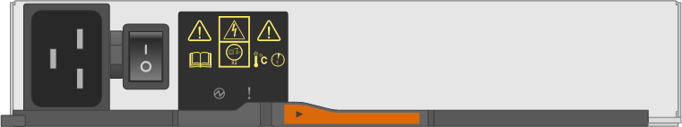
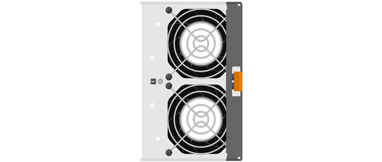

= Conditions requises pour le remplacement de l'absorbeur E5700
:allow-uri-read: 
:icons: font
:imagesdir: ../media/

[role="lead"]
Avant de remplacer une cartouche E5700, consultez les exigences et les considérations.

Les boîtiers sont constitués de trois types différents : des blocs d'alimentation (blocs d'alimentation) qui fournissent une source d'alimentation redondante et un refroidissement adéquat dans un tiroir de contrôleur ou tiroir de 24 disques de 12 ou de disques, des blocs d'alimentation qui sont utilisés pour la redondance de l'alimentation dans un tiroir de contrôleur ou un tiroir de 60 disques, les boîtiers de ventilateur utilisés pour la climatisation du tiroir de contrôleur de 60 disques ou du tiroir disque.

== Alimentation électrique

NOTE: La procédure de remplacement de l'alimentation électrique est applicable au remplacement des modules d'E/S. Pour remplacer votre module d'E/S, suivez la procédure de remplacement de l'alimentation.

Chaque tiroir contrôleur ou tiroir disque de 24 disques comprend deux blocs d'alimentation avec ventilateurs intégrés. Il s'agit de _blocs-ventilateurs_ dans SANtricity System Manager. En cas de panne de l'absorbeur, remplacez-le dès que possible afin d'assurer une source d'alimentation redondante et un refroidissement adéquat.

=== Types de tiroirs pour une alimentation électrique

Vous pouvez remplacer une alimentation dans les tiroirs suivants :

* Tiroir contrôleur E5724
* Tiroir disque DE224C

La figure ci-dessous présente un tiroir contrôleur E5724 avec deux blocs d'alimentation (blocs d'alimentation). Les tiroirs disques DE224C sont identiques, mais ils incluent des modules d'E/S (IOM) à la place des boîtiers de contrôleur.

image::../media/e5700_power_supply_callout.png[Alimentation du contrôleur E5700]

*(1)* _étagère de contrôleur avec deux blocs d'alimentation (blocs d'alimentation) sous les boîtiers de contrôleur._

Les sujets __Replace Power Supply___ ne décrivent pas comment remplacer un absorbeur de ventilateurs défectueux dans un tiroir disque DE1600 ou DE5600, qui peut être connecté aux tiroirs contrôleurs E5700 ou E2800. Pour obtenir des instructions sur ces modèles de tiroirs d'entraînement, reportez-vous à la section link:https://library.netapp.com/ecm/ecm_download_file/ECMP1140874["Remplacement d'un filtre du ventilateur d'alimentation dans le tiroir disque DE1600 ou le tiroir disque DE5600"].

=== Conditions requises pour remplacer un bloc d'alimentation

Si vous envisagez de remplacer une alimentation électrique, gardez les exigences suivantes à l'esprit.

* Vous devez disposer d'une alimentation de remplacement (cartouche du ventilateur) compatible avec votre modèle de tiroir contrôleur ou de tiroir disque.
* Vous devez avoir un bracelet ESD, ou vous avez pris d'autres précautions antistatiques.
* Vous pouvez remplacer un bloc d'alimentation (absorbeur de ventilateur d'alimentation) lorsque votre matrice de stockage est sous tension et effectuer des opérations d'E/S hôte, tant que les conditions suivantes sont remplies :
+
** Le deuxième bloc d'alimentation (canister du ventilateur d'alimentation) du shelf présente un état optimal.
** Le champ *OK à supprimer* de la zone Détails du gourou de la restauration dans le Gestionnaire de système SANtricity affiche *Oui*, indiquant qu'il est sûr de supprimer ce composant.
+

NOTE: Si le deuxième bloc d'alimentation (absorbeur de ventilateur d'alimentation) du shelf n'a pas le statut optimal ou si le gourou de la récupération indique qu'il n'est pas en mesure de retirer le boîtier du ventilateur d'alimentation, contactez le support technique.

== Réservoir d'alimentation

Chaque tiroir de contrôleur de 60 disques ou tiroir de disque comprend deux blocs d'alimentation pour la redondance de l'alimentation.

=== Types d'étagère pour une cartouche d'alimentation

Vous pouvez remplacer une cartouche d'alimentation dans les étagères suivantes :

* Tiroirs contrôleurs E5760
* Tiroir disque DE460C

Les rubriques _Replace POWER Canister_ ne décrivent pas comment remplacer un boîtier de mise sous tension défectueux dans un tiroir de disque DE6600, qui peut être connecté au tiroir de contrôleur.

La figure suivante montre l'arrière d'un tiroir disque DE460C avec deux blocs d'alimentation :

image::../media/28_dwg_de460c_rear_no_callouts_maint-e5700.gif[DE460C avec deux blocs d'alimentation]

La figure suivante montre une cartouche de puissance :

=== Conditions requises pour le remplacement d'une cartouche d'alimentation

Si vous envisagez de remplacer un réservoir d'alimentation, gardez les exigences suivantes à l'esprit.

* Vous disposez d'une cartouche de remplacement prenant en charge votre modèle de tiroir contrôleur ou de tiroir disque.
* Vous disposez d'une cartouche d'alimentation installée et en marche.
* Vous avez un bracelet ESD, ou vous avez pris d'autres précautions antistatiques.
* Vous pouvez remplacer une cartouche d'alimentation alors que votre matrice de stockage est sous tension et effectuer des opérations d'E/S hôte, tant que les conditions suivantes sont vraies :
* L'autre cartouche d'alimentation de l'étagère présente un état optimal.
+

NOTE: Pendant la procédure, l'autre cartouche d'alimentation alimente les deux ventilateurs pour s'assurer que l'équipement ne surchauffe pas.

* Le champ *OK à supprimer* de la zone Détails du gourou de la restauration dans le Gestionnaire de système SANtricity affiche *Oui*, indiquant qu'il est sûr de supprimer ce composant.
+

NOTE: Si le deuxième bloc d'alimentation de l'étagère ne dispose pas d'un état optimal ou si le gourou de la récupération indique qu'il n'est pas OK pour retirer le boîtier d'alimentation, contacter le support technique.

== Boîtier de ventilateur

Chaque tiroir de contrôleur ou tiroir de 60 disques comprend deux boîtiers de ventilateur.

=== Types d'étagère pour une cartouche de ventilateur

Vous pouvez remplacer une cartouche de ventilateur dans les étagères suivantes :

* Tiroirs contrôleurs E5760
* Tiroir disque DE460C

Les rubriques _Replace Fan canister_ ne décrivent pas comment remplacer un boîtier de ventilateur défectueux dans un tiroir de disque DE6600, qui peut être connecté au tiroir de contrôleur.

La figure suivante montre une cartouche de ventilateur :

La figure suivante montre l'arrière d'un tiroir DE460C avec deux boîtiers de ventilation :

image::../media/28_dwg_de460c_rear_no_callouts_maint-e5700.gif[DE460C avec deux boîtiers de ventilation]

CAUTION: *Dommages possibles à l'équipement* -- si vous remplacez une cartouche de ventilateur sous tension, vous devez effectuer la procédure de remplacement dans les 30 minutes afin d'éviter toute surchauffe de l'équipement.

=== Conditions requises pour le remplacement d'une cartouche de ventilateur

Si vous envisagez de remplacer une cartouche de ventilateur, gardez les exigences suivantes à l'esprit.

* Vous disposez d'une cartouche de ventilateur de remplacement prise en charge pour votre modèle de tiroir de contrôleur ou de tiroir de disque.
* Une cartouche de ventilateur est installée et en marche.
* Vous avez un bracelet ESD, ou vous avez pris d'autres précautions antistatiques.
* Si vous effectuez cette procédure alors que l'appareil est sous tension, vous devez l'effectuer dans les 30 minutes afin d'éviter toute surchauffe.
* Vous pouvez remplacer une cartouche de ventilateur lorsque votre matrice de stockage est sous tension et effectuer des opérations d'E/S hôte, tant que les conditions suivantes sont vraies :
+
** L'état du second boîtier du ventilateur dans le shelf est optimal.
** Le champ *OK à supprimer* de la zone Détails du gourou de la restauration dans le Gestionnaire de système SANtricity affiche *Oui*, indiquant qu'il est sûr de supprimer ce composant.
+

NOTE: Si le second boîtier de ventilateur de l'étagère ne présente pas l'état optimal ou si le gourou de la récupération indique qu'il n'est pas OK pour retirer le boîtier de ventilateur, contacter le support technique.

