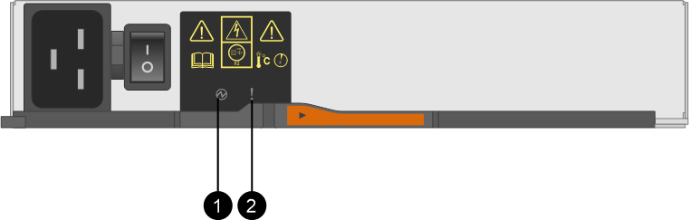

= Remplacez le boîtier d'alimentation E5700 (60 disques)
:allow-uri-read: 
:experimental: 
:icons: font
:imagesdir: ../media/

[role="lead"]
Vous pouvez remplacer un bloc d'alimentation dans une baie E5700 par un tiroir de 60 disques, qui inclut les types de tiroirs suivants :

* Tiroir contrôleur E5760
* Tiroir disque DE460C

Chaque tiroir de contrôleur de 60 disques ou tiroir de disque comprend deux blocs d'alimentation pour la redondance de l'alimentation. En cas de panne d'une cartouche, vous devez la remplacer dès que possible pour vous assurer que la tablette dispose d'une source d'alimentation redondante.

Vous pouvez remplacer une cartouche d'alimentation alors que votre matrice de stockage est sous tension et effectuer des opérations d'E/S de l'hôte, Tant que le deuxième réservoir d'alimentation de l'étagère dispose d'un état optimal et que le champ *OK pour retirer* de la zone Détails du gourou de la récupération dans le Gestionnaire de système SANtricity affiche *Oui*.

Pendant cette opération, l'autre cartouche d'alimentation alimente les deux ventilateurs pour s'assurer que l'équipement ne surchauffe pas.

.Avant de commencer
* Révision link:canisters-overview-supertask-concept.html["Conditions requises pour le remplacement de l'absorbeur E5700"].
* Passez en revue les détails du gourou de la restauration pour confirmer qu'il y a un problème avec une batterie et pour vous assurer qu'aucun autre élément ne doit être résolu en premier.
* Vérifiez que le voyant d'avertissement orange sur le boîtier d'alimentation est allumé, ce qui indique que le réservoir présente une anomalie. Contactez le support technique pour obtenir de l'aide si les LED d'avertissement orange sont allumées dans les deux blocs d'alimentation du tiroir.

.Ce dont vous avez besoin, 8217;ll
* Une cartouche d'alimentation installée et en marche.
* Cartouche d'alimentation de rechange prise en charge pour votre modèle de tiroir de contrôleur ou de tiroir de disque.
* Un bracelet antistatique ou d'autres précautions antistatiques.
* Station de gestion avec un navigateur qui peut accéder au Gestionnaire système SANtricity du contrôleur. (Pour ouvrir l'interface System Manager, pointez le navigateur vers le nom de domaine ou l'adresse IP du contrôleur.)

== Étape 1 : préparer le remplacement du boîtier d'alimentation

Préparez-vous à remplacer une cartouche d'alimentation dans un tiroir de contrôleur de 60 disques ou un tiroir disque.

.Étapes
. Collecte des données de support de votre baie de stockage à l'aide de SANtricity System Manager
+
Si un problème survient au cours de cette procédure, vous pouvez utiliser le fichier enregistré pour résoudre le problème. Le système enregistre les données d'inventaire, d'état et de performances de votre matrice de stockage dans un seul fichier.

+
.. Sélectionnez menu :support[Centre de support > Diagnostics].
.. Sélectionnez *collecter les données de support*.
.. Cliquez sur *collect*.
+
Le fichier est enregistré dans le dossier Téléchargements de votre navigateur portant le nom *support-data.7z*.

. Dans le Gestionnaire système SANtricity, déterminez quelle cartouche d'alimentation est défectueuse.
+
.. Sélectionnez *matériel*.
.. Regardez la puissance image:../media/sam1130_ss_hardware_power_icon_maint-e5700.gif[""] Icône à droite des listes déroulantes *Shelf* pour déterminer quelle étagère possède la cartouche d'alimentation défectueuse.
+
Si un composant est défectueux, cette icône est rouge.

.. Lorsque vous trouvez la tablette avec une icône rouge, sélectionnez *Afficher le verso de la tablette*.
.. Sélectionnez le boîtier électrique ou l'icône d'alimentation rouge.
.. Dans l'onglet *blocs d'alimentation*, examinez les États des blocs d'alimentation pour déterminer quel réservoir d'alimentation doit être remplacé.
+
Un composant ayant l'état *FAILED* doit être remplacé.

+

CAUTION: Si le deuxième boîtier d'alimentation de l'étagère ne possède pas l'état *optimal*, ne tentez pas de remplacer à chaud le boîtier d'alimentation défectueux. Cependant, contactez le support technique pour obtenir de l'aide.

+

NOTE: Vous pouvez également trouver des informations sur le réservoir d'alimentation défectueux dans la zone Détails du Recovery Guru, ou consulter les informations affichées pour la tablette, ou consulter le journal des événements sous support et filtrer par type de composant.

. À l'arrière de la matrice de stockage, observez les voyants d'avertissement pour localiser le boîtier d'alimentation que vous devez retirer.
+
Vous devez remplacer le boîtier d'alimentation dont le voyant d'avertissement est allumé.

+

+
*(1)* _LED d'alimentation_. S'il est *vert fixe*, le boîtier d'alimentation fonctionne correctement. S'il est *éteint*, le boîtier d'alimentation est défectueux, l'interrupteur CA est éteint, le cordon d'alimentation CA n'est pas correctement installé ou la tension d'entrée du cordon d'alimentation CA n'est pas dans la marge (il y a un problème à l'extrémité de la source du cordon d'alimentation CA).

+
*(2)* _LED attention_. S'il est de type « orange fixe », le boîtier d'alimentation est défectueux ou il n'y a pas d'alimentation d'entrée vers ce boîtier d'alimentation, mais l'autre réservoir d'alimentation fonctionne.

== Étape 2 : retirer le boîtier d'alimentation défectueux

Retirez une cartouche défectueuse pour pouvoir la remplacer par une nouvelle.

.Étapes
. Mettre en place une protection antistatique.
. Déballez la nouvelle cartouche d'alimentation et placez-la sur une surface plane à proximité de la tablette.
+
Conservez tous les matériaux d'emballage pour pouvoir les utiliser lors du retour de l'absorbeur de puissance défectueux.

. Mettez l'interrupteur d'alimentation de la cartouche d'alimentation hors tension que vous devez retirer.
. Ouvrez le dispositif de retenue du cordon d'alimentation du boîtier d'alimentation que vous devez retirer, puis débranchez le cordon d'alimentation du boîtier d'alimentation.
. Appuyez sur le loquet orange de la poignée de came de l'absorbeur de puissance, puis ouvrez la poignée de came pour libérer complètement le réservoir d'alimentation du plan médian.
. Utilisez la poignée de came pour faire glisser le boîtier d'alimentation hors de l'étagère.
+

CAUTION: Lors du retrait d'une cartouche de puissance, toujours utiliser deux mains pour soutenir son poids.

== Étape 3 : installer un nouveau réservoir d'alimentation

Installez un nouveau réservoir d'alimentation pour remplacer le boîtier défectueux.

.Étapes
. Assurez-vous que l'interrupteur marche/arrêt de la nouvelle cartouche d'alimentation est en position arrêt.
. À l'aide des deux mains, soutenez et alignez les bords de la cartouche d'alimentation avec l'ouverture du châssis du système, puis poussez doucement la cartouche d'alimentation dans le châssis à l'aide de la poignée de came jusqu'à ce qu'elle s'enclenche.
+

CAUTION: N'utilisez pas de force excessive lorsque vous faites glisser la cartouche d'alimentation dans le système ; vous risquez d'endommager le connecteur.

. Fermez la poignée de came de façon à ce que le verrou s'enclenche en position verrouillée et que le boîtier électrique soit bien en place.
. Rebranchez le cordon d'alimentation à la cartouche d'alimentation et fixez le cordon d'alimentation à la cartouche d'alimentation à l'aide de la retenue du cordon d'alimentation.
. Mettez le nouveau réservoir sous tension.

== Étape 4 : remplacement complet du réservoir d'alimentation

Vérifier que le nouveau réservoir d'alimentation fonctionne correctement, recueillir les données de support et reprendre le fonctionnement normal.

.Étapes
. Sur le nouveau boîtier d'alimentation, vérifiez que le voyant d'alimentation vert est allumé et que le voyant d'avertissement orange est éteint.
. Dans le gourou de la restauration de SANtricity System Manager, sélectionnez *revérifier* pour vous assurer que le problème a été résolu.
. Si un réservoir d'alimentation défectueux est toujours en cours de signalement, répétez les étapes à la section  2: Remove failed power canister et po  3: Install new power canister. Si le problème persiste, contactez le support technique.
. Déposer la protection antistatique.
. Collecte des données de support de votre baie de stockage à l'aide de SANtricity System Manager
+
Si un problème survient au cours de cette procédure, vous pouvez utiliser le fichier enregistré pour résoudre le problème. Le système enregistre les données d'inventaire, d'état et de performances de votre matrice de stockage dans un seul fichier.

+
.. Sélectionnez menu :support[Centre de support > Diagnostics].
.. Sélectionnez *collecter les données de support*.
.. Cliquez sur *collect*.
+
Le fichier est enregistré dans le dossier Téléchargements de votre navigateur portant le nom *support-data.7z*.

. Retournez la pièce défectueuse à NetApp, tel que décrit dans les instructions RMA (retour de matériel) fournies avec le kit.

Le remplacement du réservoir d'alimentation est terminé. Vous pouvez reprendre les opérations normales.
