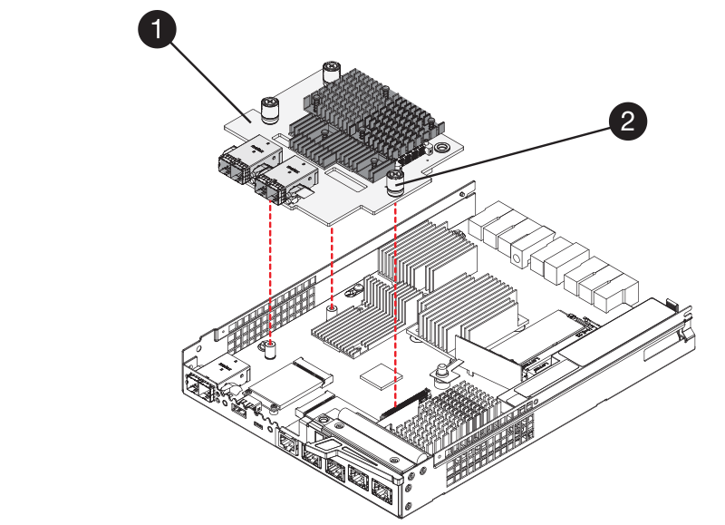

= Remplacement de la carte d'interface hôte E5700 (HIC)
:allow-uri-read: 
:experimental: 
:icons: font
:imagesdir: ../media/

[role="lead"]
Vous pouvez remplacer une carte d'interface hôte (HIC) qui a échoué.

.Description de la tâche
Lorsque vous remplacez une HIC, mettez le contrôleur hors ligne (pour les configurations duplex), retirez le boîtier du contrôleur, installez la nouvelle HIC, puis remplacez le boîtier du contrôleur.

.Avant de commencer
* Révision link:hics-overview-supertask-concept.html["Conditions requises pour le remplacement de la carte E5700 HIC"].
* Planifiez une fenêtre de maintenance des temps d'arrêt pour cette procédure. L'alimentation doit être éteinte lorsque vous installez des HIC. Vous ne pouvez donc pas accéder aux données sur la baie de stockage tant que cette procédure n'est pas terminée. (Dans une configuration duplex, les deux contrôleurs doivent avoir la même configuration HIC lorsqu'ils sont sous tension.)
* Vérifiez qu'aucun volume n'est en cours d'utilisation ou que vous avez installé un pilote multivoie sur tous les hôtes qui utilisent ces volumes.
* Dans le Gestionnaire système SANtricity, vérifiez les détails du gourou de la restauration pour confirmer que vous avez une HIC défectueuse et pour garantir qu'aucun autre élément ne doit être résolu avant que vous ne puissiez retirer et remplacer la HIC.

.Ce dont vous avez besoin
* Deux circuits intégrés compatibles avec vos contrôleurs.
+
Pour les configurations duplex (deux contrôleurs), les circuits intégrés installés dans les deux boîtiers de contrôleur doivent être identiques. La présence de circuits intégrés non concordants provoque le verrouillage du contrôleur avec la HIC de remplacement lorsque vous le met en ligne.

* Un bracelet antistatique ou d'autres précautions antistatiques.
* Un tournevis cruciforme n° 1.
* Étiquettes permettant d'identifier chaque câble connecté au boîtier du contrôleur.
* Station de gestion avec un navigateur qui peut accéder au Gestionnaire système SANtricity du contrôleur. (Pour ouvrir l'interface System Manager, pointez le navigateur vers le nom de domaine ou l'adresse IP du contrôleur.)

== Étape 1 : mise hors ligne du contrôleur (duplex)

Si vous disposez d'une configuration duplex, vous devez mettre le contrôleur affecté hors ligne pour pouvoir supprimer en toute sécurité la HIC défaillante.

.Étapes
. Dans la zone Details du Recovery Guru, déterminez quelle carte contrôleur possède la HIC défaillante.
. Sauvegardez la base de données de configuration de la baie de stockage à l'aide de SANtricity System Manager.
+
Si un problème survient au cours de cette procédure, vous pouvez utiliser le fichier enregistré pour restaurer votre configuration. Le système enregistre l'état actuel de la base de données de configuration RAID, qui inclut toutes les données des groupes de volumes et des pools de disques sur le contrôleur.

+
** Depuis System Manager :
+
... Sélectionnez menu :support[Centre de support > Diagnostics].
... Sélectionnez *collecter les données de configuration*.
... Cliquez sur *collect*.
+
Le fichier est enregistré dans le dossier Téléchargements de votre navigateur sous le nom *configurationData-<arrayName>-<DateTime>.7z*.

** Vous pouvez également sauvegarder la base de données de configuration à l'aide de la commande CLI suivante :
+
`save storageArray dbmDatabase sourceLocation=onboard contentType=all file="filename";`

. Collecte des données de support de votre baie de stockage à l'aide de SANtricity System Manager
+
Si un problème survient au cours de cette procédure, vous pouvez utiliser le fichier enregistré pour résoudre le problème. Le système enregistre les données d'inventaire, d'état et de performances de votre matrice de stockage dans un seul fichier.

+
.. Sélectionnez menu :support[Centre de support > Diagnostics].
.. Sélectionnez *collecter les données de support*.
.. Cliquez sur *collect*.
+
Le fichier est enregistré dans le dossier Téléchargements de votre navigateur portant le nom *support-data.7z*.

. Si le contrôleur n'est pas encore hors ligne, mettez-le hors ligne maintenant en utilisant SANtricity System Manager.
+
** Depuis SANtricity System Manager :
+
... Sélectionnez *matériel*.
... Si le graphique montre les disques durs, sélectionnez *Afficher le verso du tiroir* pour afficher les contrôleurs.
... Sélectionnez le contrôleur que vous souhaitez placer hors ligne.
... Dans le menu contextuel, sélectionnez *placer hors ligne* et confirmez que vous souhaitez effectuer l'opération.
+

NOTE: Si vous accédez à SANtricity System Manager à l'aide du contrôleur que vous tentez de mettre hors ligne, un message SANtricity System Manager indisponible s'affiche. Sélectionnez *connexion à une autre connexion réseau* pour accéder automatiquement au Gestionnaire système SANtricity à l'aide de l'autre contrôleur.

** Vous pouvez également mettre les contrôleurs hors ligne en utilisant les commandes de l'interface de ligne de commandes suivantes :
+
*Pour contrôleur A:* `set controller [a] availability=offline`

+
*Pour le contrôleur B:* `set controller [b] availability=offline`

. Attendez que SANtricity System Manager mette à jour l'état du contrôleur sur hors ligne.
+

NOTE: Ne pas commencer d'autres opérations tant que le statut n'a pas été mis à jour.

== Étape 2 : déposer le boîtier du contrôleur

Retirez le boîtier du contrôleur pour ajouter la nouvelle HIC.

.Étapes
. Etiqueter chaque câble relié au boîtier du contrôleur.
. Débrancher tous les câbles du boîtier du contrôleur.
+

CAUTION: Pour éviter de dégrader les performances, ne pas tordre, plier, pincer ou marcher sur les câbles.

. Vérifiez que la LED du cache actif située à l'arrière du contrôleur est éteinte.
+
La LED verte cache actif située à l'arrière du contrôleur est allumée lorsqu'il est nécessaire d'écrire les données en cache sur les disques. Vous devez attendre que ce voyant s'éteigne avant de retirer le boîtier du contrôleur.

+
image::../media/e5700_ib_hic_w_cache_led_callouts_maint-e5700.gif[e5700 ib hic avec led cache texte associé maint e5700]

+
*(1)* _cache LED active_

. Appuyez sur le loquet de la poignée de came jusqu'à ce qu'il se libère, puis ouvrez la poignée de came vers la droite pour libérer le boîtier du contrôleur de la tablette.
+
La figure suivante présente un tiroir contrôleur E5724 :

+
image::../media/28_dwg_e2824_remove_controller_canister_maint-e5700.gif[28 dwg e2824 retirer la cartouche du contrôleur maint. e5700]

+
*(1)* _canister_

+
*(2)* _poignée de came_

+
La figure suivante présente un exemple de tiroir contrôleur E5760 :

+
image::../media/28_dwg_e2860_add_controller_canister_maint-e5700.gif[28 dwg e2860 ajout de la cartouche de contrôleur maint. e5700]

+
*(1)* _canister_

+
*(2)* _poignée de came_

. A l'aide de deux mains et de la poignée de came, faites glisser le boîtier du contrôleur hors de la tablette.
+

CAUTION: Toujours utiliser deux mains pour soutenir le poids d'un boîtier de contrôleur.

+
Si vous retirez le boîtier du contrôleur d'un shelf contrôleur E5724, un rabat se met en place pour bloquer la baie vide, ce qui contribue à maintenir le débit d'air et le refroidissement.

. Retournez le boîtier du contrôleur afin que le capot amovible soit orienté vers le haut.
. Placez le boîtier du contrôleur sur une surface plane et exempte d'électricité statique.

== Étape 3 : installer une HIC

Installez une nouvelle HIC pour remplacer la HIC défectueuse.

CAUTION: *Perte possible d'accès aux données* -- n'installez jamais d'HIC dans un boîtier de contrôleur E5700 si cette HIC a été conçue pour un autre contrôleur E-Series. En outre, si vous disposez d'une configuration duplex, les deux contrôleurs et les deux circuits intégrés doivent être identiques. La présence de circuits intégrés incompatibles ou non concordants provoque le blocage des contrôleurs lorsque vous mettez le système sous tension.

.Étapes
. Déballez la nouvelle HIC et la nouvelle plaque HIC.
. Appuyez sur le bouton situé sur le couvercle du boîtier du contrôleur et faites glisser le couvercle pour le retirer.
. Vérifiez que le voyant vert à l'intérieur du contrôleur (par les DIMM) est éteint.
+
Si ce voyant vert est allumé, le contrôleur utilise toujours l'alimentation de la batterie. Vous devez attendre que ce voyant s'éteigne avant de retirer des composants.

+
image::../media/28_dwg_e2800_internal_cache_active_led_maint-e5700.gif[28 dwg e2800 cache interne led active maint. e5700]

+
*(1)* _LED active cache interne_

+
*(2)* _batterie_

. À l'aide d'un tournevis cruciforme n° 1, retirez les quatre vis qui fixent le cache blanc au boîtier du contrôleur, puis retirez le cache.
. Alignez les trois vis moletées de la HIC avec les trous correspondants du contrôleur, puis alignez le connecteur situé au bas de la HIC avec le connecteur d'interface HIC de la carte contrôleur.
+
Veillez à ne pas rayer ou heurter les composants au bas de la HIC ou au-dessus de la carte contrôleur.

. Abaisser avec précaution la HIC et mettre le connecteur HIC en place en appuyant doucement sur la HIC.
+

CAUTION: *Dommages possibles à l'équipement* -- faites très attention de ne pas pincer le connecteur ruban doré pour les voyants du contrôleur entre la HIC et les vis à molette.

+

+
*(1)* _carte d'interface hôte_

+
*(2)* _vis_

. Serrez les vis à molette HIC à la main.
+
N'utilisez pas de tournevis, sinon vous risquez de trop serrer les vis.

. À l'aide d'un tournevis cruciforme n° 1, fixez la nouvelle carte HIC sur le boîtier du contrôleur à l'aide des quatre vis que vous avez retirées précédemment.
+
image::../media/28_dwg_e2800_hic_faceplace_screws_maint-e5700.gif[28 dwg e2800 vis à face arrière maint e5700]

== Étape 4 : réinstallez le boîtier du contrôleur

Après avoir installé le HIC, réinstallez le boîtier du contrôleur dans le shelf.

.Étapes
. Retournez le boîtier du contrôleur, de sorte que le capot amovible soit orienté vers le bas.
. Avec la poignée de came en position ouverte, faites glisser le boîtier du contrôleur complètement dans la tablette du contrôleur.
+
La figure suivante présente un tiroir contrôleur E5724 :

+
image::../media/28_dwg_e2824_remove_controller_canister_maint-e5700.gif[28 dwg e2824 retirer la cartouche du contrôleur maint. e5700]

+
*(1)* _canister_

+
*(2)* _poignée de came_

+
La figure suivante présente un exemple de tiroir contrôleur E5760 :

+
image::../media/28_dwg_e2860_add_controller_canister_maint-e5700.gif[28 dwg e2860 ajout de la cartouche de contrôleur maint. e5700]

+
*(1)* _canister_

+
*(2)* _poignée de came_

. Déplacez la poignée de came vers la gauche pour verrouiller le boîtier du contrôleur en place.
. Rebranchez tous les câbles que vous avez retirés.
+

NOTE: Ne connectez pas les câbles de données aux nouveaux ports HIC pour le moment.

. (Facultatif) si vous ajoutez des HIC à une configuration duplex, répétez toutes les étapes pour retirer le second boîtier de contrôleur, installer la deuxième HIC et réinstaller le second boîtier de contrôleur.

== Étape 5 : mise en ligne du contrôleur (duplex)

Si vous disposez d'une configuration duplex, connectez le contrôleur pour vérifier que la matrice de stockage fonctionne correctement, collectez les données de support et reprenez les opérations.

NOTE: Effectuez cette tâche uniquement si votre baie de stockage dispose de deux contrôleurs.

.Étapes
. Au démarrage du contrôleur, vérifier les LED du contrôleur et l'écran à sept segments.
+

NOTE: La figure montre un exemple de cartouche de contrôleur. Votre contrôleur peut avoir un nombre différent et un type différent de ports hôtes.

+
Lorsque la communication avec l'autre contrôleur est rétablie :

+
** L'affichage à sept segments montre la séquence répétée *OS*, *OL*, *_blank_* pour indiquer que le contrôleur est hors ligne.
** Le voyant d'avertissement orange reste allumé.
** Les voyants Host Link peuvent être allumés, clignotants ou éteints, selon l'interface hôte.image:../media/e5700_hic_3_callouts_maint-e5700.gif[""]
+
*(1)* _LED Host Link_

+
*(2)* _voyant attention (ambre)_

+
*(3)* _affichage à sept segments_

. Mettre le contrôleur en ligne à l'aide de SANtricity System Manager.
+
** Depuis SANtricity System Manager :
+
... Sélectionnez *matériel*.
... Si le graphique montre les lecteurs, sélectionnez *Afficher le verso du tiroir*.
... Sélectionnez le contrôleur que vous souhaitez placer en ligne.
... Sélectionnez *placer en ligne* dans le menu contextuel et confirmez que vous souhaitez effectuer l'opération.
+
Le système met le contrôleur en ligne.

** Vous pouvez également utiliser les commandes suivantes de l'interface de ligne de commandes :
+
*Pour contrôleur A:* `set controller [a] availability=online;`

+
*Pour le contrôleur B:* `set controller [b] availability=online;`

. Vérifier les codes sur l'affichage à sept segments du contrôleur lorsqu'il est de nouveau en ligne. Si l'écran affiche l'une des séquences répétées suivantes, retirez immédiatement le contrôleur.
+
** *OE*, *L0*, *_blank_* (contrôleurs non concordants)
** *OE*, *L6*, *_blank_* (HIC non pris en charge) *attention:* *perte possible d'accès aux données* -- si le contrôleur que vous venez d'installer affiche l'un de ces codes et que l'autre contrôleur est réinitialisé pour quelque raison que ce soit, le second contrôleur pourrait également se verrouiller.

. Une fois le contrôleur reen ligne, vérifiez que son état est optimal et vérifiez les LED d'avertissement du tiroir contrôleur.
+
Si l'état n'est pas optimal ou si l'un des voyants d'avertissement est allumé, vérifiez que tous les câbles sont correctement installés et que la HIC et le boîtier du contrôleur sont correctement installés. Au besoin, déposer et réinstaller le boîtier du contrôleur et le HIC.

+

NOTE: Si vous ne pouvez pas résoudre le problème, contactez le support technique.

. Collecte des données de support de votre baie de stockage à l'aide de SANtricity System Manager
+
.. Sélectionnez menu :support[Centre de support > Diagnostics].
.. Sélectionnez *collecter les données de support*.
.. Cliquez sur *collect*.
+
Le fichier est enregistré dans le dossier Téléchargements de votre navigateur portant le nom *support-data.7z*.

. Retournez la pièce défectueuse à NetApp, tel que décrit dans les instructions RMA (retour de matériel) fournies avec le kit.
+
Contactez l'assistance technique à l'adresse http://mysupport.netapp.com["Support NetApp"^], 888-463-8277 (Amérique du Nord), 00-800-44-638277 (Europe) ou +800-800-80-800 (Asie/Pacifique) si vous avez besoin du numéro RMA.

.Et la suite ?
Votre remplacement HIC est terminé. Vous pouvez reprendre les opérations normales.
