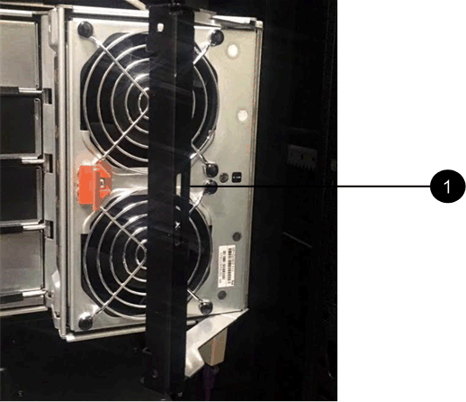
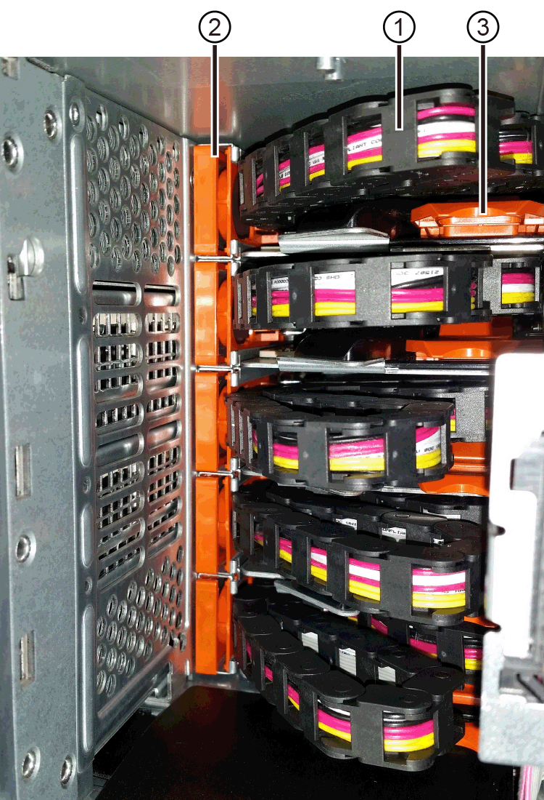
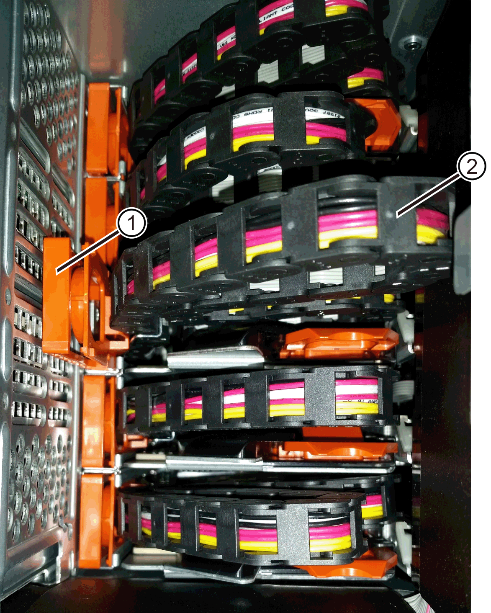
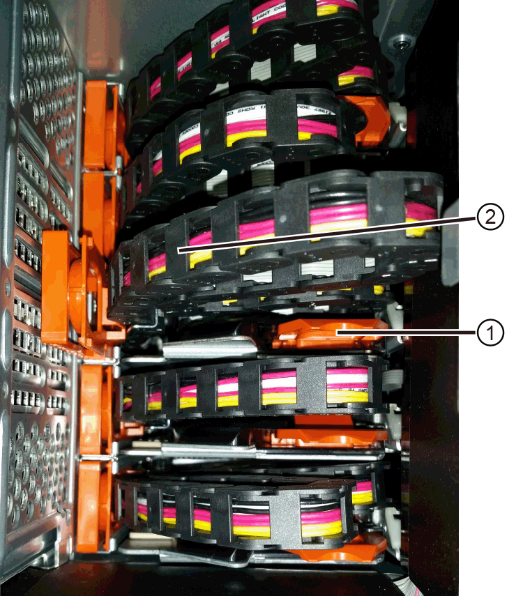
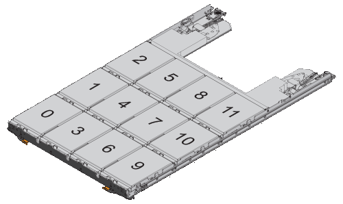
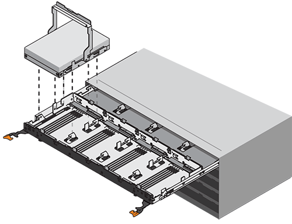
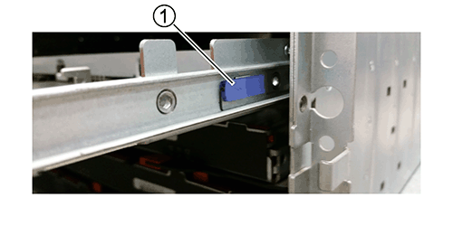
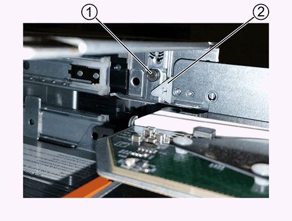
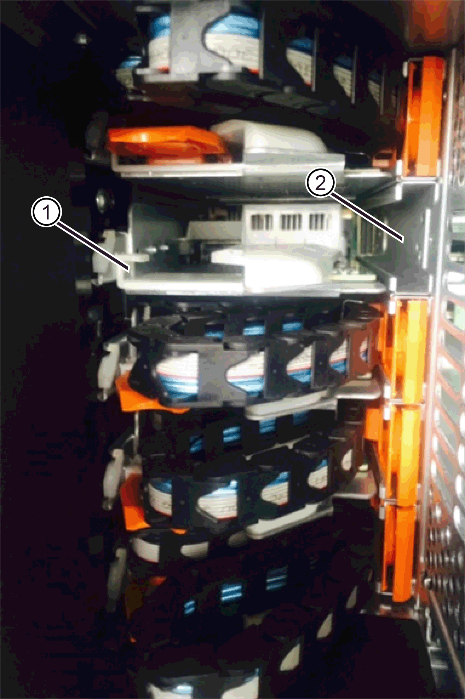
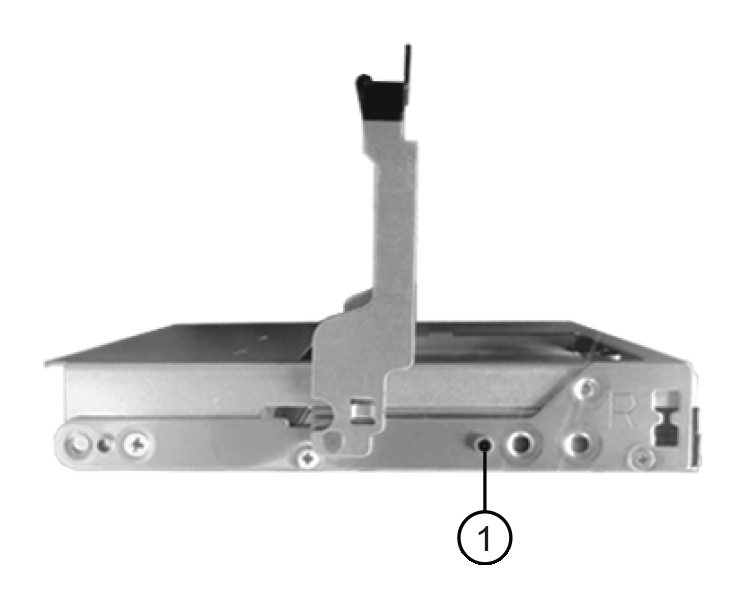

= Remplacez le tiroir de disque DE460C sur les systèmes de stockage EF50 et EF80
:allow-uri-read: 
:experimental: 
:icons: font
:imagesdir: ../media/

[role="lead"]
Pour les systèmes de stockage EF50 et EF80, vous pouvez remplacer un tiroir de disque dans une baie de disques d'extension DE460C lorsque la baie de disques est en ligne ou hors ligne.

.Description de la tâche
Les étapes de remplacement d'un tiroir de disque défaillant dans un tiroir de disques DE460C dépendent de la protection des volumes du tiroir par la Drawer Loss Protection. Si tous les volumes du tiroir de disque se trouvent dans des pools de disques ou des groupes de volumes bénéficiant de la Drawer Loss Protection, vous pouvez effectuer cette procédure en ligne. Sinon, vous devez effectuer cette procédure hors ligne en arrêtant toute activité d'E/S de l'hôte et en mettant hors tension l'ensemble du système de stockage (baie de contrôleur et toutes les baies d'extension) avant de remplacer un tiroir de disque.

.Avant de commencer
* Assurez-vous que le tiroir disque respecte toutes les conditions suivantes :
+
** La température du tiroir disque ne peut pas être excessive.
** Les deux ventilateurs doivent être installés et avoir le statut optimal.
** Tous les composants des tiroirs disques doivent être en place.
** Les volumes dans le tiroir du lecteur ne peuvent pas être en état dégradé.
+

CAUTION: *Perte possible d'accès aux données* -- si un volume est déjà dans un état dégradé et que vous retirez des disques du tiroir de lecteur, le volume peut échouer.

* Assurez-vous de disposer des éléments suivants :
+
** Un tiroir disque de remplacement.
** Un bracelet antistatique ou d'autres précautions antistatiques.
** Une lampe de poche.
** Un marqueur permanent pour noter l'emplacement exact de chaque lecteur lorsque vous retirez le lecteur du tiroir.
** Accès à l'interface de ligne de commandes (CLI) du système de stockage. Si vous n'avez pas accès à la CLI, vous pouvez faire l'une des actions suivantes :
+
*** *Pour SANtricity System Manager (version 11.60 et supérieure)* -- Télécharger le paquet CLI (fichier zip) depuis System Manager. Accédez au menu:Paramètres[système > modules complémentaires > interface de ligne de commande]. Vous pouvez ensuite lancer des commandes CLI à partir d'une invite du système d'exploitation, telle que l'invite DOS C:.

NOTE: Si vous avez besoin d'informations sur la façon de remplacer un tiroir d'extension E-Series DE460C, veuillez vous référer à https://kb.netapp.com/on-prem/E-Series/Hardware-KBs/How_to_replace_an_E_Series_DE460c_controller_expansion_shelf["Base de connaissances NetApp"^].

[[step-1-prepare-to-replace-drive-drawer]]
== Étape 1 : préparation du remplacement du tiroir disque

Déterminez si vous pouvez effectuer la procédure de remplacement pendant que le tiroir de disques est en ligne ou si vous devez interrompre l'activité d'E/S de l'hôte et mettre hors tension le système de stockage (effectuer la procédure hors ligne).

Si vous remplacez un tiroir dans une étagère équipée de la protection contre la perte de tiroir, il n'est pas nécessaire d'interrompre l'activité d'E/S de l'hôte ni de mettre hors tension le système de stockage.

.Étapes
. Déterminez si le tiroir du disque cible est sous tension.
+
** Si l'alimentation est coupée, il n'est pas nécessaire d'utiliser la commande CLI pour mettre le tiroir cible en mode service. Accédez à <<Étape 2 : déposer les chaînes de câble>>.
** Si le système est sous tension, passez à l'étape suivante.

. Accédez à l'interface de ligne de commandes (CLI), puis saisissez la commande suivante pour mettre le tiroir cible en mode service :
+
[listing]
----
SMcli <ctlr_IP1\> -k -u "array_username" -p "array_password" -c "set tray [trayID] drawer [drawerID]
serviceAllowedIndicator=on;"
----
+
où ?

+
** `<ctlr_IP1>` est l'identifiant du contrôleur.
**  `array_username` est le nom d'utilisateur de la baie de stockage. Vous devez placer la valeur de  `array_username` entre guillemets doubles ("").
**  `array_password` est le mot de passe de la matrice de stockage. Vous devez inclure la valeur de `array_password` en guillemets doubles ("").
** `[trayID]` est l'identifiant du tiroir disque qui contient le tiroir disque que vous souhaitez remplacer. Les valeurs des ID de tiroir disque sont 0 à 99. Vous devez inclure la valeur de `trayID` entre crochets.
** `[drawerID]` est l'identifiant du tiroir de lecteur que vous souhaitez remplacer. Les valeurs d'ID du tiroir sont 1 (tiroir supérieur) à 5 (tiroir inférieur). Vous devez inclure la valeur de `drawerID` entre crochets.
+
Cette commande permet de supprimer le tiroir le plus haut du tiroir 10 :

+
[listing]
----
SMcli <ctlr_IP1\> -k -u "array_username" -p "array_password" -c "set tray [10] drawer [1]
serviceAllowedIndicator=forceOnWarning;"
----
. Déterminez si vous devez arrêter l'activité E/S de l'hôte, comme suit :
+
** Si la commande réussit, il n'est pas nécessaire d'arrêter l'activité d'E/S de l'hôte. Tous les disques du tiroir se trouvent dans des pools ou des groupes de volumes avec protection contre la perte de tiroirs. Accédez à <<Étape 2 : déposer les chaînes de câble>>.
+

CAUTION: *Dommages possibles aux lecteurs* -- attendez 60 secondes après la fin de la commande avant d'ouvrir le tiroir du lecteur. L'attente de 60 secondes permet aux disques de tourner, ce qui évite d'endommager le matériel.

** Si un avertissement s'affiche indiquant que cette commande n'a pas pu être exécutée, vous devez interrompre toute activité d'E/S de l'hôte avant de retirer le tiroir. Cet avertissement s'affiche car un ou plusieurs disques du tiroir concerné appartiennent à des pools ou des groupes de volumes sans Drawer Loss Protection. Pour éviter toute perte de données, vous devez suivre les étapes suivantes afin d'interrompre toute activité d'E/S de l'hôte et de mettre hors tension le contrôleur et tous les tiroirs d'extension.

. Assurez-vous qu'aucune opération d'E/S n'a lieu entre le système de stockage et tous les hôtes connectés. Par exemple, vous pouvez effectuer les étapes suivantes :
+
** Arrêtez tous les processus qui impliquent les LUN mappées du stockage vers les hôtes.
** Assurez-vous qu'aucune application n'écrit de données sur les LUN mappées du stockage aux hôtes.
** Démontez tous les systèmes de fichiers associés aux volumes sur le système de stockage.
+

NOTE: Les étapes exactes permettant d'arrêter les opérations d'E/S de l'hôte dépendent du système d'exploitation hôte et de la configuration, qui dépassent le cadre de ces instructions. Si vous ne savez pas comment arrêter les opérations d'E/S des hôtes dans votre environnement, essayez d'arrêter l'hôte.

. Si le système de stockage participe à une relation de mise en miroir, arrêtez toutes les opérations d'E/S de l'hôte sur le système de stockage secondaire.
+

CAUTION: *Risque de perte de données* -- Si vous poursuivez cette procédure pendant que des opérations d'E/S sont en cours, l'application hôte risque de perdre des données car le système de stockage ne sera pas accessible.

. Attendez que les données de la mémoire cache soient écrites sur les disques.
+
La LED verte cache actif située à l'arrière de chaque contrôleur est allumée lorsque les données en cache ont besoin d'être écrites sur les disques. Vous devez attendre que ce voyant s'éteigne.

. Sur la page d'accueil de SANtricity System Manager, sélectionnez *Afficher les opérations en cours*.
. Attendez que toutes les opérations soient terminées avant de poursuivre l'étape suivante.
. Mettez hors tension l'ensemble du système de stockage si vous disposez de tiroirs d'extension *sans* _Drawer Loss Protection_ :
+

NOTE: Si vous remplacez un tiroir dans une étagère *avec* _Drawer Loss Protection_ : il n’est PAS nécessaire de mettre hors tension l’une des étagères. Vous pouvez effectuer la procédure de remplacement pendant que le tiroir de disques est en ligne, car la commande CLI Set Drawer Service Action Allowed Indicator s’est exécutée avec succès.

+
.. Eteindre les deux interrupteurs de l'alimentation en panne du tiroir contrôleur.
.. Attendre que toutes les LED du tiroir contrôleur s'foncent.
.. Éteignez les deux interrupteurs d'alimentation de chaque tiroir d'extension.
.. Attendre deux minutes que l'activité du lecteur s'arrête.

[[step-2-remove-cable-chains]]
== Étape 2 : déposer les chaînes de câble

Retirez les deux chaînes de câble pour retirer et remplacer un tiroir disque défectueux.

.Description de la tâche
Chaque tiroir disque comporte des câbles en forme de chaîne gauche et droite. Les chaînes de câbles gauche et droite permettent aux tiroirs de glisser vers l'intérieur et l'extérieur.

Les extrémités métalliques des chaînes de câbles coulissent dans les rails de guidage verticaux et horizontaux correspondants à l'intérieur du boîtier, comme suit :

* Les rails de guidage verticaux gauche et droit relient la chaîne de câble au fond de panier central du boîtier.
* Les rails de guidage horizontaux gauche et droit relient la chaîne de câbles au tiroir individuel.

CAUTION: *Risque de dommages matériels* – Si le tiroir de disques est sous tension, la chaînette de câbles reste alimentée jusqu'à ce que ses deux extrémités soient débranchées. Pour éviter tout court-circuit de l'équipement, ne laissez pas le connecteur débranché de la chaînette de câbles toucher le châssis métallique si l'autre extrémité de la chaînette de câbles est encore branchée.

.Étapes
. Assurez-vous que le châssis du contrôleur et les châssis d'extension ne présentent plus d'activité d'E/S et sont hors tension, ou que vous avez exécuté la commande  `Set Drawer Attention Indicator` CLI.
. À l'arrière du tiroir du disque cible, retirez le boîtier du ventilateur droit :
+
.. Appuyez sur la languette orange pour libérer la poignée du boîtier du ventilateur.
+
La figure montre la poignée de la cartouche de ventilateur déployée et libérée de la languette orange sur la gauche.

+

+
*(1)* _poignée du canister du ventilateur_

.. À l'aide de la poignée, retirez le boîtier du ventilateur du tiroir de disques et mettez-le de côté.
.. Si le shelf est sous tension, assurez-vous que le ventilateur gauche accède à sa vitesse maximale.
+

CAUTION: *Risque de dommages matériels dus à la surchauffe* -- Si le tiroir de disques est sous tension, ne retirez pas les deux ventilateurs simultanément. Sinon, le matériel pourrait surchauffer.

. Déterminez quelle chaîne de câbles déconnecter :
+
** Si le système est sous tension, le voyant d'avertissement orange situé à l'avant du tiroir indique la chaîne de câbles que vous devez déconnecter.
** Si l'alimentation est coupée, vous devez déterminer manuellement les cinq chaînes à débrancher. La figure montre le côté droit de la tablette d'entraînement avec le boîtier du ventilateur déposé. Une fois le boîtier du ventilateur retiré, vous pouvez voir les cinq chaînes de câbles et les connecteurs verticaux et horizontaux de chaque tiroir.
+
La chaîne de câbles supérieure est fixée au tiroir d'entraînement 1. La chaîne de câbles inférieure est fixée au tiroir d'entraînement 5. Les légendes du tiroir de disque 1 sont fournies.

+

+
*(1)* _chaîne de câble_

+
*(2)* _connecteur vertical (connecté au fond de panier central)_

+
*(3)* _connecteur horizontal (connecté au tiroir)_

. Pour faciliter l'accès, utilisez votre doigt pour déplacer la chaîne de câbles du côté droit vers la gauche.
. Débrancher l'une des chaînes de câbles droite de leur rail de guidage vertical correspondant.
+
.. A l'aide d'une lampe de poche, repérez l'anneau orange à l'extrémité de la chaîne de câbles qui est connectée au rail de guidage vertical dans le boîtier.
+

+
*(1)* _bague orange sur rail de guidage vertical_

+
*(2)* _chaîne de câble, partiellement retirée_

.. Pour déverrouiller la chaîne de câbles, insérez votre doigt dans l'anneau orange et appuyez vers le centre du système.
.. Pour débrancher la chaîne de câbles, tirez avec précaution votre doigt vers vous d'environ 2.5 cm (1 po). Laissez le connecteur de la chaîne de câbles dans le rail de guidage vertical. (Si le plateau d'entraînement est sous tension, ne laissez pas le connecteur de chaîne de câbles toucher le châssis métallique.)

. Débrancher l'autre extrémité de la chaîne de câbles :
+
.. À l'aide d'une lampe de poche, repérez l'anneau orange à l'extrémité de la chaîne de câbles fixée au rail de guidage horizontal dans le boîtier.
+
La figure montre le connecteur horizontal sur la droite et la chaîne de câbles déconnectée et partiellement tirée sur le côté gauche.

+

+
*(1)* _bague orange sur rail de guidage horizontal_

+
*(2)* _chaîne de câble, partiellement retirée_

.. Pour déverrouiller la chaîne de câbles, insérez délicatement votre doigt dans l'anneau orange et poussez vers le bas.
+
La figure montre l'anneau orange sur le rail de guidage horizontal (voir l'élément 1 dans la figure ci-dessus), car il est poussé vers le bas de manière à ce que le reste de la chaîne de câble puisse être tiré hors de l'enceinte.

.. Tirez votre doigt vers vous pour débrancher la chaîne de câbles.

. Tirez avec précaution sur toute la chaîne de câbles pour la sortir du shelf d'entraînement.
. Remplacer le boîtier de ventilateur droit :
+
.. Faites glisser le boîtier du ventilateur complètement dans la tablette.
.. Déplacez la poignée du boîtier du ventilateur jusqu'à ce qu'elle s'enclenche avec la languette orange.
.. Si le tiroir disque est alimenté, vérifiez que la LED d'avertissement orange située à l'arrière du ventilateur n'est pas allumée et que de l'air sort de l'arrière du ventilateur.
+
Le voyant peut rester allumé pendant une minute après avoir réinstallé le ventilateur pendant que les deux ventilateurs se stabilisent à la vitesse correcte.

+
Si l'alimentation est éteinte, les ventilateurs ne fonctionnent pas et le voyant n'est pas allumé.

. À l'arrière de la tablette de lecteur, retirez la cartouche de ventilateur gauche.
. Si le tiroir disque est alimenté, vérifiez que le ventilateur droit accède à sa vitesse maximale.
+

CAUTION: *Dommages possibles à l'équipement en raison d'une surchauffe* -- si l'étagère est sous tension, ne retirez pas les deux ventilateurs en même temps. Dans le cas contraire, l'équipement risque de surchauffer.

. Débrancher la chaîne de câbles gauche de son rail de guidage vertical :
+
.. A l'aide d'une lampe de poche, repérez l'anneau orange à l'extrémité de la chaîne de câbles fixée au rail de guidage vertical.
.. Pour déverrouiller la chaîne de câbles, insérez votre doigt dans l'anneau orange.
.. Pour débrancher la chaîne de câbles, tirez vers vous d'environ 2.5 cm (1 po). Laissez le connecteur de la chaîne de câbles dans le rail de guidage vertical.
+

CAUTION: *Risque de dommages matériels* – Si le tiroir de disques est sous tension, la chaînette de câbles reste alimentée jusqu'à ce que ses deux extrémités soient débranchées. Pour éviter tout court-circuit de l'équipement, ne laissez pas le connecteur débranché de la chaînette de câbles toucher le châssis métallique si l'autre extrémité de la chaînette de câbles est encore branchée.

. Débranchez la chaîne de câbles gauche du rail de guidage horizontal et tirez sur toute la chaîne de câbles pour la sortir du shelf d'entraînement.
+
Si vous effectuez cette procédure alors que vous êtes sous tension, tous les voyants s'éteignent lorsque vous débranchez le dernier connecteur de chaîne de câbles, y compris le voyant d'avertissement orange.

. Remplacer le boîtier de ventilateur gauche. Si le tiroir disque est alimenté, vérifiez que la LED orange située à l'arrière du ventilateur n'est pas allumée et que de l'air sort de l'arrière du ventilateur.
+
Le voyant peut rester allumé pendant une minute après avoir réinstallé le ventilateur pendant que les deux ventilateurs se stabilisent à la vitesse correcte.

[[step-3-remove-failed-drive-drawer]]
== Étape 3 : retirez le tiroir de disque défectueux

Retirez un tiroir de disque défectueux pour le remplacer par un nouveau.

CAUTION: *Perte possible d'accès aux données* -- les champs magnétiques peuvent détruire toutes les données sur le lecteur et causer des dommages irréparables aux circuits d'entraînement. Pour éviter tout accès aux données et tout endommagement des disques, éloignez toujours les disques des dispositifs magnétiques.

.Étapes
. Assurez-vous que :
+
** Les chaînes de câbles droite et gauche sont débranchées.
** Les boîtiers de ventilateur droit et gauche sont remplacés.

. Retirez le panneau de l'avant du tiroir disque.
. Déverrouillez le tiroir d'entraînement en tirant sur les deux leviers.
. A l'aide des leviers étendus, tirez doucement le tiroir d'entraînement vers l'extérieur jusqu'à ce qu'il s'arrête. Ne retirez pas complètement le tiroir disque.
. Si des volumes ont déjà été créés et affectés, utilisez un marqueur permanent pour noter l'emplacement exact de chaque disque. Par exemple, en utilisant le dessin suivant comme référence, inscrivez le numéro de logement approprié sur le dessus de chaque lecteur.
+

+

CAUTION: **Perte possible d'accès aux données** -- Assurez-vous d'enregistrer l'emplacement exact de chaque lecteur avant de le retirer.

. Retirez les lecteurs du tiroir :
+
.. Tirez doucement le loquet de déverrouillage orange qui est visible sur le centre avant de chaque lecteur.
.. Relever la poignée d'entraînement à la verticale.
.. Utilisez la poignée pour soulever le lecteur du tiroir.
+

.. Placez le lecteur sur une surface plane et exempte d'électricité statique et à l'écart des dispositifs magnétiques.

. Retirez le tiroir d'entraînement :
+
.. Repérez le levier de déverrouillage en plastique de chaque côté du tiroir d'entraînement.
+

+
*(1)* _levier de déverrouillage du tiroir d'entraînement_

.. Désengagez les deux leviers de déverrouillage en tirant les loquets vers vous.
.. Tout en maintenant les deux leviers de déverrouillage, tirez le tiroir d'entraînement vers vous.
.. Retirez le tiroir disque du tiroir.

[[step-4-install-new-drive-drawer]]
== Étape 4 : installez un nouveau tiroir d'entraînement

Installez un nouveau tiroir de disque pour remplacer le tiroir défectueux.

.Étapes
. De l'avant de la tablette d'entraînement, faites briller une lampe de poche dans la fente de tiroir vide, puis repérez la clé à molette de verrouillage pour cet emplacement.
+
L'ensemble à bascule de verrouillage est une fonction de sécurité qui vous empêche d'ouvrir plusieurs tiroirs d'entraînement à la fois.

+

+
*(1)* _bascule de verrouillage_

+
*(2)* _Guide de tiroir_

. Placez le tiroir d'entraînement de remplacement devant la fente vide et légèrement à droite du centre.
+
Le positionnement du tiroir légèrement à droite du centre permet de s'assurer que le verre à bascule et le guide du tiroir sont correctement engagés.

. Faites glisser le tiroir d'entraînement dans la fente et assurez-vous que le guide de tiroir coulisse sous le verre à bascule.
+

CAUTION: *Risque de détérioration de l'équipement* -- des dommages se produisent si le guide du tiroir ne glisse pas sous le gobelet de verrouillage.

. Poussez avec précaution le tiroir d'entraînement jusqu'à ce que le loquet s'engage complètement.
+
Le fait de connaître un niveau de résistance plus élevé est normal lorsque vous poussez le tiroir fermé pour la première fois.

+

CAUTION: *Risque de détérioration de l'équipement* -- cessez de pousser le tiroir d'entraînement si vous vous sentez grippé. Utilisez les leviers de déverrouillage à l'avant du tiroir pour le faire glisser vers l'arrière. Réinsérez ensuite le tiroir dans la fente, assurez-vous que le gobelet est au-dessus du rail et que les rails sont correctement alignés.

[[step-5-attach-cable-chains]]
== Étape 5 : fixer les chaînes de câble

Fixez les chaînes de câble pour pouvoir réinstaller les disques en toute sécurité dans le tiroir d'entraînement.

.Description de la tâche
Lors de la fixation d'une chaîne de câbles, inverser l'ordre utilisé lors du débranchement de la chaîne de câbles. Vous devez insérer le connecteur horizontal de la chaîne dans le rail de guidage horizontal du boîtier avant d'insérer le connecteur vertical de la chaîne dans le rail de guidage vertical du boîtier.

.Étapes
. Assurez-vous que :
+
** Un nouveau tiroir de lecteur est installé.
** Vous avez deux chaînes de câble de rechange, marquées COMME GAUCHE et DROITE (sur le connecteur horizontal à côté du tiroir d'entraînement).

. À l'arrière de la tablette de lecteur, retirez le boîtier du ventilateur sur le côté droit et mettez-le de côté.
. Si le shelf est sous tension, assurez-vous que le ventilateur gauche accède à sa vitesse maximale.
+

CAUTION: *Dommages possibles à l'équipement en raison d'une surchauffe* -- si l'étagère est sous tension, ne retirez pas les deux ventilateurs en même temps. Dans le cas contraire, l'équipement risque de surchauffer.

. Fixer la chaîne de câbles droite :
+
.. Localisez les connecteurs horizontaux et verticaux sur la chaîne de câbles droite, ainsi que le rail de guidage horizontal et le rail de guidage vertical correspondants à l'intérieur du boîtier.
.. Alignez les deux connecteurs de la chaîne de câbles avec leurs rails de guidage correspondants.
.. Faites glisser le connecteur horizontal de la chaîne de câbles sur le rail de guidage horizontal et poussez-le aussi loin que possible.
+

CAUTION: *Risque de dysfonctionnement de l'équipement* -- Assurez-vous de faire glisser le connecteur dans le rail de guidage. Si le connecteur repose sur la partie supérieure du rail de guidage, des problèmes peuvent survenir lorsque le système fonctionne.

+
La figure montre les rails de guidage horizontaux et verticaux du second tiroir de lecteur dans le boîtier.

+

+
*(1)* _rail de guidage horizontal_

+
*(2)* _rail de guidage vertical_

.. Faites glisser le connecteur vertical de la chaîne de câbles droite dans le rail de guidage vertical.
.. Après avoir rebranché les deux extrémités de la chaîne de câbles, tirez avec précaution sur la chaîne de câbles pour vérifier que les deux connecteurs sont verrouillés.
+

CAUTION: *Risque de dysfonctionnement de l'équipement* -- si les connecteurs ne sont pas verrouillés, la chaîne du câble risque de se desserrer pendant le fonctionnement du tiroir.

. Réinstallez le boîtier de ventilateur droit. Si le tiroir disque est alimenté, vérifiez que la LED orange située à l'arrière du ventilateur est éteinte et que l'air sort de l'arrière.
+
La LED peut rester allumée pendant une minute après avoir réinstallé le ventilateur pendant que le ventilateur s'enfonce dans la vitesse correcte.

. De l'arrière de la tablette de lecteur, retirez le boîtier du ventilateur sur le côté gauche de la tablette.
. Si le shelf est sous tension, vérifiez que le ventilateur droit accède à sa vitesse maximale.
+

CAUTION: *Dommages possibles à l'équipement en raison d'une surchauffe* -- si l'étagère est sous tension, ne retirez pas les deux ventilateurs en même temps. Dans le cas contraire, l'équipement risque de surchauffer.

. Refixer la chaîne de câbles gauche :
+
.. Localisez les connecteurs horizontaux et verticaux sur la chaîne de câbles et leurs rails de guidage horizontaux et verticaux correspondants à l'intérieur du boîtier.
.. Alignez les deux connecteurs de la chaîne de câbles avec leurs rails de guidage correspondants.
.. Faites glisser le connecteur horizontal de la chaîne de câbles dans le rail de guidage horizontal et poussez-le aussi loin que possible.
+

CAUTION: *Risque de dysfonctionnement de l'équipement* -- Assurez-vous de faire glisser le connecteur dans le rail de guidage. Si le connecteur repose sur la partie supérieure du rail de guidage, des problèmes peuvent survenir lorsque le système fonctionne.

.. Faites glisser le connecteur vertical de la chaîne de câbles gauche dans le rail de guidage vertical.
.. Après avoir rebranché les deux extrémités de la chaîne de câbles, tirez avec précaution sur la chaîne de câbles pour vérifier que les deux connecteurs sont verrouillés.
+

CAUTION: *Risque de dysfonctionnement de l'équipement* -- si les connecteurs ne sont pas verrouillés, la chaîne du câble risque de se desserrer pendant le fonctionnement du tiroir.

. Réinstallez le boîtier de ventilateur gauche. Si le tiroir disque est alimenté, vérifiez que la LED orange située à l'arrière du ventilateur est éteinte et que l'air sort de l'arrière.
+
Le voyant peut rester allumé pendant une minute après avoir réinstallé le ventilateur pendant que les deux ventilateurs se stabilisent à la vitesse correcte.

[[step-6-complete-drive-drawer-replacement]]
== Étape 6 : remplacement complet du tiroir de disque

Réinsérez les disques dans le bon ordre, réinstallez le tiroir du disque dans le tiroir d'extension, remettez en place le panneau avant, rétablissez l'alimentation (si nécessaire), reconstruisez manuellement les disques (si nécessaire), puis retournez la pièce défectueuse à NetApp.

CAUTION: *Perte possible d'accès aux données* -- vous devez installer chaque lecteur à son emplacement d'origine dans le tiroir de disque.

.Étapes
. Assurez-vous que :
+
** Vous savez où installer chaque lecteur.
** Vous avez remplacé le tiroir du lecteur.
** Vous avez installé les nouveaux câbles de tiroir.

. Réinstallez les disques dans le tiroir :
+
.. Déverrouillez le tiroir d'entraînement en tirant sur les deux leviers situés à l'avant du tiroir.
.. A l'aide des leviers étendus, tirez doucement le tiroir d'entraînement vers l'extérieur jusqu'à ce qu'il s'arrête. Ne retirez pas complètement le tiroir disque.
.. Déterminez le lecteur à installer dans chaque logement en utilisant les notes que vous avez faites lors du retrait des lecteurs.
+

.. Relever la poignée de l'entraînement à la verticale.
.. Alignez les deux boutons en relief de chaque côté du lecteur avec les encoches du tiroir.
+
La figure montre la vue du côté droit d'un lecteur, indiquant l'emplacement des boutons relevés.

+

+
*(1)* _bouton relevé sur le côté droit de l'entraînement_

.. Abaissez le lecteur tout droit, en veillant à ce qu'il soit complètement enfoncé dans la baie, puis faites pivoter la poignée du lecteur vers le bas jusqu'à ce qu'il s'enclenche.
+

.. Répétez ces étapes pour installer tous les lecteurs.

. Faites glisser le tiroir dans la tablette en le poussant du centre et en fermant les deux leviers.
+

CAUTION: *Risque de dysfonctionnement de l'équipement* -- Assurez-vous de fermer complètement le tiroir d'entraînement en poussant les deux leviers. Vous devez fermer complètement le tiroir d'entraînement pour permettre un débit d'air correct et éviter toute surchauffe.

. Fixez le panneau à l'avant du tiroir disque.
. Si vous avez mis hors tension le système de stockage (tiroir du contrôleur et tiroirs d'extension) pour remplacer un tiroir de disque, remettez-le sous tension :
+
.. Mettez en marche les deux interrupteurs d'alimentation de tous les tiroirs d'extension.
.. Vérifiez que les deux ventilateurs s'allument et que le voyant orange à l'arrière des ventilateurs est éteint.
.. Attendre deux minutes avant d'appliquer la mise sous tension du tiroir contrôleur.
.. Mettez les deux boutons marche/arrêt sur le tiroir contrôleur.
.. Attendez 10 minutes pour terminer le processus de mise sous tension. Vérifiez que les deux ventilateurs s'allument et que le voyant orange à l'arrière des ventilateurs est éteint.

. Si vous avez effectué la procédure de remplacement du tiroir de disque en ligne et si des disques du tiroir de remplacement sont défectueux, vous devez les reconstruire manuellement.
+
À l'aide de SANtricity System Manager, complétez la link:https://docs.netapp.com/us-en/e-series-santricity/sm-hardware/reconstruct-drive-manually.html["Reconstruire un lecteur manuellement"^]procédure.

. Retournez la pièce défectueuse à NetApp, comme indiqué dans les instructions RMA fournies avec le kit. Consultez la  https://mysupport.netapp.com/site/info/rma["Retour et remplacement de pièces"] page pour plus d'informations.

.Et la suite ?
Le remplacement du tiroir de disque est terminé. Vous pouvez reprendre les opérations normales.
