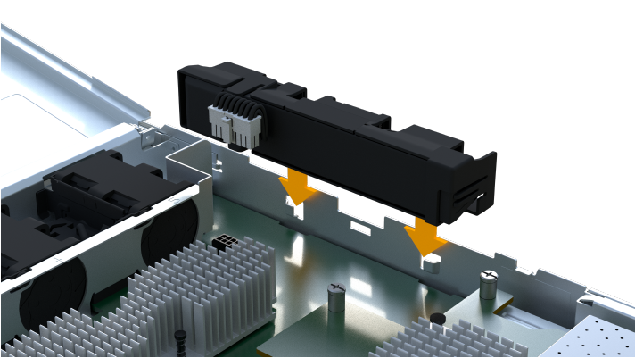

= Remplacez la batterie EF300 ou EF600
:allow-uri-read: 
:experimental: 
:icons: font
:imagesdir: ../media/

[role="lead"]
Vous pouvez remplacer une batterie dans un système de stockage EF300, EF600, EF300C ou EF600C.

.Description de la tâche
Chaque boîtier de contrôleur comprend une batterie qui préserve les données en mémoire cache en cas de panne de l'alimentation secteur. Si le gourou de la restauration de SANtricity System Manager indique un état « batterie défaillante » ou un état « remplacement de batterie requis », vous devez remplacer la batterie concernée.

.Avant de commencer
* Vérifiez qu'aucun volume n'est en cours d'utilisation ou que vous avez installé un pilote multivoie sur tous les hôtes qui utilisent ces volumes.
* Vérifiez le link:batteries-overview-requirements-concept.html["Exigences relatives au remplacement de la batterie EF300 ou EF600"].
* Assurez-vous de disposer des éléments suivants :
+
** La batterie de rechange.
** Un bracelet antistatique ou d'autres précautions antistatiques.
** Une zone de travail plate et sans électricité statique.
** Étiquettes permettant d'identifier chaque câble connecté au boîtier du contrôleur.
** Station de gestion avec un navigateur qui peut accéder au Gestionnaire système SANtricity du contrôleur. (Pour ouvrir l'interface System Manager, pointez le navigateur vers le nom de domaine ou l'adresse IP du contrôleur.)

== Étape 1 : mettez le contrôleur hors ligne

Sauvegardez les données et mettez le contrôleur affecté hors ligne.

.Étapes
. Dans SANtricity System Manager, vérifiez les détails dans la fonctionnalité Recovery Guru qui confirme la présence d'un problème au niveau de la batterie et pour garantir qu'aucun autre élément ne doit être résolu en premier.
. Dans la zone Details du Recovery Guru, déterminez la batterie à remplacer.
. Sauvegardez la base de données de configuration de la baie de stockage à l'aide de SANtricity System Manager.
+
Si un problème survient lorsque vous supprimez un contrôleur, vous pouvez utiliser le fichier enregistré pour restaurer votre configuration. Le système enregistre l'état actuel de la base de données de configuration RAID, qui inclut toutes les données des groupes de volumes et des pools de disques sur le contrôleur.

+
** Depuis System Manager :
+
... Sélectionnez menu :support[Centre de support > Diagnostics].
... Sélectionnez *collecter les données de configuration*.
... Cliquez sur *collect*.
+
Le fichier est enregistré dans le dossier Téléchargements de votre navigateur sous le nom *configurationData-<arrayName>-<DateTime>.7z*.

. Si le contrôleur n'est pas encore hors ligne, mettez-le hors ligne maintenant en utilisant SANtricity System Manager.
+
.. Sélectionnez *matériel*.
.. Si le graphique montre les disques durs, sélectionnez *Afficher le verso du tiroir* pour afficher les contrôleurs.
.. Sélectionnez le contrôleur que vous souhaitez placer hors ligne.
.. Dans le menu contextuel, sélectionnez *placer hors ligne* et confirmez que vous souhaitez effectuer l'opération.
+

NOTE: Si vous accédez à SANtricity System Manager à l'aide du contrôleur que vous tentez de mettre hors ligne, un message SANtricity System Manager indisponible s'affiche. Sélectionnez *connexion à une autre connexion réseau* pour accéder automatiquement au Gestionnaire système SANtricity à l'aide de l'autre contrôleur.

. Attendez que SANtricity System Manager mette à jour l'état du contrôleur sur hors ligne.
+

NOTE: Ne pas commencer d'autres opérations tant que le statut n'a pas été mis à jour.

. Sélectionnez *revérification* dans Recovery Guru, puis confirmez que le champ OK pour supprimer dans la zone Détails affiche Oui, indiquant qu'il est sûr de supprimer ce composant.

== Étape 2 : déposer le boîtier du contrôleur

Remplacez la batterie défectueuse par une batterie neuve.

.Étapes
. Placez un bracelet antistatique ou prenez d'autres précautions antistatiques.
. Etiqueter chaque câble relié au boîtier du contrôleur.
. Débrancher tous les câbles du boîtier du contrôleur.
+

CAUTION: Pour éviter de dégrader les performances, ne pas tordre, plier, pincer ou marcher sur les câbles.

. Vérifiez que la LED du cache actif située à l'arrière du contrôleur est éteinte.
. Appuyez sur les poignées situées de chaque côté du contrôleur et tirez-les vers l'arrière jusqu'à ce qu'elles soient sorties du tiroir.
+
image::../media/remove_controller_5.png[Appuyez sur les poignées pour retirer le contrôleur]

. A l'aide de deux mains et des poignées, faites glisser le boîtier du contrôleur hors de l'étagère. Lorsque l'avant du contrôleur est libre du boîtier, tirez-le complètement à l'aide de deux mains.
+

CAUTION: Toujours utiliser deux mains pour soutenir le poids d'un boîtier de contrôleur.

+
image::../media/remove_controller_6.png[Utiliser deux mains pour soutenir le poids du contrôleur lors de la dépose]

. Placez le boîtier du contrôleur sur une surface plane et exempte d'électricité statique.

== Étape 3 : retirez la batterie défectueuse

Retirez la batterie défectueuse du contrôleur.

.Étapes
. Retirez le capot du boîtier du contrôleur en dévissant la vis à molette unique et en soulevant le couvercle.
. Vérifiez que la LED verte située dans le contrôleur est éteinte.
+
Si ce voyant vert est allumé, le contrôleur utilise toujours l'alimentation de la batterie. Vous devez attendre que ce voyant s'éteigne avant de retirer des composants.

. Repérez la languette « PRESS » située sur le côté du contrôleur.
. Déverrouillez la batterie en appuyant sur la languette et en appuyant sur le boîtier de la batterie.
+
image::../media/batt_3.png[« Appuyez sur la languette pour déverrouiller la batterie]

. Presser doucement le boîtier du connecteur le câblage de la batterie. Tirez la batterie vers le haut, en la débranchant de la carte.
+
image::../media/batt_2.png[Déposer le connecteur du câblage de la batterie]

. Soulevez la batterie hors du contrôleur et placez-la sur une surface plane et sans électricité statique.
+
image::../media/batt_4.png[Soulever la batterie hors du contrôleur]

. Suivez les procédures appropriées pour votre emplacement afin de recycler ou de mettre au rebut la batterie défectueuse.
+

CAUTION: Pour se conformer aux réglementations IATA, n'expédiez jamais une batterie au lithium par avion à moins qu'elle ne soit installée sur le shelf contrôleur.

== Étape 4 : installez une nouvelle batterie

Après avoir retiré la batterie défectueuse du boîtier du contrôleur, suivez cette étape pour installer la nouvelle batterie.

.Étapes
. Déballez la nouvelle batterie et placez-la sur une surface plane et sans électricité statique.
+

NOTE: Conformément aux réglementations de sécurité IATA, les batteries de rechange sont livrées avec un état de charge (SoC) de 30 % ou moins. Lorsque vous réappliquez l'alimentation, n'oubliez pas que la mise en cache des écritures ne reprend pas tant que la batterie de remplacement n'est pas entièrement chargée et qu'elle a terminé son cycle d'apprentissage initial.

. Insérer la batterie dans le contrôleur en alignant le boîtier de la batterie avec les loquets métalliques situés sur le côté du contrôleur.
+

+
La batterie s'enclenche.

. Rebranchez le connecteur de la batterie sur la carte.

== Étape 5 : réinstallez le boîtier du contrôleur

Réinstallez le contrôleur dans le tiroir du contrôleur.

.Étapes
. Abaissez le capot du boîtier du contrôleur et fixez la vis à molette.
. Tout en appuyant sur les poignées du contrôleur, faites glisser délicatement le boîtier du contrôleur jusqu'à ce qu'il se place dans le tiroir du contrôleur.
+

NOTE: Le contrôleur émet un déclic sonore lorsqu'il est correctement installé dans le tiroir.

+
image::../media/remove_controller_7.png[Installez le contrôleur dans le shelf]

== Étape 6 : remplacement complet de la batterie

Placez le contrôleur en ligne, collectez les données de support et reprenez les opérations.

.Étapes
. Mettez le contrôleur en ligne.
+
.. Dans System Manager, accédez à la page Hardware.
.. Sélectionnez *Afficher le verso du contrôleur*.
.. Sélectionner le contrôleur avec la batterie remplacée.
.. Sélectionnez *placer en ligne* dans la liste déroulante.

. Pendant le démarrage du contrôleur, vérifiez les LED du contrôleur.
+
Lorsque la communication avec l'autre contrôleur est rétablie :

+
** Le voyant d'avertissement orange reste allumé.
** Les voyants Host Link peuvent être allumés, clignotants ou éteints, selon l'interface hôte.

. Une fois le contrôleur reen ligne, vérifiez que son état est optimal et vérifiez les LED d'avertissement du tiroir contrôleur.
+
Si l'état n'est pas optimal ou si l'un des voyants d'avertissement est allumé, vérifiez que tous les câbles sont correctement installés et que le boîtier du contrôleur est correctement installé. Au besoin, déposer et réinstaller le boîtier du contrôleur.

+

NOTE: Si vous ne pouvez pas résoudre le problème, contactez le support technique.

. Cliquez sur menu:support [Centre de mise à niveau] pour vous assurer que la dernière version de SANtricity OS est installée.
+
Au besoin, installez la dernière version.

. Vérifiez que tous les volumes ont été renvoyés au propriétaire préféré.
+
.. Sélectionnez menu:Storage[volumes]. Dans la page *tous les volumes*, vérifiez que les volumes sont distribués à leurs propriétaires préférés. Sélectionnez menu:More[change Ownership] pour afficher les propriétaires de volumes.
.. Si les volumes appartiennent tous au propriétaire préféré, passez à l'étape 6.
.. Si aucun volume n'est renvoyé, vous devez le renvoyer manuellement. Accédez au menu:plus[redistribuez les volumes].
.. Si seulement certains volumes sont renvoyés à leurs propriétaires préférés après la distribution automatique ou manuelle, vous devez vérifier le Recovery Guru pour les problèmes de connectivité hôte.
.. S'il n'y a pas de Recovery Guru présent ou si vous suivez les étapes de Recovery guru, les volumes ne sont toujours pas retournés à leurs propriétaires préférés contactez le support.

. Collecte des données de support de votre baie de stockage à l'aide de SANtricity System Manager
+
.. Sélectionnez menu :support[Centre de support > Diagnostics].
.. Sélectionnez *collecter les données de support*.
.. Cliquez sur *collect*.
+
Le fichier est enregistré dans le dossier Téléchargements de votre navigateur portant le nom *support-data.7z*.

.Et la suite ?
Le remplacement de la batterie est terminé. Vous pouvez reprendre les opérations normales.
