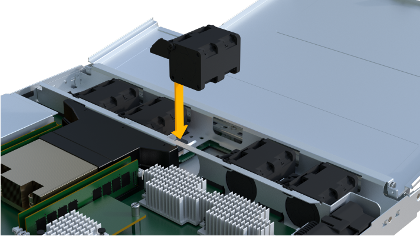

= Remplacez le contrôleur EF300 ou EF600
:allow-uri-read: 
:experimental: 
:icons: font
:imagesdir: ../media/

[role="lead"]
Vous pouvez remplacer un seul contrôleur par un tiroir de contrôleur EF300 ou EF600.

.Description de la tâche
Lorsque vous remplacez un boîtier de contrôleur défectueux, vous devez retirer la batterie, l'alimentation, les modules DIMM, les ventilateurs et la carte d'interface hôte (HIC) du boîtier de contrôleur d'origine, puis les installer dans le boîtier de contrôleur de remplacement.

.Avant de commencer
* Révision link:controllers-overview-supertask-concept.html["Exigences relatives au remplacement des contrôleurs EF300 ou EF600"].
* Déterminez si le boîtier du contrôleur est défectueux de l'une des deux façons suivantes :
+
** Le gourou de la restauration de SANtricity System Manager vous indique de remplacer le boîtier du contrôleur.
** La LED d'avertissement orange sur le boîtier du contrôleur est allumée, ce qui indique que le contrôleur est défectueux.

.Ce dont vous avez besoin
* Un boîtier de contrôleur de remplacement portant le même numéro de pièce que le boîtier de contrôleur que vous remplacez.
* Un bracelet antistatique ou d'autres précautions antistatiques.
* Une zone de travail plate et sans électricité statique.
* Un tournevis cruciforme n° 1
* Étiquettes permettant d'identifier chaque câble connecté au boîtier du contrôleur.
* Station de gestion avec un navigateur qui peut accéder au Gestionnaire système SANtricity du contrôleur. (Pour ouvrir l'interface System Manager, pointez le navigateur vers le nom de domaine ou l'adresse IP du contrôleur.)

== Étape 1 : préparer le remplacement du contrôleur

Préparez-vous à remplacer un boîtier de contrôleur défectueux en vérifiant que le boîtier de contrôleur de remplacement possède le numéro de pièce FRU correct, en sauvegardant la configuration et en recueillant les données de support.

.Étapes
. Déballez le nouveau boîtier du contrôleur et placez-le sur une surface plane et sans électricité statique.
+
Conservez les matériaux d'emballage à utiliser lors de l'expédition du boîtier de contrôleur défectueux.

. Repérez les étiquettes d'adresse MAC et de référence des FRU à l'arrière du boîtier du contrôleur.
. Dans le Gestionnaire système SANtricity, recherchez la référence de remplacement du boîtier du contrôleur que vous remplacez.
+
Lorsqu'un contrôleur présente une défaillance et doit être remplacé, la référence du remplacement est affichée dans la zone Détails du Recovery Guru. Si vous devez trouver ce numéro manuellement, procédez comme suit :

+
.. Sélectionnez *matériel*.
.. Recherchez le tiroir contrôleur, marqué par l'icône du contrôleur image:../media/sam1130_ss_hardware_controller_icon_maint-ef600.gif[""].
.. Cliquez sur l'icône du contrôleur.
.. Sélectionnez le contrôleur et cliquez sur *Suivant*.
.. Dans l'onglet *base*, notez le *Numéro de pièce de remplacement* pour le contrôleur.

. Vérifiez que le numéro de référence de la référence de remplacement du contrôleur défectueux est identique à celui de la référence de l'unité remplaçable sur site du contrôleur de remplacement.
+

CAUTION: *Perte possible d'accès aux données* -- si les numéros de deux pièces ne sont pas les mêmes, ne pas essayer cette procédure. En outre, si le boîtier de contrôleur défectueux comporte une carte d'interface hôte (HIC), vous devez l'installer dans le nouveau boîtier de contrôleur. Suite à des incohérences de contrôleur ou de contrôleur HIC, le nouveau contrôleur se verrouille lorsque vous le mettez en ligne.

. Sauvegardez la base de données de configuration de la baie de stockage à l'aide de SANtricity System Manager.
+
Si un problème survient lorsque vous supprimez un contrôleur, vous pouvez utiliser le fichier enregistré pour restaurer votre configuration. Le système enregistre l'état actuel de la base de données de configuration RAID, qui inclut toutes les données des groupes de volumes et des pools de disques sur le contrôleur.

+
** Depuis System Manager :
+
... Sélectionnez menu :support[Centre de support > Diagnostics].
... Sélectionnez *collecter les données de configuration*.
... Cliquez sur *collect*.
+
Le fichier est enregistré dans le dossier Téléchargements de votre navigateur sous le nom *configurationData-<arrayName>-<DateTime>.7z*.

. Si le contrôleur n'est pas encore hors ligne, mettez-le hors ligne maintenant en utilisant SANtricity System Manager.
+
.. Sélectionnez *matériel*.
.. Si le graphique montre les disques durs, sélectionnez *Afficher le verso du tiroir* pour afficher les contrôleurs.
.. Sélectionnez le contrôleur que vous souhaitez placer hors ligne.
.. Dans le menu contextuel, sélectionnez *placer hors ligne* et confirmez que vous souhaitez effectuer l'opération.

+

NOTE: Si vous accédez à SANtricity System Manager à l'aide du contrôleur que vous tentez de mettre hors ligne, un message SANtricity System Manager indisponible s'affiche. Sélectionnez *connexion à une autre connexion réseau* pour accéder automatiquement au Gestionnaire système SANtricity à l'aide de l'autre contrôleur.

. Attendez que SANtricity System Manager mette à jour l'état du contrôleur sur hors ligne.
+

CAUTION: Ne pas commencer d'autres opérations tant que le statut n'a pas été mis à jour.

. Sélectionnez *revérification* dans Recovery Guru, et confirmez que le champ *OK pour supprimer* dans la zone Détails affiche *Oui*, indiquant qu'il est sûr de supprimer ce composant.

== Étape 2 : retirer le contrôleur défectueux

Retirer un boîtier de contrôleur pour remplacer le boîtier défectueux par un boîtier neuf.

Il s'agit d'une procédure en plusieurs étapes qui vous oblige à retirer les composants suivants : batterie, carte d'interface hôte, bloc d'alimentation, DIMM et ventilateurs.

=== Étape 2a : déposer le boîtier du contrôleur

Retirez le boîtier du contrôleur défectueux pour pouvoir le remplacer par un nouveau.

.Étapes
. Placez un bracelet antistatique ou prenez d'autres précautions antistatiques.
. Etiqueter chaque câble relié au boîtier du contrôleur.
. Débrancher tous les câbles du boîtier du contrôleur.
+

CAUTION: Pour éviter de dégrader les performances, ne pas tordre, plier, pincer ou marcher sur les câbles.

. Si le boîtier du contrôleur possède une HIC utilisant des émetteurs-récepteurs SFP+, retirez les SFP.
+
Comme vous devez retirer la HIC du contrôleur défaillant, vous devez retirer tous les SFP des ports HIC. Lorsque vous reconnectez les câbles, vous pouvez déplacer ces SFP vers le nouveau boîtier de contrôleur.

. Vérifiez que la LED du cache actif située à l'arrière du contrôleur est éteinte.
. Appuyez sur les poignées situées de chaque côté du contrôleur et tirez-les vers l'arrière jusqu'à ce qu'elles soient sorties du tiroir.
+
image::../media/remove_controller_5.png[déposer le contrôleur 5]

. A l'aide de deux mains et des poignées, faites glisser le boîtier du contrôleur hors de l'étagère. Lorsque l'avant du contrôleur est libre du boîtier, tirez-le complètement à l'aide de deux mains.
+

CAUTION: Toujours utiliser deux mains pour soutenir le poids d'un boîtier de contrôleur.

+
image::../media/remove_controller_6.png[déposer le contrôleur 6]

. Placez le boîtier du contrôleur sur une surface plane et exempte d'électricité statique.

=== Étape 2b : retirez la batterie

Retirez la batterie du boîtier du contrôleur défectueux afin de pouvoir l'installer dans le nouveau boîtier du contrôleur.

.Étapes
. Retirez le capot du boîtier du contrôleur en dévissant la vis à molette unique et en soulevant le couvercle.
. Repérez la languette « PRESS » située sur le côté du contrôleur.
. Déverrouillez la batterie en appuyant sur la languette et en appuyant sur le boîtier de la batterie.
+
image::../media/batt_3.png[batterie 3]

. Presser doucement le boîtier du connecteur le câblage de la batterie. Tirez la batterie vers le haut, en la débranchant de la carte.image:../media/batt_2.png[""]
. Soulevez la batterie hors du contrôleur et placez-la sur une surface plane et sans électricité statique.image:../media/batt_4.png[""]

=== Étape 2c : retirez la HIC

Si le boîtier du contrôleur comporte une HIC, vous devez retirer la HIC du boîtier du contrôleur d'origine. Sinon, vous pouvez ignorer cette étape.

.Étapes
. À l'aide d'un tournevis cruciforme, retirez les deux vis qui fixent le cadran HIC au boîtier du contrôleur.
+
image::../media/hic_2.png[hic 2]

+

NOTE: L'image ci-dessus est un exemple, l'apparence de votre HIC peut varier.

. Retirez la plaque HIC.
. À l'aide de vos doigts ou d'un tournevis cruciforme, desserrez la vis à molette unique qui fixent le HIC à la carte contrôleur.
+
image::../media/hic_3.png[hic 3]

+

NOTE: La HIC est fournie avec trois emplacements de vis sur le dessus mais est fixée avec un seul emplacement.

. Détachez avec précaution la carte HIC de la carte contrôleur en la soulevant et en la sortant du contrôleur.
+

CAUTION: Veillez à ne pas rayer ou heurter les composants au bas de la HIC ou au-dessus de la carte contrôleur.

+
image::../media/hic_4.png[hic 4]

. Placez le HIC sur une surface plane et sans électricité statique.

=== Étape 2d : retirer l'alimentation

Retirez le bloc d'alimentation afin de pouvoir l'installer dans le nouveau contrôleur.

.Étapes
. Débranchez les câbles d'alimentation :
+
.. Ouvrez le dispositif de retenue du cordon d'alimentation, puis débranchez le cordon d'alimentation du bloc d'alimentation.
.. Débranchez le cordon d'alimentation de la source d'alimentation.

. Repérez la languette située à droite du bloc d'alimentation et appuyez dessus vers le bloc d'alimentation.
+
image::../media/psup_2.png[psup 2]

. Repérez la poignée à l'avant du bloc d'alimentation.
. Utilisez la poignée pour faire glisser le bloc d'alimentation hors du système.
+
image::../media/psup_3.png[psup 3]

+

CAUTION: Lors de la dépose d'une alimentation électrique, toujours utiliser deux mains pour soutenir son poids.

=== Étape 2e : retirez les modules DIMM

Retirez les modules DIMM pour pouvoir les installer dans le nouveau contrôleur.

.Étapes
. Localisez les modules DIMM de votre contrôleur.
. Notez l'orientation du module DIMM dans le support afin que vous puissiez insérer le module DIMM de remplacement dans le bon sens.
+

NOTE: Une encoche située au bas du DIMM vous aide à aligner le DIMM pendant l'installation.

. Poussez lentement les deux languettes d'éjection du module DIMM de chaque côté du module DIMM pour éjecter le module DIMM de son logement, puis faites-le glisser hors du logement.
+

NOTE: Tenez soigneusement le module DIMM par les bords pour éviter toute pression sur les composants de la carte de circuit DIMM.

+
image::../media/dimm_2.png[dimm 2]

+
image::../media/dimim_3.png[dime 3]

=== Étape 2f : retirer les ventilateurs

Retirez les ventilateurs pour pouvoir les installer dans le nouveau contrôleur.

.Étapes
. Soulever doucement le ventilateur du contrôleur.
+
image::../media/fan_2.png[ventilateur 2]

. Répétez l'opération jusqu'à ce que tous les ventilateurs soient retirés.

== Étape 3 : installer un nouveau contrôleur

Installez un nouveau boîtier de contrôleur pour remplacer le boîtier défectueux.

Il s'agit d'une procédure en plusieurs étapes qui vous oblige à installer les composants suivants à partir du contrôleur d'origine : batterie, carte d'interface hôte, bloc d'alimentation, modules DIMM et ventilateurs.

=== Étape 3a : installer la batterie

Installer la batterie dans le boîtier de contrôleur de remplacement.

.Étapes
. Assurez-vous que vous disposez des éléments suivants :
+
** La batterie du boîtier de contrôleur d'origine ou une batterie neuve que vous avez commandée.
** Le boîtier de contrôleur de rechange.

. Insérer la batterie dans le contrôleur en alignant le boîtier de la batterie avec les loquets métalliques situés sur le côté du contrôleur.
+
image::../media/batt_5.png[batterie 5]

+
La batterie s'enclenche.

. Rebranchez le connecteur de la batterie sur la carte.

=== Étape 3b : installez le HIC

Si vous avez retiré une HIC du boîtier de contrôleur d'origine, vous devez installer cette HIC dans le nouveau boîtier de contrôleur. Sinon, vous pouvez ignorer cette étape.

.Étapes
. À l'aide d'un tournevis cruciforme n° 1, retirez les deux vis qui fixent le cache blanc au boîtier du contrôleur de remplacement, puis retirez le cache.
. Alignez la vis moletée unique de la HIC avec le trou correspondant du contrôleur, puis alignez le connecteur situé au bas de la HIC avec le connecteur d'interface HIC de la carte contrôleur.
+
Veillez à ne pas rayer ou heurter les composants au bas de la HIC ou au-dessus de la carte contrôleur.

+
image::../media/hic_7.png[hic 7]

+

NOTE: L'image ci-dessus est un exemple ; l'apparence de votre HIC peut varier.

. Abaisser avec précaution la HIC et mettre le connecteur HIC en place en appuyant doucement sur la HIC.
+

CAUTION: *Dommages possibles à l'équipement* -- faites très attention de ne pas pincer le connecteur ruban doré pour les voyants du contrôleur entre la HIC et la vis à molette.

. Serrez manuellement la vis à molette HIC.
+
N'utilisez pas de tournevis, sinon vous risquez de trop serrer la vis.

+
image::../media/hic_3.png[hic 3]

+

NOTE: L'image ci-dessus est un exemple ; l'apparence de votre HIC peut varier.

. À l'aide d'un tournevis cruciforme n° 1, fixez la plaque HIC que vous avez retirée du boîtier de contrôleur d'origine sur le nouveau boîtier de contrôleur à l'aide des deux vis.

=== Étape 3c : installez l'alimentation

Installer l'alimentation dans le boîtier de contrôleur de remplacement.

.Étapes
. À l'aide des deux mains, soutenez et alignez les bords du bloc d'alimentation avec l'ouverture du châssis du système, puis poussez doucement le bloc d'alimentation dans le châssis à l'aide de la poignée de came.
+
Les blocs d'alimentation sont munis de clés et ne peuvent être installés qu'une seule fois.

+

CAUTION: N'utilisez pas de force excessive lorsque vous faites glisser le bloc d'alimentation dans le système ; vous risquez d'endommager le connecteur.

+
image::../media/psup_4.png[psup 4]

=== Étape 3d : installez les modules DIMM

Installez les modules DIMM dans le nouveau boîtier de contrôleur.

.Étapes
. Tenez le DIMM par les coins et alignez-le sur le logement.
+
L'encoche entre les broches du DIMM doit être alignée avec la languette du support.

. Insérez le module DIMM directement dans le logement.
+
image::../media/dimm_4.png[dimm 4]

+
Le module DIMM s'insère bien dans le logement, mais devrait être facilement installé. Si ce n'est pas le cas, réalignez le module DIMM avec le logement et réinsérez-le.

+

NOTE: Inspectez visuellement le module DIMM pour vérifier qu'il est bien aligné et complètement inséré dans le logement.

. Poussez délicatement, mais fermement, sur le bord supérieur du DIMM jusqu'à ce que les loquets s'enclenchent sur les encoches aux extrémités du DIMM.
+

NOTE: Les modules DIMM s'adaptent bien. Vous devrez peut-être appuyer doucement d'un côté à la fois et le fixer à l'aide de chaque languette individuellement.

+
image::../media/dimm_5.png[dimm 5]

=== Étape 3e : installez les ventilateurs

Installer les ventilateurs dans le boîtier de contrôleur de remplacement.

.Étapes
. Faites glisser le ventilateur complètement dans le contrôleur de remplacement.
+

+
image::../media/fan_3_a.png[ventilateur 3 a]

. Répétez l'opération jusqu'à ce que tous les ventilateurs soient installés.

=== Étape 3f : installer un nouveau boîtier de contrôleur

En dernier lieu, installez le nouveau boîtier de contrôleur dans le shelf de contrôleur.

.Étapes
. Abaissez le capot du boîtier du contrôleur et fixez la vis à molette.
. Tout en appuyant sur les poignées du contrôleur, faites glisser délicatement le boîtier du contrôleur jusqu'à ce qu'il se place dans le tiroir du contrôleur.
+

NOTE: Le contrôleur émet un déclic sonore lorsqu'il est correctement installé dans le tiroir.

+
image::../media/remove_controller_7.png[déposer le contrôleur 7]

. Installez les SFP à partir du contrôleur d'origine dans les ports hôte du nouveau contrôleur, s'ils ont été installés sur le contrôleur d'origine, et reconnectez tous les câbles.
+
Si vous utilisez plusieurs protocoles hôtes, assurez-vous d'installer les SFP dans les ports hôtes appropriés.

. Si le contrôleur d'origine utilise DHCP pour l'adresse IP, localisez l'adresse MAC sur l'étiquette située à l'arrière du contrôleur de remplacement. Demandez à votre administrateur réseau d'associer le DNS/réseau et l'adresse IP du contrôleur que vous avez supprimé à l'adresse MAC du contrôleur de remplacement.
+

NOTE: Si le contrôleur d'origine n'a pas utilisé DHCP pour l'adresse IP, le nouveau contrôleur adopte l'adresse IP du contrôleur que vous avez retiré.

== Étape 4 : remplacement complet du contrôleur

Placez le contrôleur en ligne, collectez les données de support et reprenez les opérations.

.Étapes
. Mettez le contrôleur en ligne.
+
.. Dans System Manager, accédez à la page Hardware.
.. Sélectionnez *Afficher le verso du contrôleur*.
.. Sélectionner le contrôleur remplacé.
.. Sélectionnez *placer en ligne* dans la liste déroulante.

. Pendant le démarrage du contrôleur, vérifiez les LED du contrôleur.
+
Lorsque la communication avec l'autre contrôleur est rétablie :

+
** Le voyant d'avertissement orange reste allumé.
** Les voyants Host Link peuvent être allumés, clignotants ou éteints, selon l'interface hôte.

. Une fois le contrôleur reen ligne, vérifiez que son état est optimal et vérifiez les LED d'avertissement du tiroir contrôleur.
+
Si l'état n'est pas optimal ou si l'un des voyants d'avertissement est allumé, vérifiez que tous les câbles sont correctement installés et que le boîtier du contrôleur est correctement installé. Au besoin, déposer et réinstaller le boîtier du contrôleur.

+

NOTE: Si vous ne pouvez pas résoudre le problème, contactez le support technique.

. Cliquez sur Menu:matériel [support > Centre de mise à niveau] pour vous assurer que la dernière version de SANtricity OS est installée.
+
Au besoin, installez la dernière version.

. Vérifiez que tous les volumes ont été renvoyés au propriétaire préféré.
+
.. Sélectionnez menu:Storage[volumes]. Dans la page *tous les volumes*, vérifiez que les volumes sont distribués à leurs propriétaires préférés. Sélectionnez menu:More[change Ownership] pour afficher les propriétaires de volumes.
.. Si les volumes appartiennent tous au propriétaire préféré, passez à l'étape 6.
.. Si aucun volume n'est renvoyé, vous devez le renvoyer manuellement. Accédez au menu:plus[redistribuez les volumes].
.. Si seulement certains volumes sont renvoyés à leurs propriétaires préférés après la distribution automatique ou manuelle, vous devez vérifier le Recovery Guru pour les problèmes de connectivité hôte.
.. S'il n'y a pas de Recovery Guru présent ou si vous suivez les étapes de Recovery guru, les volumes ne sont toujours pas retournés à leurs propriétaires préférés contactez le support.

. Collecte des données de support de votre baie de stockage à l'aide de SANtricity System Manager
+
.. Sélectionnez menu :support[Centre de support > Diagnostics].
.. Sélectionnez *collecter les données de support*.
.. Cliquez sur *collect*.
+
Le fichier est enregistré dans le dossier Téléchargements de votre navigateur portant le nom *support-data.7z*.

.Et la suite ?
Le remplacement de votre contrôleur est terminé. Vous pouvez reprendre les opérations normales.
