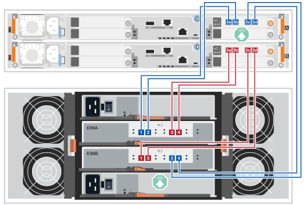
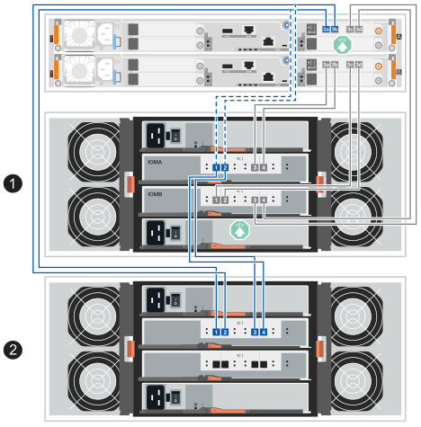
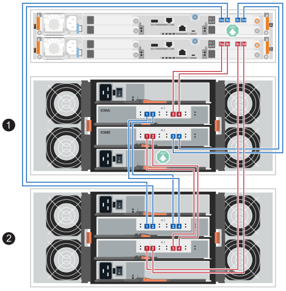
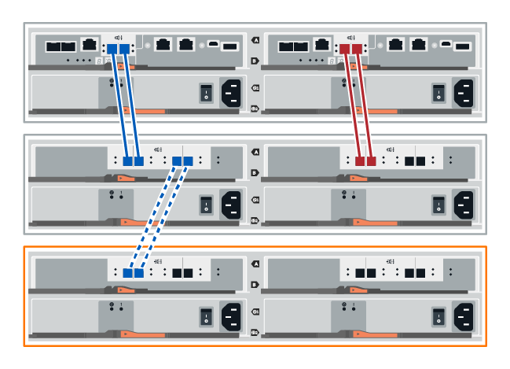
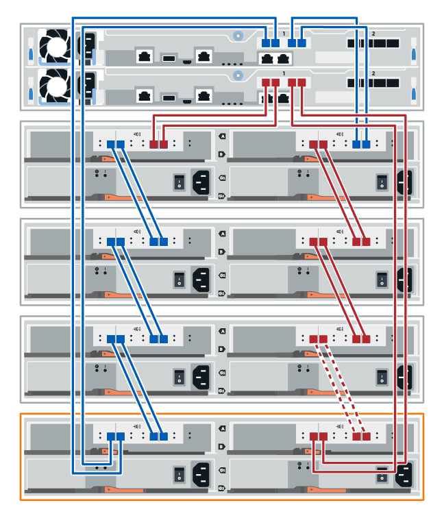

= Ajoutez à chaud un châssis de disque IOM12 ou IOM12B dans les systèmes EF300 et EF600
:allow-uri-read: 
:icons: font
:imagesdir: ../media/

[role="lead"]
Vous pouvez ajouter un nouveau tiroir disque pendant que l'alimentation est toujours appliquée aux autres composants du système de stockage. Vous pouvez configurer, reconfigurer, ajouter ou transférer la capacité du système de stockage sans interrompre l'accès des utilisateurs aux données.

.Avant de commencer
* En raison de la complexité de cette procédure, lisez toutes les étapes avant de commencer la procédure.
+
Lors de l'ajout à chaud d'un tiroir à un ou plusieurs tiroirs existants, afin de préserver l'intégrité du système pendant la procédure, vous devez toujours maintenir un chemin actif. Vous devez suivre la procédure exactement dans l'ordre présenté.

+
Pour câbler le nouveau tiroir, vous recâblez les connexions contrôleur-vers-tiroir côté A (tiroir IOM A) et ajoutez des connexions tiroir-vers-tiroir, vérifiez que le chemin côté A est actif, recâblez les connexions contrôleur-vers-tiroir côté B (tiroir IOMB) et ajoutez des connexions tiroir-vers-tiroir, puis vérifiez que la redondance a été rétablie.

+

NOTE: Si vous installez un tiroir de disques qui a déjà été installé dans un système de stockage, cette procédure comporte des étapes supplémentaires que vous devez suivre.

* Assurez-vous que l'ajout à chaud d'un tiroir disque est la procédure adéquate.
* Vérifiez que votre système de stockage exécute une version de SANtricity qui prend en charge les tiroirs d'extension SAS et que vous ne dépassez pas le nombre maximal de tiroirs SAS pris en charge.
+
Pour obtenir des informations sur les versions prises en charge de SANtricity et le nombre maximal de tiroirs d'extension SAS pris en charge pour votre système de stockage, consultez le NetApp Hardware Universe : https://hwu.netapp.com/Controller/Index?platformTypeId=2357027["Hardware Universe"^].

+

NOTE: Les systèmes de stockage EF50 et EF80 exécutant SANtricity 12.10 ou une version ultérieure prennent en charge les tiroirs d'extension SAS.

* Votre système de stockage doit disposer de ports SAS disponibles. Cela signifie que des modules d'E/S SAS doivent déjà être installés. S'ils ne le sont pas, utilisez la procédure appropriée pour installer les modules d'E/S SAS, puis revenez à cette procédure pour ajouter le tiroir d'extension à chaud.
+
** Pour les systèmes de stockage EF50 et EF80, utilisez la link:../maintenance-ef50-ef80/io-module-upgrade.html["Mettre à niveau les modules d'E/S"^] procédure.
** Pour les systèmes de stockage plus anciens, utilisez la procédure _cartes d'extension SAS_ correspondant à votre modèle de système de stockage dans la section _Maintain systems_.

.Description de la tâche
* Cette procédure s'applique à un châssis de contrôleur E2800, E2800B, EF280, E5700, E5700B, EF570, EF300, EF600, EF300C, EF600C, E4000, EF50 ou EF80.
+

NOTE: Si vous câblez un ancien tiroir de contrôleur, consultez https://mysupport.netapp.com/ecm/ecm_download_file/ECMLP2859057["Ajout de tiroirs disques IOM à un tiroir contrôleur E27XX, E56XX ou EF560 existant"^].

* Cette procédure s'applique à l'ajout à chaud d'un châssis de disque DE212C, DE224C ou DE460C avec des modules IOM12, IOM12B ou IOM12C.
+

NOTE: Les modules IOM12C ne sont pris en charge que sur SANtricity OS 11.90R3 et versions ultérieures. Assurez-vous que le micrologiciel de votre contrôleur a été mis à jour avant d'installer ou de mettre à niveau vers un IOM12C.

[[step-1-prepare-to-add-the-drive-shelf]]
== Étape 1 : préparez-vous à ajouter le tiroir disque

Pour préparer l'ajout à chaud d'un tiroir disque, vérifiez la présence d'événements critiques et le statut des IOM.

.Avant de commencer
* La source d'alimentation de votre système de stockage doit être capable de répondre aux besoins en alimentation du nouveau tiroir disque. Pour connaître les spécifications d'alimentation de votre tiroir disque, reportez-vous au https://hwu.netapp.com/Controller/Index?platformTypeId=2357027["Hardware Universe"^].
* Le modèle de câblage du système de stockage existant doit correspondre à l'un des schémas applicables présentés dans cette procédure.

.Étapes
. Dans SANtricity System Manager, sélectionnez *support* > *support Center* > *Diagnostics*.
. Sélectionnez *collecter les données de support*.
+
La boîte de dialogue récupérer les données de support s'affiche.

. Cliquez sur *collect*.
+
Le fichier est enregistré dans le dossier Téléchargements de votre navigateur sous le nom support-data.7z. Les données ne sont pas automatiquement envoyées au support technique.

. Sélectionnez *support* > *Journal des événements*.
+
La page Journal des événements affiche les données d'événement.

. Sélectionnez l'en-tête de la colonne *priorité* pour trier les événements critiques en haut de la liste.
. Examinez les événements critiques du système pour les événements survenus au cours des deux à trois dernières semaines et vérifiez que tous les événements critiques récents ont été résolus ou résolus.
+

NOTE: Si des événements critiques non résolus se sont produits au cours des deux à trois semaines précédentes, arrêtez la procédure et contactez le support technique. Continuer la procédure uniquement lorsque le problème est résolu.

. Si des modules d'E/S sont connectés au matériel, procédez comme suit. Sinon, passez à l' <<step2_install_drive_shelf,Étape 2 : installez le tiroir disque et mettez-le sous tension.>>
+
.. Sélectionnez le menu : Hardware [Controllers and components].
.. Sélectionnez l'icône *modules d'E/S (IOM)*.
+

+
La boîte de dialogue Paramètres des composants de la tablette s'affiche avec l'onglet *IOM (ESM)* sélectionné.

.. Assurez-vous que l'état indiqué pour chaque IOM/ESM est _optimal_.
.. Cliquez sur *Afficher plus de paramètres*.
.. Vérifiez que les conditions suivantes sont réunies :
+
*** Le nombre de modules de gestion des E/S détectés correspond au nombre d'modules de gestion des E/S installés dans le système et à celui de chaque tiroir de disque.
*** Les deux EDM/modules d'E/S montrent que la communication est correcte.
*** Le débit de données est de 12 Gbit/s pour les tiroirs disques DE212C, DE224C et DE460C ou de 6 Gbit/s pour les autres tiroirs disques.

[[step-2-install-the-drive-shelf-and-apply-power]]
[[step2_install_drive_shelf]]
== Étape 2 : installer le tiroir disque et mettre sous tension

Vous installez un nouveau tiroir disque ou un tiroir disque installé précédemment, mettez sous tension et vérifiez si les LED nécessitent une intervention.

.Étapes
. Si vous installez un tiroir disque qui a déjà été installé dans un système de stockage, retirez les lecteurs. Les lecteurs doivent être installés un par un plus tard dans cette procédure.
+
Si l'historique d'installation du tiroir disque que vous installez est inconnu, vous devez supposer qu'il a été précédemment installé dans un système de stockage.

. Installez le tiroir disque dans le rack qui contient les composants du système de stockage.
+

NOTE: Consultez les instructions d'installation de votre modèle pour connaître la procédure complète d'installation physique et de câblage d'alimentation. Les instructions d'installation de votre modèle incluent des notes et des avertissements que vous devez prendre en compte pour installer en toute sécurité une étagère de disques.

. Mettez le nouveau tiroir disque sous tension et vérifiez qu'aucun voyant d'avertissement orange n'est allumé sur le tiroir disque. Si possible, résolvez toute anomalie avant de poursuivre cette procédure.

[[step-3-cable-the-drive-shelf]]
== Étape 3 : Câbler le tiroir de disques

Pour connecter le tiroir à votre système de stockage, vous raccordez chaque contrôleur de sorte qu'il dispose d'un chemin côté A (IOMA) et d'un chemin côté B (IOMB) vers le tiroir unique ou la pile de tiroirs (selon le cas). Et si vous avez une pile de tiroirs, vous connectez ensuite les tiroirs entre eux (connexions tiroir à tiroir) via le chemin côté A et le chemin côté B.

Vous câblez toujours les contrôleurs et un ou plusieurs tiroirs de manière à ce qu'il y ait deux connexions de câble pour le chemin côté A (IOMA) et le chemin côté B (IOMB), comme indiqué dans les illustrations de câblage.

[role="tabbed-block"]
====
.Connectez le tiroir de disques pour EF50 ou EF80
--
Cette procédure vous explique comment ajouter à chaud le premier tiroir d'extension SAS à votre système de stockage EF50 ou EF80 et comment recâbler le tiroir initial pour ajouter à chaud un deuxième tiroir ; cependant, cette procédure peut être appliquée lors de l'ajout de tiroirs supplémentaires.

.Avant de commencer
Vous avez mis à jour votre micrologiciel à la dernière version. Pour mettre à jour votre micrologiciel, suivez les instructions de la section link:../upgrade-santricity/index.html["Mise à niveau de SANtricity OS"].

.Description de la tâche
* Si vous ajoutez à chaud un tiroir d'extension supplémentaire à un ou plusieurs tiroirs d'extension existants, les règles suivantes s'appliquent :
+
** Cette procédure consiste à recâbler les connexions entre le contrôleur et le tiroir afin de toujours maintenir un chemin actif vers le tiroir du contrôleur.
+
Pour maintenir un chemin actif pendant cette procédure, vous recâblez les connexions contrôleur-vers-tiroir côté A (IOMA du tiroir) et ajoutez des connexions tiroir-à-tiroir, vérifiez que le chemin côté A est actif, recâblez les connexions contrôleur-vers-tiroir côté B (IOMB du tiroir) et ajoutez des connexions tiroir-à-tiroir, puis vérifiez que la redondance a été rétablie.

** Vous déplacez toujours les câbles du dernier tiroir de la pile vers les mêmes modules d'E/S et ports de modules d'E/S sur le nouveau tiroir, puis vous connectez le nouveau tiroir au précédent dernier tiroir de la pile (connexions tiroir à tiroir).

* Cette procédure décrit les étapes d'ajout à chaud de deux tiroirs d'extension maximum. Toutefois, si vous ajoutez un tiroir d'extension supplémentaire, commencez par l'étape 2 et appliquez les étapes correspondantes à ce tiroir d'extension.
* Cette procédure présente les contrôleurs dotés d'un module d'E/S SAS dans l'emplacement 3. Pour consulter toutes les configurations de modules d'E/S SAS prises en charge, voir link:https://hwu.netapp.com["NetApp Hardware Universe"^].
* Sur les schémas de câblage, les connexions du contrôleur A sont représentées en bleu et celles du contrôleur B en rouge. Les lignes pointillées (bleues et rouges) représentent le câblage existant que vous déplacez pour effectuer les étapes de câblage. Les ports et lignes grisés représentent le câblage existant qui reste en place pendant que vous effectuez les étapes de câblage.

.Étapes
. Pour ajouter à chaud un tiroir d'extension SAS qui est le tiroir d'extension SAS initial, suivez les sous-étapes suivantes ; sinon, passez à l'étape suivante.
+
.. Connectez le port 3a du contrôleur A au port 1 du IOMA du tiroir.
.. Connectez le port 3b du contrôleur A au port 2 du tiroir IOMA.
.. Connectez le port 3c du contrôleur A au port 3 du tiroir IOMB.
.. Connectez le port 3d du contrôleur A au port 4 du tiroir IOMB.
.. Connectez le port 3a du contrôleur B au port 3 du IOMA du tiroir.
.. Connectez le port 3b du contrôleur B au port 4 du tiroir IOMA.
.. Connectez le port 3c du contrôleur B au port 1 du tiroir IOMB.
.. Connectez le port 3d du contrôleur B au port 2 du tiroir IOMB.
+
Une fois le câblage du tiroir terminé, le câblage doit ressembler à ce qui suit :

+

. Pour ajouter à chaud un deuxième tiroir d'extension (tiroir 2), recâblez les connexions du contrôleur côté A au tiroir et ajoutez des connexions entre les tiroirs côté A, comme suit ; sinon, passez à l'étape suivante.
+
.. Débranchez le câble du port IOMA 1 du tiroir 1 et rebranchez-le au port IOMA 1 du tiroir 2.
.. Débranchez le câble du port IOMA 2 du tiroir 1 et rebranchez-le au port IOMA 2 du tiroir 2.
.. Connectez le port IOMA 1 du tiroir 1 au port IOMA 4 du tiroir 2.
.. Connectez le port IOMA 2 du tiroir 1 au port IOMA 3 du tiroir 2.
+
Une fois que vous avez terminé de recâbler les connexions côté A, le câblage devrait ressembler à ce qui suit :

+

. Dans SANtricity System Manager, cliquez sur menu:Hardware[Contrôleurs et composants].
+

NOTE: Si vous ajoutez un deuxième tiroir d'extension SAS, à ce stade de la procédure, vous ne disposez que d'un seul chemin actif vers le tiroir contrôleur.

. Faites défiler vers le bas si nécessaire pour voir tous les tiroirs disques du nouveau système de stockage. Si le nouveau tiroir disque n'est pas affiché, résolvez le problème de connexion.
. Sélectionnez l'icône *ESMS/IOMS* pour la nouvelle étagère de disques.
+

+
La boîte de dialogue *Paramètres de composant de tiroir* s'affiche.

. Sélectionnez l'onglet *ESMS/IOMS* dans la boîte de dialogue *Paramètres de composant de tiroir*.
. Sélectionnez *Afficher plus d'options* et vérifiez les éléments suivants :
+
** Si vous ajoutez le premier tiroir d'extension SAS, les modules IOM/ESM A et IOM/ESM B sont listés. Si vous ajoutez un deuxième tiroir d'extension SAS, seul le module IOM/ESM A est listé.
** Le débit de données actuel est de 12 Gbit/s pour un tiroir disque SAS-3.
** Les communications de la carte sont correctes.

. Si vous ajoutez un deuxième tiroir d'extension SAS, recâblez les connexions du contrôleur côté B vers le tiroir et ajoutez les connexions tiroir à tiroir côté B, comme suit ; sinon, passez à l'étape 10.
+
.. Débranchez le câble du port IOMB 1 du tiroir 1 et rebranchez-le au port IOMB 1 du tiroir 2.
.. Débranchez le câble du port IOMB 2 du tiroir 1 et rebranchez-le au port IOMB 2 du tiroir 2.
.. Connectez le port IOMB 1 du tiroir 1 au port IOMB 3 du tiroir 2.
.. Connectez le port IOMB 2 du tiroir 1 au port IOMB 4 du tiroir 2.
+
Une fois le recâblage des connexions côté B terminé, le câblage devrait ressembler à ce qui suit :

+
image::../media/drw_ef50-ef80_2nd_de460c_cabling_hotadd_b-side_ieops-3007.svg[ajoutez un deuxième tiroir et recâblez les connexions du côté B]

. Si vous ajoutez un deuxième tiroir d'extension, une fois le recâblage des deux tiroirs terminé, le câblage devrait ressembler à ce qui suit :
+

NOTE: Si vous ajoutez à chaud un troisième tiroir à une pile de deux tiroirs, le câblage doit correspondre à l’illustration dans la link:../install-hw-ef50-ef80/install-cable.html#step-3-cable-the-sas-shelf-connections["Option 2 : Trois tiroirs DE460C"^] section _Câblez les connexions du tiroir SAS_ pour les nouvelles installations de système.

+

. Si ce n'est pas déjà fait, sélectionnez l'onglet *ESMS/IOMS* dans la boîte de dialogue *Paramètres de composant de tiroir*, puis sélectionnez *Afficher plus d'options*. Vérifiez que les communications de la carte sont *OUI*.
+

NOTE: L'état optimal indique que la perte d'erreur de redondance associée au nouveau tiroir disque a été résolue et que le système de stockage est stabilisé.

--
.Connectez le tiroir disque pour les systèmes E2800 ou E5700
--
Vous connectez le tiroir disque au contrôleur A, confirmez l'état du module d'E/S et connectez le tiroir disque au contrôleur B.

.Étapes
. Connectez le tiroir disque au contrôleur A.
+
La figure suivante montre un exemple de connexion entre un tiroir disque supplémentaire et le contrôleur A. Pour localiser les ports de votre modèle, reportez-vous à la section https://hwu.netapp.com/Controller/Index?platformTypeId=2357027["Hardware Universe"^].

+
image::../media/hot_e5700_0.png[Connectez le tiroir disque au contrôleur]

+

. Dans le Gestionnaire système SANtricity, cliquez sur *matériel*.
+

NOTE: À ce stade de la procédure, un seul chemin d'accès actif vers le tiroir contrôleur n'est disponible.

. Faites défiler vers le bas si nécessaire pour voir tous les tiroirs disques du nouveau système de stockage. Si le nouveau tiroir disque n'est pas affiché, résolvez le problème de connexion.
. Sélectionnez l'icône *ESMS/IOMS* pour la nouvelle étagère de disques.
+

+
La boîte de dialogue *Paramètres de composant de tiroir* s'affiche.

. Sélectionnez l'onglet *ESMS/IOMS* dans la boîte de dialogue *Paramètres de composant de tiroir*.
. Sélectionnez *Afficher plus d'options* et vérifiez les éléments suivants :
+
** IOM/ESM A figure dans la liste.
** Le débit de données actuel est de 12 Gbit/s pour un tiroir disque SAS-3.
** Les communications de la carte sont correctes.

. Débrancher tous les câbles d'extension du contrôleur B.
. Connectez le tiroir disque au contrôleur B.
+
La figure suivante montre un exemple de connexion entre un tiroir disque supplémentaire et le contrôleur B. Pour localiser les ports de votre modèle, reportez-vous à la section https://hwu.netapp.com/Controller/Index?platformTypeId=2357027["Hardware Universe"^].

+
image::../media/hot_e5700_2.png[Exemple de connexion de tiroir disque]

. Si ce n'est pas déjà fait, sélectionnez l'onglet *ESMS/IOMS* dans la boîte de dialogue *Paramètres de composant de tiroir*, puis sélectionnez *Afficher plus d'options*. Vérifiez que les communications de la carte sont *OUI*.
+

NOTE: L'état optimal indique que la perte d'erreur de redondance associée au nouveau tiroir disque a été résolue et que le système de stockage est stabilisé.

--
.Connectez le tiroir disque pour EF300 ou EF600
--
Vous connectez le tiroir disque au contrôleur A, confirmez l'état du module d'E/S et connectez le tiroir disque au contrôleur B.

.Avant de commencer
* Vous avez mis à jour votre micrologiciel à la dernière version. Pour mettre à jour votre micrologiciel, suivez les instructions de la section link:../upgrade-santricity/index.html["Mise à niveau de SANtricity OS"].

.Étapes
. Déconnectez les deux câbles du contrôleur côté A des ports IOM12 un et deux du dernier tiroir précédent de la pile, puis connectez-les aux nouveaux ports IOM12 du tiroir un et deux.
+
image::../media/de224c_sides.png[Déconnectez les câbles du contrôleur A et connectez-les au nouveau tiroir]

. Connectez les câbles aux ports IOM12 latéraux A trois et quatre du nouveau tiroir aux ports 1 et 2 du dernier tiroir IOM12 précédent.
+
La figure suivante montre un exemple de connexion côté entre un tiroir disque supplémentaire et le dernier tiroir précédent. Pour localiser les ports de votre modèle, reportez-vous à la section https://hwu.netapp.com/Controller/Index?platformTypeId=2357027["Hardware Universe"^].

+
image::../media/hot_ef_0.png[Exemple de câblage de tiroir disque]

+
image::../media/hot_ef_1.png[Exemple de câblage de tiroir disque]

. Dans SANtricity System Manager, cliquez sur menu:Hardware[Contrôleurs et composants].
+

NOTE: À ce stade de la procédure, un seul chemin d'accès actif vers le tiroir contrôleur n'est disponible.

. Faites défiler vers le bas si nécessaire pour voir tous les tiroirs disques du nouveau système de stockage. Si le nouveau tiroir disque n'est pas affiché, résolvez le problème de connexion.
. Sélectionnez l'icône *ESMS/IOMS* pour la nouvelle étagère de disques.
+

+
La boîte de dialogue *Paramètres de composant de tiroir* s'affiche.

. Sélectionnez l'onglet *ESMS/IOMS* dans la boîte de dialogue *Paramètres de composant de tiroir*.
. Sélectionnez *Afficher plus d'options* et vérifiez les éléments suivants :
+
** IOM/ESM A figure dans la liste.
** Le débit de données actuel est de 12 Gbit/s pour un tiroir disque SAS-3.
** Les communications de la carte sont correctes.

. Déconnectez les deux câbles du contrôleur côté B des ports IOM12 un et deux du dernier tiroir précédent de la pile, puis connectez-les aux nouveaux ports IOM12 du tiroir un et deux.
. Connectez les câbles aux ports IOM12 du côté B trois et quatre du nouveau shelf aux ports IOM12 du dernier tiroir précédent un et deux.
+
La figure suivante montre un exemple de connexion côté B entre un tiroir disque supplémentaire et le dernier tiroir précédent. Pour localiser les ports de votre modèle, reportez-vous à la section https://hwu.netapp.com/Controller/Index?platformTypeId=2357027["Hardware Universe"^].

+

. Si ce n'est pas déjà fait, sélectionnez l'onglet *ESMS/IOMS* dans la boîte de dialogue *Paramètres de composant de tiroir*, puis sélectionnez *Afficher plus d'options*. Vérifiez que les communications de la carte sont *OUI*.
+

NOTE: L'état optimal indique que la perte d'erreur de redondance associée au nouveau tiroir disque a été résolue et que le système de stockage est stabilisé.

--
.Connectez le tiroir disque pour E4000
--
Vous connectez le tiroir disque au contrôleur A, confirmez l'état du module d'E/S et connectez le tiroir disque au contrôleur B.

.Étapes
. Connectez le tiroir disque au contrôleur A.
+
image::../media/hot_e4000_cabling_1.png[Câblage du tiroir disque]

. Dans SANtricity System Manager, cliquez sur menu:Hardware[Contrôleurs et composants].
+

NOTE: À ce stade de la procédure, un seul chemin d'accès actif vers le tiroir contrôleur n'est disponible.

. Faites défiler vers le bas si nécessaire pour voir tous les tiroirs disques du nouveau système de stockage. Si le nouveau tiroir disque n'est pas affiché, résolvez le problème de connexion.
. Sélectionnez l'icône *ESMS/IOMS* pour la nouvelle étagère de disques.
+

+
La boîte de dialogue *Paramètres de composant de tiroir* s'affiche.

. Sélectionnez l'onglet *ESMS/IOMS* dans la boîte de dialogue *Paramètres de composant de tiroir*.
. Sélectionnez *Afficher plus d'options* et vérifiez les éléments suivants :
+
** IOM/ESM A figure dans la liste.
** Le débit de données actuel est de 12 Gbit/s pour un tiroir disque SAS-3.
** Les communications de la carte sont correctes.

. Débrancher tous les câbles d'extension du contrôleur B.
. Connectez le tiroir disque au contrôleur B.
+
image::../media/hot_e4000_cabling_2.png[Câblage du tiroir disque]

. Si ce n'est pas déjà fait, sélectionnez l'onglet *ESMS/IOMS* dans la boîte de dialogue *Paramètres de composant de tiroir*, puis sélectionnez *Afficher plus d'options*. Vérifiez que les communications de la carte sont *OUI*.
+

NOTE: L'état optimal indique que la perte d'erreur de redondance associée au nouveau tiroir disque a été résolue et que le système de stockage est stabilisé.

--
====

[[step-4-assign-drive-shelf-ids]]
== Étape 4 : Attribuer des identifiants aux tiroirs de disques

Mettez les tiroirs sous tension, puis attribuez un identifiant unique à chaque tiroir.

.Description de la tâche
* L'attribution d'un identifiant unique à chaque tiroir garantit que le tiroir est distinct au sein de votre système de stockage.
+
Un identifiant de tiroir valide est compris entre 01 et 99.

+
Les étagères internes (stockage), qui sont intégrées aux contrôleurs, se voient attribuer un ID d'étagère fixe de 00.

* Vous devez redémarrer le tiroir (éteindre l'interrupteur d'alimentation de chaque alimentation du tiroir SAS, attendre au moins 10 secondes, puis remettre l'alimentation en marche) pour que l'identifiant du tiroir soit pris en compte.

.Étapes
. Retirez le capuchon latéral gauche pour accéder au bouton d'identification orange de l'étagère sur la façade.
+
image::../media/drw_shelf_id_sas_ieops-2187.svg[Modifier l'ID du tiroir SAS]

+
[cols="20%,80%"]
|===

 a| 
image::../media/icon_round_1.png[Callout numéro 1]
 a| 
Embout d'étagère

 a| 
image::../media/icon_round_2.png[Callout numéro 2]
 a| 
panneau du tiroir

 a| 
image::../media/icon_round_3.png[[Appel numéro 3]
 a| 
Bouton d'identification de l'étagère

 a| 
image::../media/icon_round_4.png[[Appel numéro 4]
 a| 
Numéro d'identification de l'étagère

|===
. Modifiez le premier chiffre de l'identifiant du tiroir :
+
.. Maintenez le bouton d'identification de l'étagère enfoncé jusqu'à ce que le premier chiffre sur l'écran numérique clignote, puis relâchez le bouton.
+
Le clignotement du numéro peut prendre jusqu'à 15 secondes. Cela active le mode de programmation de l'ID du tiroir.

+

NOTE: Si l'ID met plus de 15 secondes à clignoter, appuyez de nouveau sur le bouton d'identification du tiroir et maintenez-le enfoncé en vous assurant de l'enfoncer complètement.

.. Appuyez sur le bouton d'identification de l'étagère et relâchez-le pour faire avancer le numéro jusqu'à atteindre le chiffre souhaité, de 0 à 9.
+
La durée de chaque pression et relâchement peut être aussi courte qu'une seconde.

+
Le premier chiffre continue de clignoter.

. Modifiez le deuxième chiffre de l'identifiant de l'étagère :
+
.. Maintenez le bouton enfoncé jusqu'à ce que le deuxième chiffre sur l'affichage numérique clignote.
+
Le chiffre peut mettre jusqu'à trois secondes à clignoter.

+
Le premier chiffre affiché sur l'écran numérique cesse de clignoter.

.. Appuyez sur le bouton d'identification de l'étagère et relâchez-le pour faire avancer le numéro jusqu'à atteindre le chiffre souhaité, de 0 à 9.
+
Le deuxième chiffre continue de clignoter.

. Verrouillez le numéro souhaité et quittez le mode de programmation en maintenant enfoncé le bouton d'identification de l'étagère jusqu'à ce que le deuxième numéro cesse de clignoter.
+
Il peut s'écouler jusqu'à trois secondes avant que le chiffre cesse de clignoter.

+
Les deux chiffres sur l'affichage numérique commencent à clignoter et la LED orange s'allume après environ cinq secondes, vous signalant que l'identifiant de tiroir en attente n'a pas encore été pris en compte.

. Redémarrez le tiroir d'extension pendant au moins 10 secondes pour que l'ID du tiroir d'extension soit pris en compte.
+
.. Éteignez l'interrupteur d'alimentation de chaque bloc d'alimentation.
.. Attendez 10 secondes.
.. Mettez en marche l'interrupteur d'alimentation de chaque bloc d'alimentation pour terminer le cycle d'alimentation.
+
Lorsque l'alimentation est mise sous tension, la LED bicolore doit s'allumer en vert.

. Remettez le capuchon gauche en place.

[[step-5-complete-the-hot-add]]
== Étape 5 : Terminez l’ajout à chaud

Pour terminer l'ajout à chaud, vérifiez s'il n'y a pas d'erreur et vérifiez que le tiroir disque ajouté utilise le dernier firmware.

.Étapes
. Dans le Gestionnaire système SANtricity, cliquez sur *Accueil*.
. Si le lien intitulé *Recover from problemes* apparaît au centre de la page, cliquez sur le lien et résolvez les problèmes indiqués dans le Recovery Guru.
. Dans SANtricity System Manager, cliquez sur menu:Hardware[Controllers and components], puis faites défiler vers le bas, si nécessaire, pour voir le tiroir de disque nouvellement ajouté.
. Pour les disques qui ont été installés dans un autre système de stockage, ajoutez un disque à la fois au tiroir qui vient d'être installé. Attendez que chaque lecteur soit reconnu avant d'insérer le disque suivant.
+
Lorsqu'un lecteur est reconnu par le système de stockage, la représentation de l'emplacement du lecteur dans la page *Hardware* s'affiche sous la forme d'un rectangle bleu.

. Sélectionnez l'onglet *support* > *support Center* > *support Resources*.
. Cliquez sur le lien *Software and Firmware Inventory*, puis vérifiez quelles versions du firmware IOM/ESM et du firmware du lecteur sont installées sur le nouveau tiroir.
+

NOTE: Vous devrez peut-être faire défiler la page pour accéder à ce lien.

. Si nécessaire, mettez à niveau le micrologiciel du lecteur.
+
Le firmware IOM/ESM est automatiquement mis à niveau vers la dernière version, sauf si vous avez désactivé la fonctionnalité de mise à niveau.

.Et la suite ?
La procédure d'ajout à chaud est terminée. Vous pouvez reprendre les opérations normales.
