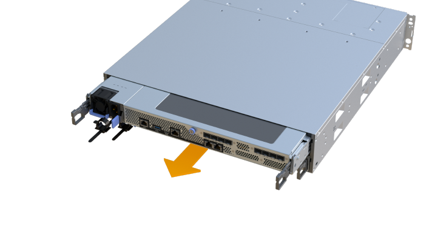

= Remplacement de la carte d'interface hôte (HIC) défectueuse dans EF300 ou EF600
:allow-uri-read: 
:experimental: 
:icons: font
:imagesdir: ../media/

[role="lead"]
Suivez cette procédure pour remplacer une carte d'interface hôte (HIC) défectueuse dans une baie EF300 ou EF600.

.Description de la tâche
Lorsque vous remplacez une HIC défectueuse, vous devez mettre la baie de stockage hors tension, remplacer la HIC et mettre de nouveau l'alimentation.

.Avant de commencer
* Révision link:hics-overview-supertask-concept.html["Conditions requises pour les mises à niveau des HIC EF300 ou EF600"].
* Planifiez une fenêtre de maintenance des temps d'arrêt pour cette procédure. Vous ne pouvez pas accéder aux données de la matrice de stockage tant que vous n'avez pas terminé cette procédure avec succès. Étant donné que les deux contrôleurs doivent avoir la même configuration HIC lorsqu'ils sont sous tension, l'alimentation doit être éteinte lorsque vous installez des cartes HIC.
* Assurez-vous de disposer des éléments suivants :
+
** HIC compatibles avec vos contrôleurs.
** Un bracelet antistatique ou d'autres précautions antistatiques.
** Une zone de travail plate et sans électricité statique.
** Étiquettes permettant d'identifier chaque câble connecté au boîtier du contrôleur.
** Un tournevis cruciforme n° 1.
** Station de gestion avec un navigateur qui peut accéder au Gestionnaire système SANtricity du contrôleur. (Pour ouvrir l'interface System Manager, pointez le navigateur vers le nom de domaine ou l'adresse IP du contrôleur.)
+

CAUTION: *Perte possible d'accès aux données* -- n'installez jamais d'HIC dans un boîtier de contrôleur EF300 ou EF600 si cette HIC a été conçue pour un autre contrôleur E-Series. En outre, les deux contrôleurs et les deux HIC doivent être identiques. La présence de circuits intégrés incompatibles ou non concordants provoque le blocage des contrôleurs lorsque vous mettez le système sous tension.

== Étape 1 : mettre le contrôleur hors ligne

Mettez le contrôleur affecté hors ligne pour pouvoir remplacer les circuits intégrés en toute sécurité.

.Étapes
. Dans SANtricity System Manager, vérifiez les détails dans la fonctionnalité Recovery Guru qui confirme la présence d'un problème au niveau de la batterie et pour garantir qu'aucun autre élément ne doit être résolu en premier.
. Dans la zone Details du Recovery Guru, déterminez la batterie à remplacer.
. Sauvegardez la base de données de configuration de la baie de stockage à l'aide de SANtricity System Manager.
+
Si un problème survient lorsque vous supprimez un contrôleur, vous pouvez utiliser le fichier enregistré pour restaurer votre configuration. Le système enregistre l'état actuel de la base de données de configuration RAID, qui inclut toutes les données des groupes de volumes et des pools de disques sur le contrôleur.

+
** Depuis System Manager :
+
... Sélectionnez menu :support[Centre de support > Diagnostics].
... Sélectionnez *collecter les données de configuration*.
... Cliquez sur *collect*.
+
Le fichier est enregistré dans le dossier Téléchargements de votre navigateur sous le nom *configurationData-<arrayName>-<DateTime>.7z*.

. Si le contrôleur n'est pas encore hors ligne, mettez-le hors ligne maintenant en utilisant SANtricity System Manager.
+
.. Sélectionnez *matériel*.
.. Si le graphique montre les disques durs, sélectionnez *Afficher le verso du tiroir* pour afficher les contrôleurs.
.. Sélectionnez le contrôleur que vous souhaitez placer hors ligne.
.. Dans le menu contextuel, sélectionnez *placer hors ligne* et confirmez que vous souhaitez effectuer l'opération.
+

NOTE: Si vous accédez à SANtricity System Manager à l'aide du contrôleur que vous tentez de mettre hors ligne, un message SANtricity System Manager indisponible s'affiche. Sélectionnez *connexion à une autre connexion réseau* pour accéder automatiquement au Gestionnaire système SANtricity à l'aide de l'autre contrôleur.

. Attendez que SANtricity System Manager mette à jour l'état du contrôleur sur hors ligne.
+

NOTE: Ne pas commencer d'autres opérations tant que le statut n'a pas été mis à jour.

. Sélectionnez *revérification* dans Recovery Guru, puis confirmez que le champ OK pour supprimer dans la zone Détails affiche Oui, indiquant qu'il est sûr de supprimer ce composant.

== Étape 2 : déposer le boîtier du contrôleur

Retirez le boîtier du contrôleur afin de pouvoir remplacer la carte d'interface hôte défectueuse.

.Étapes
. Etiqueter chaque câble relié au boîtier du contrôleur.
. Débrancher tous les câbles du boîtier du contrôleur.
+

CAUTION: Pour éviter de dégrader les performances, ne pas tordre, plier, pincer ou marcher sur les câbles.

. Si les ports HIC utilisent des émetteurs-récepteurs SFP+, retirez-les.
+
En fonction du type de HIC auquel vous effectuez la mise à niveau, vous pourrez réutiliser ces SFP.

. Vérifiez que la LED du cache actif située à l'arrière du contrôleur est éteinte.
. Appuyez sur les poignées situées de chaque côté du contrôleur et tirez-les vers l'arrière jusqu'à ce qu'elles soient sorties du tiroir.
+
image::../media/remove_controller_5.png[Appuyez sur les poignées pour retirer le contrôleur]

. A l'aide de deux mains et des poignées, faites glisser le boîtier du contrôleur hors de l'étagère. Lorsque l'avant du contrôleur est libre du boîtier, tirez-le complètement à l'aide de deux mains.
+

CAUTION: Toujours utiliser deux mains pour soutenir le poids d'un boîtier de contrôleur.

+

. Placez le boîtier du contrôleur sur une surface plane et exempte d'électricité statique.

== Étape 3 : retirez la HIC

Supprimez la carte HIC d'origine pour la remplacer par une carte mise à niveau.

.Étapes
. Retirez le capot du boîtier du contrôleur en dévissant la vis à molette unique et en soulevant le couvercle.
. Vérifiez que la LED verte située dans le contrôleur est éteinte.
+
Si ce voyant vert est allumé, le contrôleur utilise toujours l'alimentation de la batterie. Vous devez attendre que ce voyant s'éteigne avant de retirer des composants.

. À l'aide d'un tournevis cruciforme, retirez les deux vis qui fixent le cadran HIC au boîtier du contrôleur.
+
image::../media/hic_2.png[Déposer la façade HIC]

+

NOTE: L'image ci-dessus est un exemple ; l'apparence de votre HIC peut varier.

. Retirez la plaque HIC.
. À l'aide de vos doigts ou d'un tournevis cruciforme, desserrez la vis à molette unique qui fixent le HIC à la carte contrôleur.
+
image::../media/hic_3.png[Desserrez les vis à molette HIC]

+

NOTE: La HIC est fournie avec trois emplacements de vis sur le dessus, mais est fixée avec un seul emplacement.

+

NOTE: L'image ci-dessus est un exemple ; l'apparence de votre HIC peut varier.

. Détachez avec précaution la carte HIC de la carte contrôleur en la soulevant et en la sortant du contrôleur.
+

CAUTION: Veillez à ne pas rayer ou heurter les composants au bas de la HIC ou au-dessus de la carte contrôleur.

+
image::../media/hic_4.png[Retirez le HIC de la carte contrôleur]

+

NOTE: L'image ci-dessus est un exemple ; l'apparence de votre HIC peut varier.

. Placez le HIC sur une surface plane et sans électricité statique.

== Étape 4 : remplacer la HIC

Après avoir retiré l'ancienne HIC, installez une nouvelle HIC.

CAUTION: *Perte possible d'accès aux données* -- n'installez jamais d'HIC dans un boîtier de contrôleur EF300 ou EF600 si cette HIC a été conçue pour un autre contrôleur E-Series. En outre, si vous disposez d'une configuration duplex, les deux contrôleurs et les deux circuits intégrés doivent être identiques. La présence de circuits intégrés incompatibles ou non concordants provoque le blocage des contrôleurs lorsque vous mettez le système sous tension.

.Étapes
. Déballez la nouvelle HIC et la nouvelle plaque HIC.
. Alignez la vis moletée unique de la HIC avec les trous correspondants du contrôleur, puis alignez le connecteur situé au bas de la HIC avec le connecteur d'interface HIC de la carte contrôleur.
+
Veillez à ne pas rayer ou heurter les composants au bas de la HIC ou au-dessus de la carte contrôleur.

. Abaisser avec précaution la HIC et mettre le connecteur HIC en place en appuyant doucement sur la HIC.
+

CAUTION: **Dommages possibles à l'équipement** -- faites très attention de ne pas pincer le connecteur ruban doré pour les voyants du contrôleur entre la HIC et la vis à molette.

+
image::../media/hic_7.png[Installer le HIC]

+

NOTE: L'image ci-dessus est un exemple ; l'apparence de votre HIC peut varier.

. Serrez manuellement la vis à molette HIC.
+
N'utilisez pas de tournevis, sinon vous risquez de trop serrer les vis.

. À l'aide d'un tournevis cruciforme n° 1, fixez la plaque HIC que vous avez retirée de la HIC d'origine à l'aide des trois vis.

== Étape 5 : réinstallez le boîtier du contrôleur

Après avoir remplacé l'HIC, réinstallez le boîtier du contrôleur dans le shelf.

.Étapes
. Abaissez le capot du boîtier du contrôleur et fixez la vis à molette.
. Tout en appuyant sur les poignées du contrôleur, faites glisser délicatement le boîtier du contrôleur jusqu'à ce qu'il se place dans le tiroir du contrôleur.
+

NOTE: Le contrôleur émet un déclic sonore lorsqu'il est correctement installé dans le tiroir.

+
image::../media/remove_controller_7.png[Installez le contrôleur dans le tiroir]

. Installez les SFP dans la nouvelle HIC et reconnectez tous les câbles.
+
Si vous utilisez plusieurs protocoles hôtes, assurez-vous d'installer les SFP dans les ports hôtes appropriés.

== Étape 6 : remplacement HIC complet

Placez le contrôleur en ligne, collectez les données de support et reprenez les opérations.

.Étapes
. Mettez le contrôleur en ligne.
+
.. Dans System Manager, accédez à la page hardware.
.. Sélectionnez *Afficher le verso du contrôleur*.
.. Sélectionnez le contrôleur avec la carte d'interface hôte remplacée.
.. Sélectionnez *placer en ligne* dans la liste déroulante.

. Pendant le démarrage du contrôleur, vérifiez les LED du contrôleur.
+
Lorsque la communication avec l'autre contrôleur est rétablie :

+
** Le voyant d'avertissement orange reste allumé.
** Les voyants Host Link peuvent être allumés, clignotants ou éteints, selon l'interface hôte.

. Une fois le contrôleur reen ligne, vérifiez que son état est optimal et vérifiez les LED d'avertissement du tiroir contrôleur.
+
Si l'état n'est pas optimal ou si l'un des voyants d'avertissement est allumé, vérifiez que tous les câbles sont correctement installés et que le boîtier du contrôleur est correctement installé. Au besoin, déposer et réinstaller le boîtier du contrôleur.

+

NOTE: Si vous ne pouvez pas résoudre le problème, contactez le support technique.

. Cliquez sur Menu:matériel [support > Centre de mise à niveau] pour vous assurer que la dernière version de SANtricity OS est installée.
+
Au besoin, installez la dernière version.

. Vérifiez que tous les volumes ont été renvoyés au propriétaire préféré.
+
.. Sélectionnez menu:Storage[volumes]. Dans la page *tous les volumes*, vérifiez que les volumes sont distribués à leurs propriétaires préférés. Sélectionnez menu:More[change Ownership] pour afficher les propriétaires de volumes.
.. Si les volumes appartiennent tous au propriétaire préféré, passez à l'étape 6.
.. Si aucun volume n'est renvoyé, vous devez le renvoyer manuellement. Accédez au menu:plus[redistribuez les volumes].
.. Si seulement certains volumes sont renvoyés à leurs propriétaires préférés après la distribution automatique ou manuelle, vous devez vérifier le Recovery Guru pour les problèmes de connectivité hôte.
.. S'il n'y a pas de Recovery Guru présent ou si vous suivez les étapes de Recovery guru, les volumes ne sont toujours pas retournés à leurs propriétaires préférés contactez le support.

. Collecte des données de support de votre baie de stockage à l'aide de SANtricity System Manager
+
.. Sélectionnez menu :support[Centre de support > Diagnostics].
.. Sélectionnez *collecter les données de support*.
.. Cliquez sur *collect*.
+
Le fichier est enregistré dans le dossier Téléchargements de votre navigateur portant le nom *support-data.7z*.

.Et la suite ?
Le remplacement de votre carte d'interface hôte est terminé. Vous pouvez reprendre les opérations normales.
