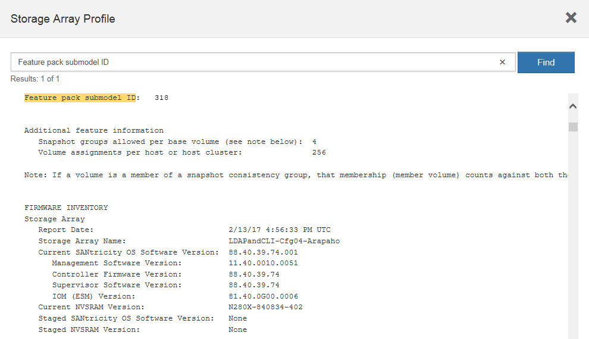

= Modification du protocole hôte pour un système EF300 ou EF600
:allow-uri-read: 
:experimental: 
:icons: font
:imagesdir: ../media/

[role="lead"]
Suivez cette procédure pour modifier le protocole du port hôte dans une baie EF300, EF600, EF300C ou EF600C. Cette procédure ne s'applique qu'aux cartes d'interface hôte (HIC) utilisant des protocoles Infiniband (IB) ou Fibre Channel (FC).

== Étape 1 : obtenir la clé du pack de fonctions

Pour obtenir la clé du pack de fonctionnalités, vous avez besoin du numéro de série du tiroir du contrôleur, d'un code d'activation de la fonction et de l'identifiant d'activation de la fonctionnalité de la matrice de stockage.

.Étapes
. Recherchez le numéro de série.
+
.. Dans SANtricity System Manager, sélectionnez menu :support[support Center].
.. Lorsque l'onglet *Ressources de support* est sélectionné, faites défiler jusqu'à la section *Afficher les propriétés supérieures de la matrice de stockage*.
.. Localisez le *Numéro de série du châssis* et copiez cette valeur dans un fichier texte.
+
image::../media/sam1130_ss_e2800_storage_array_profile_sn_smid_copy_maint-ef600.gif[Numéro de série du châssis]

. Localisez l'ID du sous-modèle *Feature Pack*.
+
.. Dans le Gestionnaire système SANtricity, sélectionnez *support*.
.. Sélectionnez la mosaïque *support Center*.
.. Dans l'onglet Ressources de support, localisez et sélectionnez le lien *profil de matrice de stockage*.
.. Saisissez *ID du sous-modèle du pack de fonctionnalités* dans la zone de texte, puis cliquez sur *Rechercher*.
.. Localisez l'ID du sous-modèle du pack de fonctionnalités pour la configuration de départ.
+

. À l'aide de l'ID du sous-modèle du pack de fonctionnalités, localisez l'ID du sous-modèle de contrôleur correspondant à la configuration de départ et trouvez le code d'activation de la fonction correspondant à la configuration de fin souhaitée dans le tableau suivant. Ensuite, copiez le code d'activation de cette fonction dans un fichier texte.
+
|===
2+| Démarrage de la configuration 2+| Fin de la configuration .2+| Code d'activation de la fonction 

| ID du sous-modèle du contrôleur | Ports HIC | ID du sous-modèle du contrôleur | Ports HIC 

 a| 
443
 a| 
NVMe/FC, NVMe/RoCE ou iSCSI
 a| 
444
 a| 
NVME/FC ou NVMe/IB
 a| 
DH5-HB4-ZK9QH

 a| 
448
 a| 
FC
 a| 
JHX-UB4-ZGTP1

 a| 
491
 a| 
Iser/IB
 a| 
0H1-675-Z5SII

 a| 
492
 a| 
SRP/IB
 a| 
NHD-V75-ZB6ZX

 a| 
444
 a| 
NVMe/FC ou NVMe/IB
 a| 
443
 a| 
NVMe/FC, NVMe/RoCE ou iSCSI
 a| 
YH3-XB4-ZJRIZ

 a| 
448
 a| 
FC
 a| 
2HU-BB4-ZFCG5

 a| 
491
 a| 
Iser/IB
 a| 
2H3-P75-Z6AQG

 a| 
492
 a| 
SRP/IB
 a| 
5HG-G75-ZNEZ

 a| 
448
 a| 
FC
 a| 
443
 a| 
NVMe/FC, NVMe/RoCE ou iSCSI
 a| 
7 HZ-EB4-ZHAYW

 a| 
444
 a| 
NVMe/FC ou NVMe/IB
 a| 
LHS-RB4-ZDV29

 a| 
491
 a| 
Iser/IB
 a| 
FH6-975-Z7Q7H

 a| 
492
 a| 
SRP/IB
 a| 
0HI-Z75-ZE4L5

 a| 
491
 a| 
Iser/IB
 a| 
443
 a| 
NVMe/FC, NVMe/RoCE ou iSCSI
 a| 
MHQ-M85-ZIJNT

 a| 
444
 a| 
NVMe/FC ou NVMe/IB
 a| 
4HS-685-ZJZ1U

 a| 
448
 a| 
FC
 a| 
YHU-P85-ZLHCX

 a| 
465
 a| 
FC/CÉ-P
 a| 
AHX-985-ZMXMI

 a| 
492
 a| 
SRP/IB
 a| 
ZHZ-S85-ZNF4J

 a| 
492
 a| 
SRP/IB
 a| 
443
 a| 
NVMe/FC, NVMe/RoCE ou iSCSI
 a| 
EH3-C85-Z0V93

 a| 
444
 a| 
NVMe/FC ou NVMe/IB
 a| 
BH5-V85-ZQDQJ

 a| 
448
 a| 
FC
 a| 
1H8-F85-ZRT1V

 a| 
465
 a| 
FC/CÉ-P
 a| 
1HA-Y85-ZSB7S

 a| 
491
 a| 
Iser/IB
 a| 
KHD-I85-ZUSMI

 a| 
465
 a| 
FC/CÉ-P
 a| 
491
 a| 
Iser
 a| 
6H8-S75-Z98FH

 a| 
492
 a| 
SRP
 a| 
LNH-J75-ZFL3W

 a| 
516
 a| 
NVMe/FC, NVMe/RoCE ou iSCSI
 a| 
517
 a| 
NVMe/IB ou NVMe/FC
 a| 
LHF-285-ZV9YZ

 a| 
518
 a| 
FC
 a| 
IHI-L85-ZXQEP

 a| 
519
 a| 
Iser/IB
 a| 
RHK-585-ZY7P5

 a| 
520
 a| 
FC-PTL
 a| 
RHN-095-ZZ0XF

 a| 
521
 a| 
SRP/IB
 a| 
GHP-895-Z25BD

 a| 
517
 a| 
NVMe/IB ou NVMe/FC
 a| 
516
 a| 
NVMe/FC, NVMe/RoCE ou iSCSI
 a| 
7HS-R95-Z3M06

 a| 
518
 a| 
FC
 a| 
UHU-B95-Z43X2

 a| 
519
 a| 
FC-PTL
 a| 
8HX-U95-Z5K6F

 a| 
520
 a| 
Iser/IB
 a| 
UHZ-E95-Z71LH

 a| 
521
 a| 
SRP/IB
 a| 
SH2-X95-Z8IVS

 a| 
518
 a| 
FC
 a| 
516
 a| 
NVMe/FC, NVMe/RoCE ou iSCSI
 a| 
UH5-H95-Z9Z58

 a| 
517
 a| 
NVMe/FC ou NVMe/IB
 a| 
XH7-195-ZBGJC

 a| 
519
 a| 
FC-PTL
 a| 
FHA-K95-ZCXX0

 a| 
520
 a| 
Iser/IB
 a| 
JHC-595-ZDE3X

 a| 
521
 a| 
SRP/IB
 a| 
0HF-095-ZFVFN

 a| 
519
 a| 
FC-PTL
 a| 
516
 a| 
NVMe/FC, NVMe/RoCE ou iSCSI
 a| 
YHH-895-ZGCXS

 a| 
517
 a| 
NVMe/FC ou NVMe/IB
 a| 
2HK-R95-ZHT83

 a| 
518
 a| 
FC
 a| 
1HM-BA5-ZJALA

 a| 
520
 a| 
Iser/IB
 a| 
YHP-UA5-ZKRXA

 a| 
521
 a| 
SRP/IB
 a| 
MHR-EA5-ZL83V

 a| 
520
 a| 
Iser/IB
 a| 
516
 a| 
NVMe/FC, NVMe/RoCE ou iSCSI
 a| 
HHU-XA5-ZNPLT

 a| 
517
 a| 
NVMe/FC ou NVMe/IB
 a| 
YHW-HA5-Z07QK

 a| 
518
 a| 
FC
 a| 
WHZ-1A5-ZPN4U

 a| 
519
 a| 
FC/CÉ-P
 a| 
7H2-KA5-ZR5C3

 a| 
521
 a| 
SRP
 a| 
3H5-4A5-ZSLVX

 a| 
521
 a| 
SRP/IB
 a| 
516
 a| 
NVMe/FC, NVMe/RoCE ou iSCSI
 a| 
1H7-NA5-ZT31W

 a| 
517
 a| 
NVMe/FC ou NVMe/IB
 a| 
XHA-7A5-ZVJGC

 a| 
518
 a| 
FC
 a| 
KHC-QA5-ZW1P3

 a| 
519
 a| 
FC/CÉ-P
 a| 
CHE-AA5-ZXH2F

 a| 
520
 a| 
Iser/IB
 a| 
SHH-TA5-ZZYHS

|===
+

NOTE: Si l'ID du sous-modèle de votre contrôleur n'est pas répertorié, contactez https://mysupport.netapp.com/site/["Support NetApp"^].

. Dans System Manager, localisez l'identifiant d'activation de la fonction.
+
.. Accédez au menu:Paramètres[système].
.. Faites défiler vers le bas jusqu'à *Compléments*.
.. Sous *changer Feature Pack*, localisez *Feature Enable identifier*.
.. Copiez et collez ce numéro à 32 chiffres dans un fichier texte.
+
image::../media/sam1130_ss_e2800_change_feature_pack_feature_enable_identifier_copy_maint-ef600.gif[Boîte de dialogue Modifier le pack de fonctions]

. Accédez à http://partnerspfk.netapp.com["Activation de licence NetApp : activation de la fonctionnalité Storage Array Premium"^], puis entrez les informations requises pour obtenir le pack de fonctions.
+
** Numéro de série du châssis
** Code d'activation de la fonction
** Identifiant d'activation de fonctionnalité
+

NOTE: Le site Web d'activation de la fonction Premium comprend un lien vers « instructions d'activation de la fonction Premium ». N'essayez pas d'utiliser ces instructions pour cette procédure.

. Choisissez de recevoir le fichier clé du pack de fonctionnalités dans un e-mail ou de le télécharger directement à partir du site.

== Étape 2 : arrêter les E/S de l'hôte

Arrêtez toutes les opérations d'E/S de l'hôte avant de convertir le protocole des ports hôtes.

Vous ne pouvez accéder aux données de la baie de stockage qu'une fois la conversion terminée.

.Étapes
. Assurez-vous qu'aucune opération d'E/S n'est en cours entre la matrice de stockage et tous les hôtes connectés. Par exemple, vous pouvez effectuer les opérations suivantes :
+
** Arrêtez tous les processus qui impliquent les LUN mappées du stockage vers les hôtes.
** Assurez-vous qu'aucune application n'écrit de données sur les LUN mappées du stockage aux hôtes.
** Démontez tous les systèmes de fichiers associés aux volumes de la baie.
+

NOTE: Les étapes exactes permettant d'arrêter les opérations d'E/S de l'hôte dépendent du système d'exploitation hôte et de la configuration, qui dépassent le cadre de ces instructions. Si vous ne savez pas comment arrêter les opérations d'E/S des hôtes dans votre environnement, essayez d'arrêter l'hôte.

+

CAUTION: *Perte de données possible* -- si vous continuez cette procédure pendant les opérations d'E/S, vous risquez de perdre des données.

. Attendez que les données de la mémoire cache soient écrites sur les disques.
+
La LED verte cache actif située à l'arrière de chaque contrôleur est allumée lorsque les données en cache ont besoin d'être écrites sur les disques. Vous devez attendre que ce voyant s'éteigne.

. Sur la page d'accueil de SANtricity System Manager, sélectionnez *Afficher les opérations en cours*.
. Attendez que toutes les opérations soient terminées avant de poursuivre l'étape suivante.

== Étape 3 : modifiez le pack de fonctions

Modifiez le pack de fonctionnalités pour convertir le protocole hôte de vos ports hôtes.

.Étapes
. Dans SANtricity System Manager, sélectionnez menu :Paramètres[System].
. Sous *Compléments*, sélectionnez *Modifier le pack de fonctionnalités*.
+
image::../media/sam1130_ss_system_change_feature_pack_maint-ef600.gif[Modifier le pack de fonctions]

. Cliquez sur *Parcourir*, puis sélectionnez le pack de fonctions que vous souhaitez appliquer.
. Tapez *CHANGE* dans le champ.
. Cliquez sur *Modifier*.
+
La migration du Feature Pack commence. Les deux contrôleurs redémarrent automatiquement deux fois pour permettre au nouveau pack de fonctionnalités de prendre effet. La matrice de stockage revient à un état réactif une fois le redémarrage terminé.

. Vérifiez que les ports hôtes disposent du protocole attendu.
+
.. Dans le Gestionnaire système SANtricity, sélectionnez *matériel*.
.. Cliquez sur *Afficher le verso de la tablette*.
.. Sélectionnez le graphique pour le contrôleur A ou le contrôleur B.
.. Sélectionnez *Afficher les paramètres* dans le menu contextuel.
.. Sélectionnez l'onglet *Host interfaces*.
.. Cliquez sur *Afficher plus de paramètres*.

.Et la suite ?
Accédez à link:hpp-complete-protocol-conversion-task.html["Conversion de protocole hôte complète"].
